# EstateAI
## Complete Architecture & End-to-End Workflow

**Internal Engineering Reference — Not for End Users**

*A complete, from-the-source architecture document for engineers joining or auditing the EstateAI platform. Every claim in this document is derived from reading the actual repository at `/Users/abhiparsaniya/Documents/EStateAI` — Prisma schema, route handlers, agent executors, LangGraph node/edge wiring, planner/critic/reflection/debate engines, job dispatcher, and security services. Where a feature is described as "not implemented" or "placeholder," that is a direct finding from the code, not an assumption.*

Document version 1.0 · Backend: Fastify + TypeScript + Prisma + PostgreSQL/pgvector + Redis · Frontend: Next.js 16 + React 19 · Monorepo: pnpm workspaces

***

## Table of Contents

1. Executive Summary
2. Functional Requirements
3. Complete Folder Structure
4. Database Architecture
5. Complete Request Flow
6. Agent Architecture
7. LangGraph Architecture
8. Planner Architecture
9. Tool Calling Architecture
10. RAG Architecture
11. Human-in-the-Loop
12. Debate Engine
13. Memory Architecture
14. Job System
15. AI Pipeline
16. API Documentation
17. Security
18. Complete Execution Walkthrough
19. Sequence Diagrams
20. Component Diagrams
21. Class Diagrams
22. Deployment Diagram
23. Data Flow Diagram
24. Complete End-to-End Workflow
25. Future Improvements
26. Resume Highlights

***

## 1. Executive Summary

### 1.1 What EstateAI Is

EstateAI is a **multi-agent digital asset and continuity management platform**. It is not a chatbot with a UI bolted onto an LLM call — it is an event-driven backend (Fastify + PostgreSQL + Redis) with a deterministic domain core (auth, assets, categories, tags, events, OAuth-connected accounts, discovery, a rule-based risk/compliance engine) and, layered on top of that core, an independently-versioned **AI subsystem** (`apps/api/src/ai/`) consisting of six cooperating agents, four different execution engines (a plain DAG orchestrator, a reasoning-first orchestrator, a LangGraph graph engine, and an LLM-driven dynamic planner), a Retrieval-Augmented-Generation knowledge store, a tool-calling framework, a multi-agent debate/consensus layer, and a long-term episodic memory system that lets the platform learn from its own past executions.

The repository was built incrementally across roughly 30 numbered "phases," each phase adding one cohesive capability on top of the last without modifying the public behavior of anything already shipped. That discipline is visible everywhere in the code as comments explaining *why* a new module was kept independent of an older one — this document treats those seams as first-class architecture, not incidental history.

### 1.2 The Business Problem

Individuals and teams accumulate a sprawling, invisible footprint of digital assets — GitHub repositories and organizations today, with Account rows modeled generically enough to add AWS, Gmail, Google Drive, Stripe, domains, Notion, Dropbox, Slack, and Cloudflare later without a schema change. That footprint routinely contains:

- **Security risk** — exposed secrets, missing branch protection, permissive access, unpatched dependencies.
- **Compliance gaps** — controls that map to real frameworks (NIST CSF, CIS Controls, ISO 27001, SOC 2) but are never actually evaluated because nobody audits a personal GitHub org against a framework.
- **Waste and neglect** — forgotten repositories, abandoned integrations, subscriptions nobody remembers signing up for.
- **Continuity risk** — no answer to "what happens to these assets if I'm unavailable, and who can recover them?"

EstateAI's job is to discover this footprint automatically, evaluate it continuously (not as a one-off audit), and produce a single, explainable, evidence-linked picture of risk, compliance, and recommended action — refreshed by background jobs, not a manual export.

### 1.3 Why a Multi-Agent Architecture

The system deliberately separates *evaluation* from *judgment*. A rule engine (deterministic, auditable, no LLM in the loop) decides what a `Finding` is and how severe it is — `RiskScore`/`Finding`/`Policy`/`PolicyResult` are all computed without ever calling an LLM. The **agents** sit one layer above that: each agent wraps an existing, already-correct backend service (`DiscoveryService`, `RiskService`, `ComplianceService`, `RecommendationService`) and adds *narration, cross-referencing, and confidence scoring* around it. This split has three direct consequences that shaped the whole codebase:

1. **No agent duplicates business logic.** Every agent calls the same service the plain REST routes call. An LLM failure degrades an agent to "same facts, worse prose," never "wrong facts."
2. **Agents can cross-reference each other's *output* without re-deriving it.** The Recommendation Agent reads Risk's findings and Compliance's policy failures straight out of the shared `OrchestrationContext.agentOutputs` array rather than re-querying the database — this is what makes multi-agent *collaboration* (Phase 21) and later *debate* (Phase 29) possible without a second source of truth.
3. **Four different execution engines can all wrap the same six agents.** Because every engine ultimately calls `orchestratorAgentRegistry.get(agentId).execute(input, context)`, adding LangGraph (Phase 27) or an LLM-driven dynamic planner (Phase 28) never required touching a single agent's internals — this is the load-bearing architectural decision of the entire AI subsystem, and it is enforced by convention, not by a compiler, across roughly a dozen phases of the codebase's history.

### 1.4 High-Level Feature List

| Domain | Capability |
|---|---|
| Identity | JWT auth (access + rotating refresh tokens with reuse detection), RBAC (`USER`/`ADMIN`) |
| Connections | GitHub OAuth (Authorization Code flow), manual PAT connection, AES-256-GCM credential encryption |
| Domain core | Assets, categories, tags, an append-only asset event timeline, a generic async job platform |
| Discovery | GitHub repository/organization discovery with hash-based change detection and soft-delete-on-disappearance |
| Analysis | Deterministic rule engine → `Finding` → `Recommendation`; risk scoring by scope; policy/compliance evaluation |
| Agents | Discovery, Risk, Compliance, Recommendation, Report, Copilot — six `OrchestratorAgent` implementations |
| Orchestration | A registered-workflow DAG engine, a reasoning-first adaptive planner, LangGraph (native parallel/conditional/interrupt), and an LLM-authored dynamic planner |
| Knowledge | Embeddings (pgvector), Knowledge Store, Retrieval Service — real RAG, not a stub |
| Tools | A permissioned tool-calling framework (Postgres read-only, sandboxed filesystem, GitHub REST, mock web search, knowledge search) |
| Reasoning | Critic scoring, Reflection reports, multi-agent Debate + Consensus, confidence calibration |
| Memory | Conversation memory, session memory, plan/reflection stores, long-term **episodic memory** with automatic capture and pruning |
| Human oversight | Two independent Human-in-the-Loop implementations (condition-gated and LangGraph-native `interrupt()`) |
| Ops | Prometheus metrics, structured logging, Docker Compose (dev/prod), nginx reverse proxy, health/readiness endpoints |

### 1.5 Technology Stack

| Layer | Technology | Where |
|---|---|---|
| Monorepo | pnpm workspaces | `pnpm-workspace.yaml` — `apps/*`, `packages/*` |
| Backend framework | Fastify (TypeScript, ESM) | `apps/api` |
| Frontend | Next.js 16 (App Router), React 19, Tailwind, shadcn/ui | `apps/web` |
| Database | PostgreSQL 16 + `pgvector` extension | `pgvector/pgvector:pg16` image, Prisma ORM |
| Vector search | pgvector, `vector(1536)` column, ivfflat cosine index | `KnowledgeDocument.embedding` |
| Cache / signal bus | Redis 7 (`ioredis`) | Generic `MemoryStore` abstraction reused by ~12 different stores |
| Job queue | Postgres `SyncJob` table (durable) + Redis list (fast-path only) | `services/jobs/`, `workers/` |
| Auth | Custom JWT (HS256) + rotating refresh tokens | `services/auth/` |
| AI orchestration | Hand-rolled DAG engine + LangGraph (`@langchain/langgraph`) | `ai/orchestrator/`, `ai/langgraph/` |
| LLM providers | Anthropic Claude (legacy `/ai/generate` path, real), OpenAI (agent-facing `ai/llm/` foundation default) | `services/ai/providers/`, `ai/llm/providers/` |
| Embeddings | Local deterministic hash provider (default) or OpenAI | `ai/embeddings/` |
| Observability | `prom-client` (Prometheus), `pino` (structured JSON logs) | `observability/` |
| Containerization | Docker multi-stage builds, Docker Compose (dev/prod), nginx | repo root |

***
## 2. Functional Requirements

Each subsection below states what the feature does, which files implement it, and — critically — what is real versus deterministic-fallback versus not-yet-implemented.

### 2.1 Authentication
Custom JWT implementation (`services/auth/`). Registration hashes passwords with bcrypt (`password.service.ts`, cost from `BCRYPT_COST`, default 12). Login (`login.service.ts`) returns an identical `InvalidCredentialsError` for "no such user" and "wrong password" — no user enumeration. `jwt.service.ts` signs HS256 access tokens (claims: `sub`, `email`, `role`, `iss`, `aud`, `iat`, `exp`; default TTL 15m). Refresh tokens (`refresh-token.service.ts`) are 64 random bytes, stored as a SHA-256 hash, rotated on every use (one-time-use), with **reuse detection**: presenting an already-rotated token revokes the user's entire token family and throws `RefreshTokenReuseError`. `GET /auth/me` returns the authenticated principal. RBAC is two roles only: `USER`, `ADMIN` (`UserRole` enum) — `ADMIN` bypasses ownership checks everywhere via `isOwnerOrAdmin()`.

### 2.2 GitHub OAuth
`services/oauth/oauth.service.ts` + `github.provider.ts`. Authorization Code flow: `GET /oauth/github` (authenticated, requires `assetId`) redirects to GitHub's consent screen with a single-use, Redis-backed state token (`oauth:state:<token>`, TTL from `OAUTH_STATE_TTL_SECONDS`, default 600s) that carries the caller's identity (userId/role/assetId/provider) since the browser round-trip can't carry a bearer header. `GET /oauth/github/callback` (unauthenticated by header — secured by the state token itself) deletes the state key **before** processing, so a replayed callback can never succeed twice inside the TTL window. On success, the exchanged access token is AES-256-GCM encrypted (`credential-encryption.service.ts`) and stored as `Account.credentialCiphertext` — the raw token is never logged and never leaves this one code path unencrypted.

### 2.3 Asset Management
Full CRUD over `Asset` (`routes/assets.ts`, `services/assets/`): create/list/search/get/update/soft-archive, tag attach/detach, an append-only `AssetEvent` timeline per asset, and a live WebSocket feed (`/ws`) that pushes new events to subscribed clients in real time. Every asset-scoped read/write is ownership-checked via `getOwnedAsset()`.

### 2.4 Discovery
`services/discovery/` (deterministic backend service) discovers GitHub repositories/organizations for a connected account, computes a `sha256` content hash per resource for cheap change detection, and soft-deletes (`Resource.deletedAt`) resources that disappear from the provider on rediscovery rather than hard-deleting them. The **Discovery Agent** (`ai/agents/discovery/`) wraps this service, adds an LLM-narrated summary, and is the only agent with zero upstream dependency in the workflow DAG.

### 2.5 Risk Assessment
`services/analysis/` runs a deterministic rule engine over discovered resources, producing `Finding` rows and a `RiskScore` at four possible scopes (`RESOURCE`/`ACCOUNT`/`ASSET`/`OVERALL`), weighted by severity (`RISK_WEIGHT_*` env vars). The **Risk Agent** (`ai/agents/risk/`) wraps this, adds narrated `reasoning`/`evidence`/`repeated` (has this rule fired before, from its own memory) per finding, and never lets the LLM touch the actual severity/score.

### 2.6 Compliance
`services/compliance/` evaluates registered `Policy` rows against resources, producing `PolicyResult` rows and an aggregate compliance score. The **Compliance Agent** (`ai/agents/compliance/`) joins that against a static, code-owned framework catalog (`compliance.mapping.ts`) covering **NIST CSF, CIS Controls, ISO 27001, SOC 2**, classifying every control as `PASS`/`FAIL`/`MISSING` per framework, with coverage percentages.

### 2.7 Recommendations
`Recommendation` rows are generated by the rule engine, one per `Finding`. The **Recommendation Agent** (`ai/agents/recommendation/`) is the first genuinely *collaborative* agent — it reads the Risk Agent's and Compliance Agent's live outputs directly out of `OrchestrationContext.agentOutputs` (falling back to a direct `FindingService` read only if Risk didn't run in this workflow), merges and cross-references them by `findingId`/`resourceId`, and produces one prioritized list with a computed confidence per recommendation.

### 2.8 Reports
The **Report Agent** (`ai/agents/report/`) is the terminal node of the standard DAG. It performs **no evaluation of its own** — it aggregates the other four agents' outputs (live from context, or falling back to their own memory stores if they didn't run this workflow) into sections plus an executive summary, and is the clearest example in the codebase of "narration only, zero re-derivation."

### 2.9 Copilot
The **Copilot Agent** (`ai/agents/copilot/`) is the conversational interface (`POST /ai/copilot/chat`). It classifies intent via regex (not an LLM call), maintains per-conversation memory (turns + session state), can auto-trigger an upstream workflow ("Intelligent Routing") through the same public `OrchestratorService` when the data it needs doesn't exist yet, grounds its answers in the Knowledge Store via RAG, and is the only agent that reaches into the shared generic tool framework (GitHub/Postgres/knowledge-search tools) rather than only its own dedicated tools.

### 2.10 Knowledge Base
`ai/knowledge/` — every successful agent step is **automatically** embedded and indexed (`ai/shared/knowledge.indexing.ts`, fire-and-forget, never blocks the agent) into `KnowledgeDocument` rows (pgvector-backed), upserted by `sourceId` so re-runs update in place rather than duplicating. A manual `POST /knowledge/index` route exists but automatic indexing is the primary path.

### 2.11 RAG
`ai/retrieval/retrieval.service.ts` performs real cosine-similarity vector search over the Knowledge Store (`<=>` pgvector operator), records a `RetrievalTrace` audit row per query (best-effort — a trace-write failure never breaks the actual search), and is what backs both `POST /knowledge/search` and Copilot's grounding.

### 2.12 Tool Calling
`ai/tools/` — a permissioned tool-calling framework (`ToolRegistry` + `ToolExecutor`), with a per-agent allowlist (`AGENT_TOOL_ACCESS`), a permission model that **refuses any tool declaring `write`** today (read-only everywhere is the deliberate current posture), and a persisted `ToolExecutionTrace` audit row per call.

### 2.13 Planner
Two entirely distinct planners exist. `ai/planner/goal-planner.ts`'s `GoalPlanner` is a deterministic, keyword-based workflow selector with a revision function that prunes doomed steps after a partial failure. `ai/llm-planner/` (Phase 28) is a genuine LLM-driven planner: it prompts an LLM to freely reason about an arbitrary goal, validates the structured JSON response against every registered agent/tool (rejecting cycles, unknown ids, missing dependencies), and converts a validated plan directly into a dynamic LangGraph graph with **no** pre-registered workflow required.

### 2.14 Debate
`ai/debate/debate.engine.ts` (Phase 29) — Risk, Recommendation, and Compliance agents each run their own unmodified analysis over the same asset; if a trigger condition fires (low average confidence, a detected structural disagreement, or high/severe risk), Copilot is asked to summarize the disagreement and a Consensus Engine computes an agreement score and conflict list. No agent's business logic is duplicated or its output ever mutated by another agent — "critique" is entirely a downstream, read-only comparison.

### 2.15 Consensus
`ai/debate/consensus.scoring.ts` — four deterministic structural conflict checks (e.g. high risk with a passing compliance score; critical findings with zero recommendations), a corroboration-based accept/reject classification of findings, and a weighted consensus-confidence blend. Pure functions, no LLM judgment.

### 2.16 Reflection
`ai/reflection/reflection.engine.ts` — runs after every execution path (plain orchestrator, reasoning orchestrator, LangGraph, debate), producing a `ReflectionReport`: succeeded/failed/skipped steps, missing evidence, weak recommendations, incomplete reports, a critic score, and an aggregated overall confidence.

### 2.17 Episodic Memory
`ai/episodic-memory/` (Phase 30) — every completed execution across all four execution paths is automatically captured as an `Episode` (goal, agents involved, tool usage, outcome, confidence, deterministically-derived lessons learned), indexed into the same Knowledge Store (no second vector database), searchable by semantic similarity, fed back into the LLM Planner's own prompt for a similar future goal, and prunable (max-count eviction with optional compressed archival).

### 2.18 Human Approval
Two independent implementations exist side by side. `ai/approval/hitl-orchestrator.ts`'s `HitlOrchestrator` gates the plain `WorkflowEngine` via per-round condition injection (no native pause primitive). LangGraph's own path (`ai/langgraph/nodes.ts`) uses the framework's real `interrupt()`/`Command({resume})` mechanism with a deterministic approval-request id so a replayed node finds the same pending request. Both share the same `ApprovalPolicy`/`ApprovalStore`/`ApprovalEngine` underneath.

### 2.19 LangGraph
`ai/langgraph/` (Phase 27) — a second, additive execution engine over the same six agents, adding genuine parallel branch execution (LangGraph's Pregel scheduler), a hand-built conditional-edge demo graph, durable checkpointing across process restarts, and native human-in-the-loop pausing.

### 2.20 Dynamic Planning
`ai/llm-planner/planner.executor.ts`'s `LLMPlannerExecutor` — converts an LLM-authored, validated plan directly into a one-off LangGraph graph (`buildDynamicGraph`, no `WorkflowRegistry` entry needed), and runs a **confidence-gated revision loop**: if the post-execution reflection's confidence stays below 0.6, it feeds that feedback back into the LLM planner for another attempt, capped at 3 iterations total.

***
## 3. Complete Folder Structure

```
EstateAI/
├── apps/
│   ├── api/                        Backend (Fastify + TypeScript + Prisma)
│   │   ├── src/
│   │   │   ├── ai/                 The entire AI subsystem (independently versioned)
│   │   │   │   ├── agents/         6 concrete agents: discovery, risk, compliance,
│   │   │   │   │                   recommendation, report, copilot — each a self-
│   │   │   │   │                   contained package (interface/executor/memory/
│   │   │   │   │                   tool/prompts/errors/index.ts composition root)
│   │   │   │   ├── orchestrator/   Deterministic DAG engine (Phase 17): planner,
│   │   │   │   │                   workflow.registry/engine, executor, state.manager,
│   │   │   │   │                   execution.context, agent-registry
│   │   │   │   ├── langgraph/      LangGraph execution engine (Phase 27): graph-
│   │   │   │   │                   builder, nodes, edges, state, checkpoint, executor
│   │   │   │   ├── planner/        Reasoning-first adaptive planner (Phase 25):
│   │   │   │   │                   goal-planner, reasoning-orchestrator, plan-store
│   │   │   │   ├── llm-planner/    LLM-driven dynamic planner (Phase 28): prompt,
│   │   │   │   │                   parser, validator, memory, cache, executor
│   │   │   │   ├── critic/         Deterministic execution-quality scoring
│   │   │   │   ├── reflection/     Post-execution reflection report engine
│   │   │   │   ├── debate/         Multi-agent debate + consensus engine (Phase 29)
│   │   │   │   ├── approval/       Human-in-the-loop: policy, engine, store,
│   │   │   │   │                   hitl-orchestrator (plain-orchestrator HITL path)
│   │   │   │   ├── episodic-memory/  Long-term episodic memory (Phase 30): store,
│   │   │   │   │                   indexer, search, relevance, extractor, pruner
│   │   │   │   ├── tools/          Generic tool-calling framework + 5 builtin tools
│   │   │   │   ├── knowledge/      Knowledge Store (pgvector-backed RAG storage)
│   │   │   │   ├── retrieval/      Retrieval Service (semantic search over Knowledge)
│   │   │   │   ├── embeddings/     Embedding providers (local hash / OpenAI)
│   │   │   │   ├── memory/         ConversationMemory/SessionMemory + RedisMemoryStore
│   │   │   │   ├── llm/            Newer LLM provider foundation (Phase 16; only
│   │   │   │   │                   OpenAI concretely implemented, others placeholder)
│   │   │   │   ├── config/         AI foundation config (ai-config.ts)
│   │   │   │   ├── interfaces/     Cross-cutting interfaces (MemoryStore, LLMProvider)
│   │   │   │   ├── errors/         AIError hierarchy
│   │   │   │   ├── types/          Shared cross-module types (tool.types.ts, common.ts)
│   │   │   │   └── shared/         knowledge.indexing.ts / knowledge.adapters.ts —
│   │   │   │                       the single automatic-indexing chokepoint
│   │   │   ├── services/           Deterministic domain services (pre-AI, Phase 1-15)
│   │   │   │   ├── auth/           Registration, login, JWT, refresh-token rotation
│   │   │   │   ├── assets/         Asset/category/tag/event services + ownership.ts
│   │   │   │   ├── oauth/          OAuth state + GitHub provider
│   │   │   │   ├── sync/           Account sync (GitHub provider)
│   │   │   │   ├── discovery/      Resource discovery (GitHub provider)
│   │   │   │   ├── analysis/       Rule engine → Finding/Recommendation/RiskScore
│   │   │   │   ├── compliance/     Policy evaluation → PolicyResult
│   │   │   │   ├── jobs/           Job service, dispatcher, executor, retry service
│   │   │   │   └── ai/             LEGACY Phase 7 AI system (services/ai/ — distinct
│   │   │   │                       from ai/llm/; this is the real, live Anthropic
│   │   │   │                       Claude integration for /ai/generate + /copilot/chat)
│   │   │   ├── workers/            Worker, WorkerPool, heartbeat reaper
│   │   │   ├── routes/             One file per domain, 28 files total, each a
│   │   │   │                       `xxxRoutes(app)` Fastify plugin function
│   │   │   ├── repositories/       Prisma-backed data access (one per model family)
│   │   │   ├── db/                 Prisma client singleton
│   │   │   ├── cache/              Redis client singleton
│   │   │   ├── config/             Zod-validated env schema (env.ts) — single source
│   │   │   │                       of truth for every configuration value
│   │   │   ├── observability/      Prometheus metrics registry, pino logger
│   │   │   ├── plugins/            Fastify plugins (auth, observability)
│   │   │   └── server.ts           Composition root — registers every plugin/route
│   │   │                           in a fixed, documented order
│   │   ├── prisma/                 schema.prisma + migrations/ (14+ migrations)
│   │   ├── scripts/                ~90 `verify-*.ts` scripts — this project's test
│   │   │                           suite (HTTP + in-process integration checks, no
│   │   │                           separate unit-test framework)
│   │   └── Dockerfile              Multi-stage: base → deps → dev/build → runtime
│   └── web/                        Frontend (Next.js 16 App Router)
│       └── src/
│           ├── app/                Route-per-folder pages (dashboard, assets/[id]/*,
│           │                       copilot, knowledge, compliance, risk, ...)
│           └── lib/api/            Typed API client (client.ts chokepoint +
│                                   one file per domain: accounts.ts, assets.ts, ...)
├── packages/
│   ├── shared/                     Shared TS types/constants across apps
│   └── config/                     Shared tooling config (eslint/tsconfig/prettier)
├── docs/                           ARCHITECTURE.md, DATABASE.md, API_REFERENCE.md,
│                                   DECISIONS.md, PROJECT_PROGRESS.md, TODO.md,
│                                   CHANGELOG.md — this document's primary sources
├── nginx/                          nginx.conf (prod reverse proxy)
├── docker-compose.yml              Local infra only (Postgres + Redis)
├── docker-compose.dev.yml          Infra + api + web, hot-reload bind mounts
└── docker-compose.prod.yml         Full stack + nginx, production targets
```

**Why this shape.** The `ai/` directory is deliberately siloed from `services/` — every AI capability wraps an already-correct deterministic service rather than reimplementing its logic, and the dependency only ever flows one direction (`ai/` → `services/`, never the reverse). Within `ai/`, the four execution engines (`orchestrator/`, `langgraph/`, `planner/`, `llm-planner/`) are siblings, not a hierarchy — each is additive and none of them import from each other's internals, only from the shared `agent-registry`/`execution.context`/agent packages. This is what let seven additional phases (23 through 30) ship without a single regression to Phase 17's original orchestrator.

***
## 4. Database Architecture

Source of truth: `apps/api/prisma/schema.prisma` (620 lines, 20 models, 14 enums, no `@map`/`@@map` — table/column names match Prisma model/field names exactly).

### 4.1 Core Domain ER Diagram

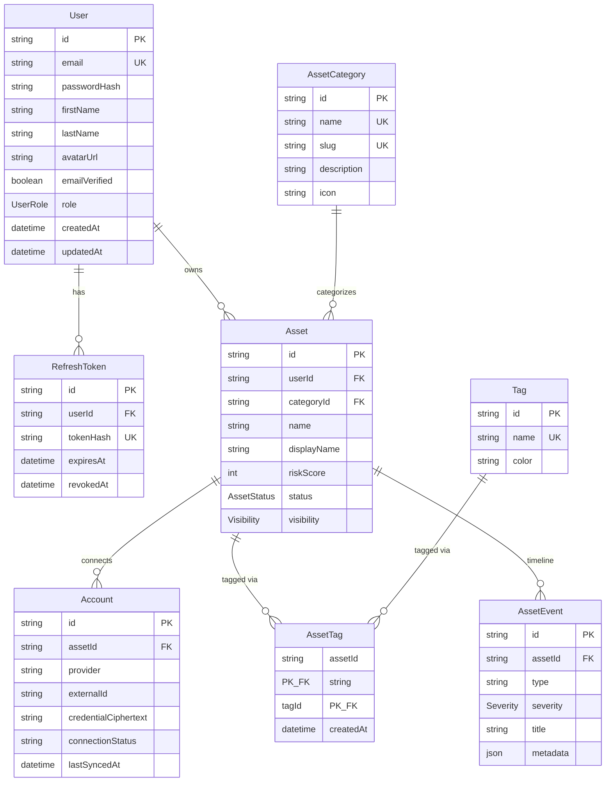
```mermaid
erDiagram
    User ||--o{ RefreshToken : "has"
    User ||--o{ Asset : "owns"
    AssetCategory ||--o{ Asset : "categorizes"
    Asset ||--o{ Account : "connects"
    Asset ||--o{ AssetTag : "tagged via"
    Tag ||--o{ AssetTag : "tagged via"
    Asset ||--o{ AssetEvent : "timeline"

    User {
        string id PK
        string email UK
        string passwordHash
        string firstName
        string lastName
        string avatarUrl
        boolean emailVerified
        UserRole role
        datetime createdAt
        datetime updatedAt
    }
    RefreshToken {
        string id PK
        string userId FK
        string tokenHash UK
        datetime expiresAt
        datetime revokedAt
    }
    AssetCategory {
        string id PK
        string name UK
        string slug UK
        string description
        string icon
    }
    Asset {
        string id PK
        string userId FK
        string categoryId FK
        string name
        string displayName
        int riskScore
        AssetStatus status
        Visibility visibility
    }
    Account {
        string id PK
        string assetId FK
        string provider
        string externalId
        string credentialCiphertext
        string connectionStatus
        datetime lastSyncedAt
    }
    Tag {
        string id PK
        string name UK
        string color
    }
    AssetTag {
        string assetId PK_FK
        string tagId PK_FK
        datetime createdAt
    }
    AssetEvent {
        string id PK
        string assetId FK
        string type
        Severity severity
        string title
        json metadata
    }
```

`Account.provider`/`AssetEvent.type` are deliberately free-form strings, not enums — a new integration or event type never requires a migration. `AssetCategory` deletion is `Restrict` (an asset always needs a category); `User`/`Asset`/`Account`/`Tag` deletions cascade downward.

### 4.2 Jobs, Discovery & Analysis ER Diagram

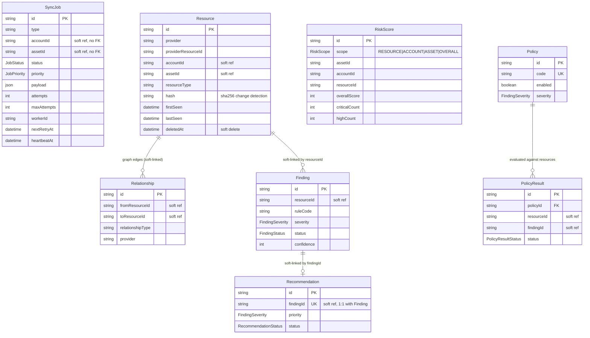
```mermaid
erDiagram
    SyncJob {
        string id PK
        string type
        string accountId "soft ref, no FK"
        string assetId "soft ref, no FK"
        JobStatus status
        JobPriority priority
        json payload
        int attempts
        int maxAttempts
        string workerId
        datetime nextRetryAt
        datetime heartbeatAt
    }
    Resource {
        string id PK
        string provider
        string providerResourceId
        string accountId "soft ref"
        string assetId "soft ref"
        string resourceType
        string hash "sha256 change detection"
        datetime firstSeen
        datetime lastSeen
        datetime deletedAt "soft delete"
    }
    Relationship {
        string id PK
        string fromResourceId "soft ref"
        string toResourceId "soft ref"
        string relationshipType
        string provider
    }
    Finding {
        string id PK
        string resourceId "soft ref"
        string ruleCode
        FindingSeverity severity
        FindingStatus status
        int confidence
    }
    Recommendation {
        string id PK
        string findingId UK "soft ref, 1:1 with Finding"
        FindingSeverity priority
        RecommendationStatus status
    }
    RiskScore {
        string id PK
        RiskScope scope "RESOURCE|ACCOUNT|ASSET|OVERALL"
        string assetId
        string accountId
        string resourceId
        int overallScore
        int criticalCount
        int highCount
    }
    Policy {
        string id PK
        string code UK
        boolean enabled
        FindingSeverity severity
    }
    PolicyResult {
        string id PK
        string policyId FK
        string resourceId "soft ref"
        string findingId "soft ref"
        PolicyResultStatus status
    }

    Resource ||--o{ Finding : "soft-linked by resourceId"
    Finding ||--o| Recommendation : "soft-linked by findingId"
    Resource ||--o{ Relationship : "graph edges (soft-linked)"
    Policy ||--o{ PolicyResult : "evaluated against resources"
```

**Soft-reference pattern (the schema's single most consistent architectural decision).** `SyncJob.accountId/assetId`, every `Resource`/`Relationship` reference, `Finding.resourceId`, `Recommendation.findingId`, `RiskScore.assetId/accountId/resourceId`, `PolicyResult.findingId`, `AgentPlanExecution.assetId`, `AIRequestLog.assetId`, `KnowledgeDocument.assetId`, `RetrievalTrace.assetId`, `ToolExecutionTrace.agentId` are **plain `String` columns, never a Prisma `@relation`**. Rationale, repeated consistently in the schema's own comments: these are audit/history/trace tables where (a) not every row necessarily has an owning entity (e.g. a future system-level AI job), and (b) the referenced row must be freely deletable without a cascading FK blocking or silently orphaning dependent rows. `RiskScore` additionally has **no DB unique constraint** despite being conceptually one-row-per-scope — Postgres treats `NULL` as distinct-from-`NULL` in a unique index, which would let duplicate `OVERALL` rows slip through; `RiskService` is the sole writer and enforces the invariant in application code instead.

### 4.3 AI Subsystem ER Diagram

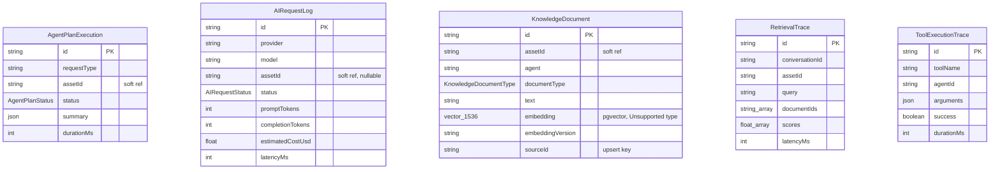
```mermaid
erDiagram
    AgentPlanExecution {
        string id PK
        string requestType
        string assetId "soft ref"
        AgentPlanStatus status
        json summary
        int durationMs
    }
    AIRequestLog {
        string id PK
        string provider
        string model
        string assetId "soft ref, nullable"
        AIRequestStatus status
        int promptTokens
        int completionTokens
        float estimatedCostUsd
        int latencyMs
    }
    KnowledgeDocument {
        string id PK
        string assetId "soft ref"
        string agent
        KnowledgeDocumentType documentType
        string text
        vector_1536 embedding "pgvector, Unsupported type"
        string embeddingVersion
        string sourceId "upsert key"
    }
    RetrievalTrace {
        string id PK
        string conversationId
        string assetId
        string query
        string_array documentIds
        float_array scores
        int latencyMs
    }
    ToolExecutionTrace {
        string id PK
        string toolName
        string agentId
        json arguments
        boolean success
        int durationMs
    }
```

`KnowledgeDocumentType` enum: `FINDING | RECOMMENDATION | REPORT | COMPLIANCE_RESULT | RISK_ASSESSMENT | DISCOVERY_SUMMARY | EPISODE` (the last value added by migration `20260804105659_add_episode_document_type` for Phase 30's episodic memory). `KnowledgeDocument.embedding` is the only pgvector-typed column in the schema — Prisma's `Unsupported("vector(1536)")` produces no typed client field at all, so every read/write touching it goes through raw `$queryRaw`/`$executeRaw` in `ai/knowledge/knowledge.repository.ts`.

### 4.4 Every Enum

| Enum | Values |
|---|---|
| `UserRole` | `USER`, `ADMIN` |
| `AssetStatus` | `ACTIVE`, `WARNING`, `INACTIVE`, `ARCHIVED` |
| `Visibility` | `PRIVATE`, `SHARED`, `PUBLIC` |
| `Severity` | `INFO`, `WARNING`, `ERROR`, `CRITICAL` |
| `JobStatus` | `QUEUED`, `RUNNING`, `COMPLETED`, `FAILED`, `RETRYING`, `CANCELLED`, `DEAD` |
| `JobPriority` | `LOW`, `NORMAL`, `HIGH`, `CRITICAL` (declared ascending — Postgres enum comparison sorts `DESC` correctly) |
| `FindingSeverity` | `CRITICAL`, `HIGH`, `MEDIUM`, `LOW`, `INFORMATIONAL` (reused as `Recommendation.priority` and `Policy.severity`) |
| `FindingStatus` | `OPEN`, `RESOLVED` |
| `RecommendationStatus` | `OPEN`, `RESOLVED`, `DISMISSED` |
| `RiskScope` | `RESOURCE`, `ACCOUNT`, `ASSET`, `OVERALL` |
| `PolicyResultStatus` | `PASS`, `FAIL`, `WARNING`, `NOT_APPLICABLE` |
| `AgentPlanStatus` | `RUNNING`, `COMPLETED`, `FAILED` |
| `AIRequestStatus` | `SUCCESS`, `FAILED` |
| `KnowledgeDocumentType` | `FINDING`, `RECOMMENDATION`, `REPORT`, `COMPLIANCE_RESULT`, `RISK_ASSESSMENT`, `DISCOVERY_SUMMARY`, `EPISODE` |

### 4.5 Key Indexes

Every model that's queried by a foreign owner has a matching `@@index` (`Asset` on `userId`/`categoryId`/`status`; `Resource` on `provider`/`resourceType`/`assetId`; `Finding` on `resourceId`/`status`/`severity`/`provider`). The two hot-path composite indexes worth calling out:

- `SyncJob @@index([status, priority, createdAt])` — exactly matches `JobRepository.claimNextJob()`'s `ORDER BY priority DESC, createdAt ASC` claim query.
- `KnowledgeDocument @@index([assetId, documentType])` — matches `KnowledgeStore.getHistory(assetId, documentType?)`'s filtered lookup.

Uniqueness constraints double as idempotency guards: `Resource @@unique([provider, providerResourceId])` (global resource identity), `Relationship @@unique([fromResourceId, toResourceId, relationshipType])` (no duplicate graph edges on rediscovery), `Finding @@unique([resourceId, ruleCode])` (one row per rule per resource, safely re-evaluable), `PolicyResult @@unique([policyId, resourceId])` (latest-result-only, not a history log).

### 4.6 Redis

`cache/redis.ts` is a single `ioredis` singleton (retry strategy: `min(attempt*100ms, 3000ms)`), used two ways:

1. **Direct** — the job queue's fast-path list (`jobs:queue`, `RPUSH`/`LPOP`, no durability guarantee — Postgres `SyncJob` is the real source of truth) and OAuth state tokens (`oauth:state:<token>`).
2. **Via `ai/interfaces/memory-store.interface.ts`'s generic `MemoryStore` abstraction** (`get/set/append/getList/delete`), implemented by `RedisMemoryStore` (all keys namespaced `ai:memory:`) and reused independently by roughly a dozen higher-level stores, each owning its own key prefix and TTL:

| Prefix | Store | TTL |
|---|---|---|
| `langgraph:checkpoint:` | `GraphCheckpointStore` | 7 days |
| `episode:record:` / `episode:history:` | `EpisodeStore` | 7 days |
| `episode:archive:` | `EpisodePruner` | 30 days (outlives the live record) |
| `reasoning:plan:` | `PlanStore` | 7 days |
| `debate:record:` / `debate:history:` | `DebateMemory` | 7 days |
| `debate:consensus:` | `ConsensusStore` | 7 days |
| `llm-planner:cache:` | `PlannerCache` | 15 minutes |
| `orchestrator:state:` | `StateManager` | 6 hours |
| `approval:request:` | `ApprovalStore` | 30 days (audit trail) |
| `approval:paused-execution:` | `PausedExecutionStore` | 7 days |
| `reasoning:reflection:` | `ReflectionStore` | 7 days |
| `oauth:state:` | `OAuthService` | 600 seconds, single-use |

This uniform pattern — one interface, many independent stores, each choosing its own retention window based on how long that data stays *useful* rather than a single global TTL — is a deliberate, repeated design decision, not an accident of convenience.

### 4.7 pgvector

Extension enabled via raw migration SQL (`CREATE EXTENSION IF NOT EXISTS vector`). Column: `vector(1536)` — a fixed width regardless of the underlying embedding provider (both the local hash provider and the OpenAI provider pad/truncate to exactly 1536 dimensions, so the column stays meaningful across a provider swap). Index: `ivfflat` with `vector_cosine_ops`, `lists = 100` — chosen over the newer `hnsw` index type for broader pgvector-version compatibility. Search uses the `<=>` cosine-distance operator, converted to a similarity score as `1 - distance` so higher is always "more relevant," matching the orientation of every other score in the codebase (`riskScore`, `confidenceScore`, `agreementScore`).

One recurring, documented migration quirk: Prisma's schema DSL has no way to express `USING ivfflat (...)`, so its own migrate-diff engine doesn't know the index exists and silently generates a `DROP INDEX` for it on every subsequent `prisma migrate dev` — that generated line has to be manually deleted from each new migration file to preserve the real index, and it recurs in at least two later migrations in this repository's history.

### 4.8 Knowledge Store & Episode Store (Logical, not new tables)

The **Knowledge Store** is not a separate database — it is `KnowledgeDocument` plus `KnowledgeRepository`'s raw-SQL vector operations plus `KnowledgeStore`'s embed-then-upsert orchestration. The **Episode Store** (`ai/episodic-memory/episode.store.ts`) is not a table at all — episodes live entirely in Redis (`episode:record:*`), and are only *indexed* (for semantic search, not for persistence) into the same `KnowledgeDocument` table under `documentType: 'EPISODE'`. This is the "no second vector database" decision stated explicitly in the Phase 30 specification and honored in the implementation.

### 4.9 Job Queue (Logical)

Not a separate queueing product (no BullMQ, no RabbitMQ, no SQS) — `SyncJob` is a plain Postgres table functioning as a durable queue, claimed via an atomic conditional `UPDATE ... WHERE status = 'QUEUED'` (Postgres re-evaluates the `WHERE` clause after taking the row lock, so a losing concurrent claim simply matches zero rows — no explicit transaction or isolation-level tuning required), with Redis used only as a fast-path "someone probably just enqueued something" signal that every worker falls back from if it's empty or stale.

***
## 5. Complete Request Flow

This section walks the exact sequence a new user's data takes through the system, end to end, from registration through a fully generated report — the backbone flow every other section in this document plugs into.

### 5.1 Narrative

1. **Register / Login** (`POST /auth/register`, `POST /auth/login`) — `services/auth/`. Returns a JWT access token (15m) and a refresh token (30d, rotated on use).
2. **Create a Category and Asset** (`POST /categories` [admin-gated], `POST /assets`) — an `Asset` is the unit everything else attaches to.
3. **Connect GitHub** — either the OAuth flow (`GET /oauth/github` → GitHub consent → `GET /oauth/github/callback`) or a manual PAT (`POST /accounts/connect`). Either path ends with an encrypted `Account.credentialCiphertext`.
4. **Sync** (`POST /accounts/:id/sync`) — enqueues a `SyncJob(type: SYNC)`, returns `202` immediately with a `jobId`. A background worker later calls `syncService.sync()`, which calls the GitHub provider's `/user` endpoint to validate the credential and get a lightweight resource count.
5. **Discover** (`POST /accounts/:id/discover`, or the AI-agent-driven `POST /ai/discovery/start`) — enqueues `DISCOVERY` (deterministic service) or `AI_DISCOVERY` (Discovery Agent). Either way, `DiscoveryService.discover()` calls the GitHub API, hashes each resource, upserts `Resource` rows, and soft-deletes anything that disappeared.
6. **Analyze** — discovery triggers the deterministic rule engine as a side effect, producing `Finding`/`Recommendation`/`RiskScore`/`PolicyResult` rows. Separately (or via the Risk/Compliance Agents' own jobs), those rows are read back and narrated.
7. **Risk** (`POST /ai/risk/analyze` → `AI_RISK` job) — Risk Agent reads `RiskScore` + open `Finding`s, adds reasoning per finding.
8. **Compliance** (`POST /ai/compliance/analyze` → `AI_COMPLIANCE` job) — Compliance Agent joins `PolicyResult`s against the 4-framework catalog.
9. **Recommendation** (`POST /ai/recommendation/analyze` → `AI_RECOMMENDATION` job) — merges Risk + Compliance output (from live context if run together, else from their own memory stores) with persisted `Recommendation` rows.
10. **Report** (`POST /ai/report/generate` → `AI_REPORT` job) — aggregates all four prior agents into one document; never evaluates anything itself.
11. **Copilot** (`POST /ai/copilot/chat`) — answers free-text questions about any of the above, auto-triggering a workflow run if the data doesn't exist yet.

Steps 7–10 can also happen in a **single call** via `POST /ai/orchestrator/execute` (intent `"full security analysis"`), which runs Discovery → {Risk, Compliance in parallel} → Recommendation → Report as one DAG — see Section 6/7/8 for the four different engines capable of running that same DAG.

### 5.2 Sequence Diagram — Full Onboarding Through Report

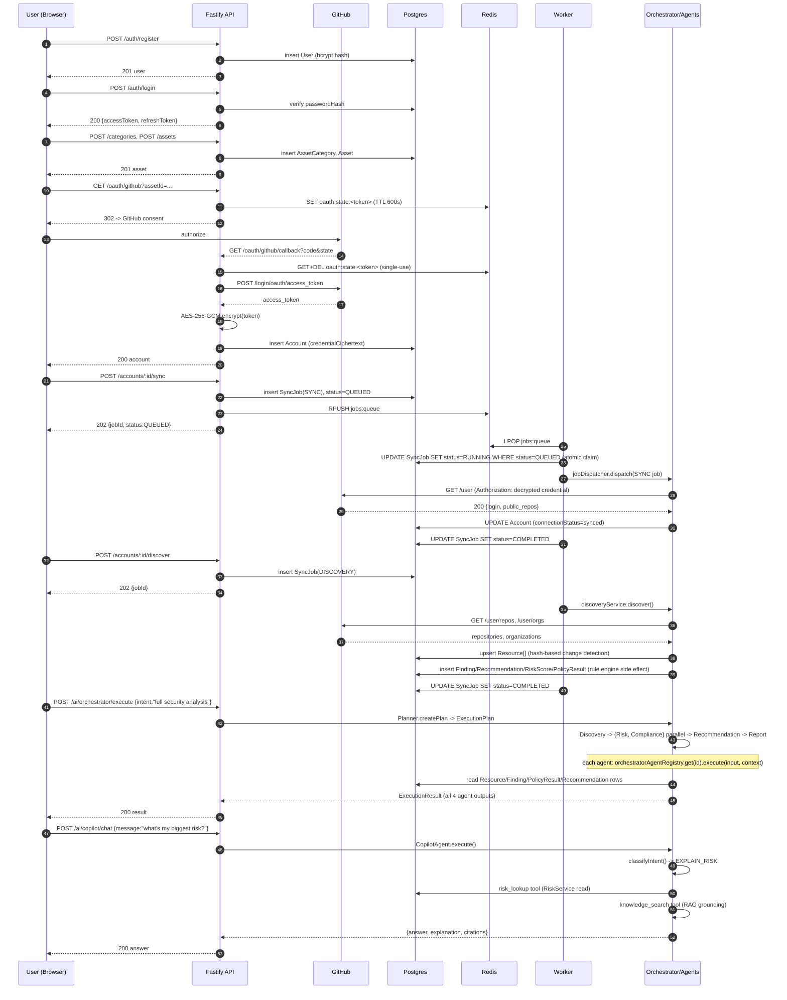
```mermaid
sequenceDiagram
    autonumber
    participant U as User (Browser)
    participant API as Fastify API
    participant GH as GitHub
    participant DB as Postgres
    participant R as Redis
    participant W as Worker
    participant O as Orchestrator/Agents

    U->>API: POST /auth/register
    API->>DB: insert User (bcrypt hash)
    API-->>U: 201 user

    U->>API: POST /auth/login
    API->>DB: verify passwordHash
    API-->>U: 200 {accessToken, refreshToken}

    U->>API: POST /categories, POST /assets
    API->>DB: insert AssetCategory, Asset
    API-->>U: 201 asset

    U->>API: GET /oauth/github?assetId=...
    API->>R: SET oauth:state:<token> (TTL 600s)
    API-->>U: 302 -> GitHub consent
    U->>GH: authorize
    GH-->>API: GET /oauth/github/callback?code&state
    API->>R: GET+DEL oauth:state:<token> (single-use)
    API->>GH: POST /login/oauth/access_token
    GH-->>API: access_token
    API->>API: AES-256-GCM encrypt(token)
    API->>DB: insert Account (credentialCiphertext)
    API-->>U: 200 account

    U->>API: POST /accounts/:id/sync
    API->>DB: insert SyncJob(SYNC), status=QUEUED
    API->>R: RPUSH jobs:queue
    API-->>U: 202 {jobId, status:QUEUED}

    W->>R: LPOP jobs:queue
    W->>DB: UPDATE SyncJob SET status=RUNNING WHERE status=QUEUED (atomic claim)
    W->>O: jobDispatcher.dispatch(SYNC job)
    O->>GH: GET /user (Authorization: decrypted credential)
    GH-->>O: 200 {login, public_repos}
    O->>DB: UPDATE Account (connectionStatus=synced)
    W->>DB: UPDATE SyncJob SET status=COMPLETED

    U->>API: POST /accounts/:id/discover
    API->>DB: insert SyncJob(DISCOVERY)
    API-->>U: 202 {jobId}
    W->>O: discoveryService.discover()
    O->>GH: GET /user/repos, /user/orgs
    GH-->>O: repositories, organizations
    O->>DB: upsert Resource[] (hash-based change detection)
    O->>DB: insert Finding/Recommendation/RiskScore/PolicyResult (rule engine side effect)
    W->>DB: UPDATE SyncJob SET status=COMPLETED

    U->>API: POST /ai/orchestrator/execute {intent:"full security analysis"}
    API->>O: Planner.createPlan -> ExecutionPlan
    O->>O: Discovery -> {Risk, Compliance} parallel -> Recommendation -> Report
    Note over O: each agent: orchestratorAgentRegistry.get(id).execute(input, context)
    O->>DB: read Resource/Finding/PolicyResult/Recommendation rows
    O-->>API: ExecutionResult (all 4 agent outputs)
    API-->>U: 200 result

    U->>API: POST /ai/copilot/chat {message:"what's my biggest risk?"}
    API->>O: CopilotAgent.execute()
    O->>O: classifyIntent() -> EXPLAIN_RISK
    O->>DB: risk_lookup tool (RiskService read)
    O->>O: knowledge_search tool (RAG grounding)
    O-->>API: {answer, explanation, citations}
    API-->>U: 200 answer
```

### 5.3 Every API Referenced Above

See **Section 16 (API Documentation)** for the complete, exhaustive endpoint reference (34 route files, every method/path/auth/request/response). The endpoints touched by the flow above:

`POST /auth/register`, `POST /auth/login`, `POST /categories`, `POST /assets`, `GET /oauth/github`, `GET /oauth/github/callback`, `POST /accounts/connect`, `POST /accounts/:id/sync`, `POST /accounts/:id/discover`, `GET /jobs/:id` (polling), `POST /ai/orchestrator/execute`, `POST /ai/risk/analyze`, `POST /ai/compliance/analyze`, `POST /ai/recommendation/analyze`, `POST /ai/report/generate`, `POST /ai/copilot/chat`.

***
## 6. Agent Architecture

### 6.1 Shared Contract

Every concrete agent implements the same interface (`ai/orchestrator/agents/agent.interface.ts`):

```typescript
interface OrchestratorAgent<TInput = Record<string, unknown>, TOutput = unknown> {
  readonly id: string;
  readonly description: string;
  canHandle(taskType: string): boolean;
  execute(input: TInput, context: OrchestrationContext): Promise<TOutput>;
}
```

Registration is a pure side effect: each agent's own `<agent>/index.ts` constructs its concrete `Memory`/`Telemetry`/`Executor`/`AgentImpl` classes and calls `orchestratorAgentRegistry.register(instance)` at import time. The registry (`ai/orchestrator/agent-registry.ts`) starts **empty** — nothing is registered until something imports an agent's `index.ts` (its route file, or `job-dispatcher.ts`'s dynamic import). No execution engine ever constructs an agent directly; every one of them resolves by string id and throws `AgentNotRegisteredError` if it isn't there yet.

All six agents share a common shape internally: a `.tool.ts` file wrapping existing backend services as `ToolDefinition`s, a private `callTool()` helper in the executor wrapping `ToolRegistry.execute()` in `withRetry` (3 attempts, 200ms backoff, non-retryable on structural errors like "not found"), and an LLM call (when one happens) through `aiFoundation.llmClient.generate({model: 'gpt-4o-mini', ...})` wrapped in try/catch with a deterministic fallback string — **no agent's correctness depends on an LLM API key being configured.**

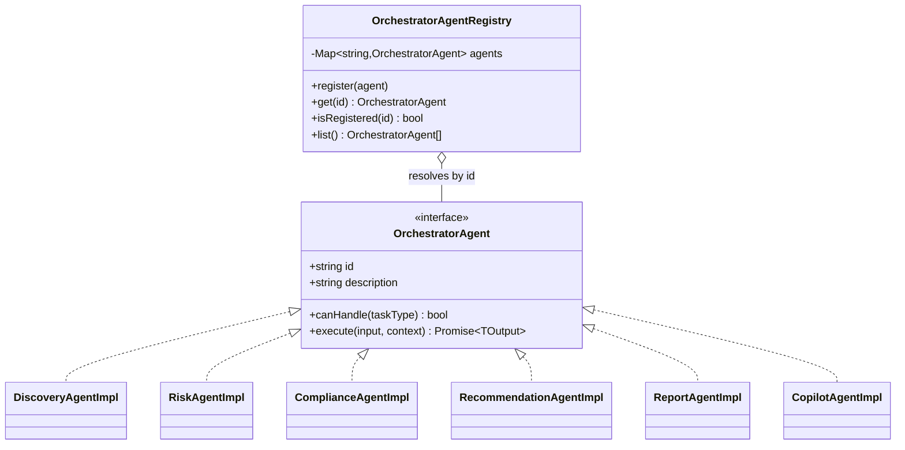
```mermaid
classDiagram
    class OrchestratorAgent {
        <<interface>>
        +string id
        +string description
        +canHandle(taskType) bool
        +execute(input, context) Promise~TOutput~
    }
    class DiscoveryAgentImpl
    class RiskAgentImpl
    class ComplianceAgentImpl
    class RecommendationAgentImpl
    class ReportAgentImpl
    class CopilotAgentImpl
    OrchestratorAgent <|.. DiscoveryAgentImpl
    OrchestratorAgent <|.. RiskAgentImpl
    OrchestratorAgent <|.. ComplianceAgentImpl
    OrchestratorAgent <|.. RecommendationAgentImpl
    OrchestratorAgent <|.. ReportAgentImpl
    OrchestratorAgent <|.. CopilotAgentImpl
    class OrchestratorAgentRegistry {
        -Map~string,OrchestratorAgent~ agents
        +register(agent)
        +get(id) OrchestratorAgent
        +isRegistered(id) bool
        +list() OrchestratorAgent[]
    }
    OrchestratorAgentRegistry o-- OrchestratorAgent : resolves by id
```

### 6.2 Discovery Agent

| | |
|---|---|
| **Purpose** | Discover GitHub repositories/organizations for a connected account; the DAG's only agent with zero upstream dependency. |
| **Input** | `{accountId?: string}` (falls back to `context.connectedAccounts[0]?.id`) |
| **Output** | `DiscoveryAgentOutput`: `status, provider, accountId, resourceCount, resources[], repositories[], organizations[], languages[], topics[], relationships:{created,updated,unchanged}, metadata, summary, confidenceScore, warnings[], errors[]` |
| **Execution** | `getOwnedAccount` → check provider implemented → tool `github_discover_repositories` (real GitHub call via `DiscoveryService`) → `recordAgentOutput` → tools `github_summarize_languages`/`github_summarize_topics` (enrichment, best-effort) → `memory.rememberDiscoveredResourceIds` → `confidenceFor()` → LLM summary → `memory.recordRun()` |
| **Tools** | 4 real (`discovery/github.tool.ts`); 6 placeholder (branches, contributors, releases, workflows, security advisories, secret scanning) that always reject |
| **Memory** | `DiscoveryMemory`, own Redis store, keys `discovery-agent:*:{accountId}`, 30d TTL |
| **Prompt** | Yes — `discoverySummaryPrompt` (`discovery.prompts.ts`), model `gpt-4o-mini`; degrades to a template string on failure |
| **Communication** | None consumed — first node in every workflow |
| **Confidence** | `!success → 0.4/0`; `errors>0 → 0.5`; `warnings>0 → 0.75`; else `1` |
| **Errors** | `DiscoveryAgentError`, `UnsupportedAgentProviderError` |

### 6.3 Risk Agent

| | |
|---|---|
| **Purpose** | Narrate the deterministic rule engine's risk output — findings, evidence, business impact — never re-scores anything. |
| **Input** | `{assetId?: string}` (falls back to `context.assets[0]?.id`) |
| **Output** | `RiskAgentOutput`: `status, assetId, overallScore, businessImpact, counts, findings: RiskFindingView[], criticalFindings[], highFindings[], mediumFindings[], lowFindings[], metadata, summary, confidenceScore, warnings[], errors[]` |
| **Execution** | Validate `assetId` (else `MissingRiskTargetError`) → `getOwnedAsset` → tool `risk_engine_score` → tool `risk_finding_store_list` → `recordAgentOutput` (stepId `risk.scoring`) → `buildFindingView()` (deterministic explanation lookup + `repeated` flag from memory) → sort by severity → `explainTopFindings()` (LLM rephrase, top 5 only) → `memory.rememberSeenRuleCodes` + `recordScoreSnapshot` → `businessImpactFromCounts()` → LLM summary → `memory.recordRun()` |
| **Tools** | 4 real (`risk.tool.ts`: engine score, asset lookup, finding list, repository aggregate); 5 placeholder (secrets scanner, branch protection, workflow risk, dependency risk, security alert) |
| **Memory** | `RiskMemory`, keys `risk-agent:*:{assetId}` incl. `score-history`/`seen-rule-codes`/`acknowledged`, 30d TTL |
| **Prompt** | Two — `riskSummaryPrompt` and `riskFindingExplanationPrompt` (max 5 findings), model `gpt-4o-mini`. Score/severity/priority are **never** LLM-decided — narration only |
| **Communication** | Writes `recordAgentOutput(stepId:'risk.scoring', output:{overallScore,counts,findingCount})` — read downstream by Recommendation and Debate |
| **Confidence** | Same shape as Discovery's `confidenceFor()` |
| **Errors** | `RiskAgentError`, `MissingRiskTargetError` |

### 6.4 Compliance Agent

| | |
|---|---|
| **Purpose** | Evaluate an asset against 4 real frameworks (NIST CSF, CIS Controls, ISO 27001, SOC 2) by joining the rule engine's `PolicyResult`s against a static catalog. |
| **Input** | `{assetId?: string}` |
| **Output** | `ComplianceAgentOutput`: `status, assetId, complianceScore, passCount, failCount, warningCount, notApplicableCount, policyFailures[], policyPasses[], frameworks: ComplianceFrameworkResult[], metadata, summary, confidenceScore, warnings[], errors[]` |
| **Execution** | Validate `assetId` (else `MissingComplianceTargetError`) → `getOwnedAsset` → tool `compliance_engine_evaluate` (authoritative score) → `recordAgentOutput` (stepId `compliance.evaluating`) → per framework, tool `compliance_control_coverage` → `explainTopGaps()` (LLM, max 5 FAIL/MISSING) → `memory.rememberSeenViolations` + snapshot → LLM summary → `memory.recordRun()` |
| **Tools** | 8, **all real** — the only agent with zero placeholder tools (`compliance_engine_evaluate`, `policy_lookup`, `finding_lookup`, `asset_lookup`, `framework_mapping` [static catalog, no backend call], `control_coverage`, `evidence`, `store`) |
| **Memory** | `ComplianceMemory`, keys `compliance-agent:*:{assetId}`, 30d TTL |
| **Prompt** | Two — `complianceSummaryPrompt`, `complianceGapExplanationPrompt`, model `gpt-4o-mini`. Control PASS/FAIL/MISSING status is never LLM-decided |
| **Communication** | Writes `recordAgentOutput(stepId:'compliance.evaluating', output.policyFailures)` — read downstream by Recommendation and Debate |
| **Confidence** | Same `confidenceFor()` shape |
| **Errors** | `ComplianceAgentError`, `MissingComplianceTargetError` |

### 6.5 Recommendation Agent — the first *collaborative* agent

| | |
|---|---|
| **Purpose** | Merge persisted `Recommendation` rows with Risk's findings and Compliance's policy failures into one prioritized, cross-referenced, confidence-scored list. |
| **Input** | `{assetId?: string}` |
| **Output** | `RecommendationAgentOutput`: `status, assetId, recommendations: RecommendationView[], prioritized[] (sorted), handoffSources: RecommendationHandoffSource[], metadata, summary, confidenceScore, warnings[], errors[]` |
| **Execution** | Validate `assetId` → `getOwnedAsset` → `resolveHandoffFromContext()` reads the most recent SUCCESS `risk-agent`/`compliance-agent` entries out of `context.agentOutputs`, adapting via `findingsFromRiskOutput`/`findingsFromComplianceOutput` → if Risk didn't run, falls back to tool `recommendation_finding_lookup` (direct DB read); Compliance has **no fallback** — a missing compliance run just omits cross-references → tool `recommendation_engine_list` (persisted, `status==='OPEN'` only) → `recordAgentOutput` (stepId `recommendation.aggregating`) → `mergeRecommendations()` (join by `findingId`/`resourceId`, `aggregateConfidence()` per item) → `prioritizeRecommendations()` (sort priority-then-confidence) → LLM summary → `memory.recordRun()` |
| **Tools** | 3, all real (`recommendation.tool.ts`) |
| **Memory** | `RecommendationMemory`, keys `recommendation-agent:*:{assetId}`, 30d TTL |
| **Prompt** | `recommendationSummaryPrompt`, model `gpt-4o-mini`; skipped when `count===0` |
| **Communication (explicit read)** | The clearest cross-agent read in the codebase — reads `context.agentOutputs` for `risk-agent.output.findings` and `compliance-agent.output.policyFailures` directly, via `recommendation.aggregate.ts`'s `resolveHandoffFromContext()` |
| **Confidence** | Two layers: run-level `confidenceFor()`, and per-item `aggregateConfidence(findings)` = `avg(confidence) + (distinctAgents>1 ? +5 : 0)`, capped 100 |
| **Errors** | `RecommendationAgentError`, `MissingRecommendationTargetError` |

### 6.6 Report Agent — the terminal aggregator

| | |
|---|---|
| **Purpose** | Aggregate Discovery/Risk/Compliance/Recommendation into one final document with an executive summary. Performs **no evaluation of its own**. |
| **Input** | `{assetId?: string}` |
| **Output** | `ReportAgentOutput`: `status, assetId, summary, sections: ReportSection[], executive: ReportExecutiveSummary, metadata, confidenceScore, warnings[], errors[]` |
| **Execution** | `report_asset_lookup` (ownership check, the *only* tool this agent calls) → for each of the 4 upstream agents in fixed order: (a) live SUCCESS entry in context → `INCLUDED`/`origin:'context'`, feeds `applyToExecutive()` (duck-typed reads); (b) live FAILED entry → `FAILED`; (c) risk/compliance/recommendation only (not discovery) → `readMemoryFallback()` **dynamically imports the sibling agent's own `index.ts`** to read its memory's `getLastRun(assetId)` → `INCLUDED`/`origin:'memory'`; (d) else → `MISSING`/`origin:'unavailable'` → `recordAgentOutput` (stepId `report.aggregating`) → status derived from included/missing counts → LLM summary composed purely from section content (never invents facts) → `memory.recordRun()` |
| **Tools** | 1 (`report_asset_lookup`) |
| **Memory** | `ReportMemory`, own store; **also reads** `riskMemory`/`complianceMemory`/`recommendationMemory` from those agents' own composition roots — the only agent that reaches directly into another agent's memory |
| **Prompt** | `reportSummaryPrompt`, model `gpt-4o-mini` |
| **Communication** | Reads all four upstream agents' live context entries, with a memory-based fallback for three of them |
| **Confidence** | `status==='FAILED'→0`; `0 included→0`; else `min(1, avg(section.confidence ?? 70)/100)` |
| **Errors** | `ReportAgentError`, `MissingReportTargetError` |

### 6.7 Copilot Agent — the conversational interface

| | |
|---|---|
| **Purpose** | Answer free-text questions about risk/compliance/recommendations, auto-triggering upstream workflows when the answer isn't ready yet, grounded via RAG. |
| **Input** | `{assetId?: string; conversationId?: string; message: string}` |
| **Output** | `CopilotAgentOutput`: `status, answer, explanation: CopilotExplanation, intent: CopilotIntent, assetId?, conversationId, triggeredWorkflow?, sourceAgents[], citations?[], metadata, confidenceScore, warnings[], errors[]` |
| **Execution** (the most complex of the six) | Validate `conversationId` → load session → append user turn → `classifyIntent()` (regex, `copilot.intent.ts`; `FOLLOW_UP`→`session.lastIntent`) → resolve `assetId` (input→session→context) → if no asset, static `NO_ASSET_EXPLANATION`; else `copilot_asset_lookup` → `selectTool()` (regex over message for GitHub issues/PRs/branches/knowledge/count-findings) — if matched, run via the shared `ToolExecutor` (permission-checked, distinct from internal `callTool()`); else if `resourceCount===0` or intent is `ANALYZE`, `tryTriggerWorkflow()` **re-enters the full public `OrchestratorService.execute()`** (not a direct agent call) → `gatherExplanation(intent)` (switch, calls dedicated lookup tools) → `retrieveGrounding()` (RAG via `knowledge_search` tool, folds text into `evidence`, ids into `citations`) → ownership errors are re-thrown, never degraded → `recordAgentOutput` (stepId `copilot.gathering`) → LLM `generateAnswer()` (rephrases the deterministic explanation, never adds facts) → append assistant turn → `memory.recordRun()` |
| **Tools** | 4 dedicated lookups +, via the shared `ToolExecutor`, generic GitHub/knowledge/Postgres tools — the only agent that calls tools outside its own registry wrapper |
| **Memory** | `CopilotMemory` — the only agent composing **three** stores: `ConversationMemory` (turn log), `SessionMemory` (`CopilotSessionState`), and its own execution-trace store |
| **Prompt** | `copilotAnswerPrompt`, model `gpt-4o-mini`. `classifyIntent()`/`selectTool()` are deterministic regex, **not** LLM calls |
| **Communication** | Indirect only — via service-wrapping tools, never `context.agentOutputs` directly; Intelligent Routing always re-enters through the same public Orchestrator entry point every external caller uses |
| **Confidence** | No dedicated formula — `explanation.confidence / 100`, set ad hoc per branch (90 if top findings present, 85 for tool-result evidence, 0 on failure, 20-50 for degraded paths) |
| **Errors** | `CopilotAgentError`, `MissingConversationIdError` |

### 6.8 Agent Comparison Matrix

| Agent | Calls LLM | Cross-agent read | Own memory | Zero placeholder tools | Terminal in DAG |
|---|:---:|:---:|:---:|:---:|:---:|
| Discovery | ✓ | — | ✓ | ✗ (6 placeholders) | — (root) |
| Risk | ✓ (x2) | — | ✓ | ✗ (5 placeholders) | — |
| Compliance | ✓ (x2) | — | ✓ | ✓ | — |
| Recommendation | ✓ | ✓ (Risk, Compliance) | ✓ | ✓ | — |
| Report | ✓ | ✓ (all 4, live + memory fallback) | ✓ + reads 3 others' | ✓ | ✓ |
| Copilot | ✓ | Indirect (services, orchestrator re-entry) | ✓ (3 composed stores) | ✓ | — (any-time) |

***
## 7. LangGraph Architecture

`ai/langgraph/` (Phase 27) is a second, fully additive execution engine over the same six agents — nothing in `ai/orchestrator/` was modified to add it.

### 7.1 Graph State

`ai/langgraph/state.ts` defines `GraphState` via LangGraph's `Annotation.Root`:

```
goal, intent, messages (append reducer), asset, connectedAccounts,
discovery, risk, compliance, recommendations, report (each: overwrite reducer),
knowledge (append), memory: {conversationTurns, session} (overwrite),
toolResults (append), reflection (overwrite),
approval: {requestIdByStep, pendingApprovalIds, rejectedStepIds} (overwrite),
executionTrace: AgentOutputEntry[] (append),
metadata: Record<string,unknown> (merge reducer)
```

### 7.2 Nodes

Built by `makeAgentNode(config)` (`ai/langgraph/nodes.ts`) — one factory producing five nodes (`discoveryNode`, `riskNode`, `complianceNode`, `recommendationNode`, `reportNode`), plus two hand-written nodes:

| Node | Behavior |
|---|---|
| `discovery-node` … `report-node` | Idempotent-replay guard (skip if `executionTrace` already has a terminal entry for this step) → approval-policy check (see §7.5) → `orchestratorAgentRegistry.get(agentId).execute(...)` — the exact same call `WorkflowEngine` makes → optional knowledge retrieval → trace entry |
| `copilot-node` | Conversational — appends to `messages` rather than writing an analysis-slot state key |
| `reflection-node` | The graph's literal final node ("auto-run ReflectionEngine after END"). Loads/derives a `ReasoningPlan`, converts `GraphState` to an `ExecutionResult`, runs `Critic` + `ReflectionEngine`, saves to `ReflectionStore`, fires `captureEpisodeSafely`. Idempotent — skips if `state.reflection` already set |

### 7.3 Graph Assembly & Edges

`buildGraphFromSteps(graphId, steps)` (`graph-builder.ts`) is the shared assembly function behind both `buildWorkflowGraph(definition)` (a registered `WorkflowDefinition`) and `buildDynamicGraph(graphId, steps)` (Phase 28's LLM-authored plans, no registry lookup needed):

1. One node per step, wrapped by `withDependencyGate(stepId, agentId, dependsOn, node)` — since a plain LangGraph `addEdge` fires regardless of upstream success/failure, this wrapper checks that every `dependsOn` entry has a `SUCCESS` trace entry before actually invoking the node; otherwise it records a `SKIPPED` entry and short-circuits. This reproduces `WorkflowEngine`'s condition-gating semantics inside LangGraph's own topology.
2. A static `addEdge` per `dependsOn` relationship — two independent branches sharing only their upstream dependency (e.g. Risk and Compliance, both depending solely on Discovery) genuinely run **concurrently within the same Pregel superstep** once that dependency resolves. There is no explicit "wave" abstraction here (unlike `WorkflowEngine.buildWaves`) — concurrency falls directly out of the edge topology.
3. Every terminal step (nothing depends on it) is wired into a shared `reflection-node → END`.
4. Compiled with `checkpointer: new MemorySaver()` (LangGraph's own in-process checkpointer, distinct from this project's own durable `GraphCheckpointStore`).

### 7.4 Conditional Edges (genuine, not gate-based)

A separate hand-built demo graph, `buildConditionalGraph()` (`CONDITIONAL_GRAPH_ID = 'security-conditional'`), uses LangGraph's real value-based `addConditionalEdges`:

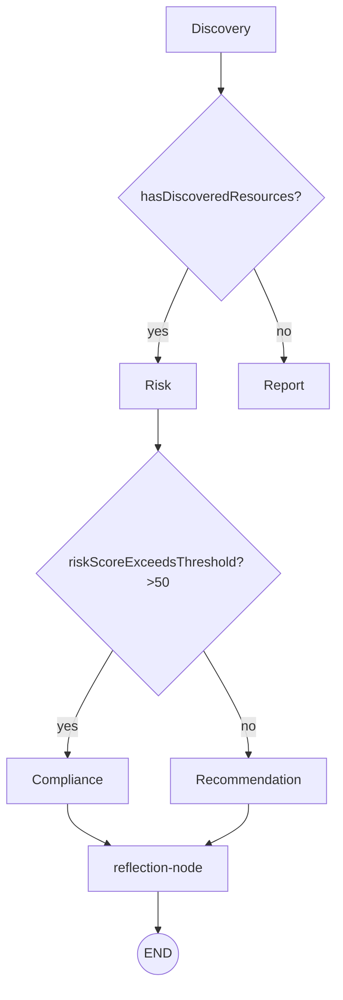
```mermaid
graph TD
    Discovery --> Cond1{hasDiscoveredResources?}
    Cond1 -->|yes| Risk
    Cond1 -->|no| Report
    Risk --> Cond2{riskScoreExceedsThreshold? >50}
    Cond2 -->|yes| Compliance
    Cond2 -->|no| Recommendation
    Compliance --> Reflection[reflection-node]
    Recommendation --> Reflection
    Reflection --> END((END))
```

`hasDiscoveredResources(state)` reads `state.discovery.resourceCount`; `riskScoreExceedsThreshold(state)` reads `state.risk.overallScore` against `RISK_SCORE_THRESHOLD = 50` — both pure, read-only functions in `edges.ts`. This is distinct from `withDependencyGate`'s pass/fail gating: it's genuine branch *selection*, not a retry/skip mechanism.

### 7.5 Human Approval Inside a Node

Each agent node checks `approvalPolicy.decideForAgent(agentId)`. If not `NEVER`:

- Requests (or idempotently reuses, via a **deterministic id** `appr-graph-${executionId}-${stepId}` — critical because `interrupt()` pauses by throwing, so on replay the node must find the *same* pending request from the durable `ApprovalStore`, not from `GraphState`, which was never updated before the throw) an `ApprovalRequest`.
- While `PENDING`, calls LangGraph's native `interrupt<GraphApprovalInterrupt, GraphApprovalResume>({approvalId, stepId, agentId, reason})` — this **throws**, pausing the whole graph mid-execution.
- On `REJECTED` → records `rejectedStepIds`, agent never called.
- On an `editedOutput` (reviewer-supplied replacement) → writes it directly as `SUCCESS`, agent never called.
- Otherwise → proceeds to the real `.execute()` call.

### 7.6 Checkpoint / Resume / Interrupt

Two checkpoint layers, deliberately distinct:

1. **LangGraph's own `MemorySaver`** — compiled into the graph object, lives only for the process's lifetime, is what makes `interrupt()`/`Command({resume})` work at all in-process.
2. **`GraphCheckpointStore`** (`graph.checkpoint.ts`) — this project's own durable layer, Redis-backed (`langgraph:checkpoint:`, 7d TTL), storing `{executionId, graphId, values: GraphState, next: string[], pendingApprovals, updatedAt}` as plain JSON. This is what survives a **process restart**, which `MemorySaver` cannot.

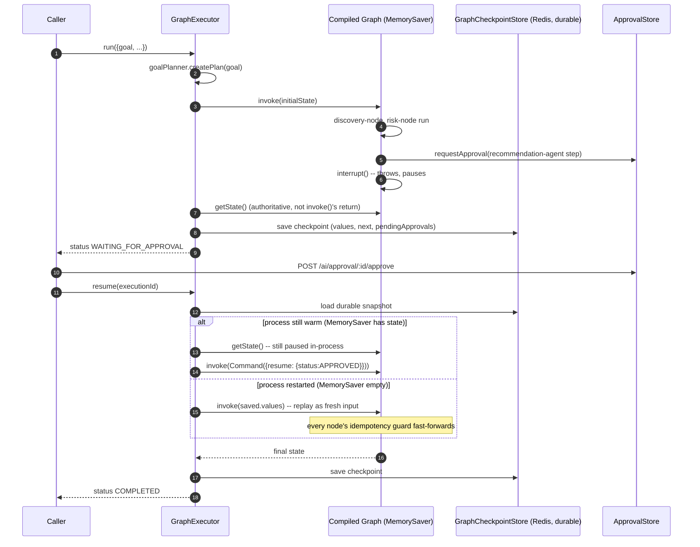
```mermaid
sequenceDiagram
    autonumber
    participant Caller
    participant GE as GraphExecutor
    participant CG as Compiled Graph (MemorySaver)
    participant CS as GraphCheckpointStore (Redis, durable)
    participant AS as ApprovalStore

    Caller->>GE: run({goal, ...})
    GE->>GE: goalPlanner.createPlan(goal)
    GE->>CG: invoke(initialState)
    CG->>CG: discovery-node, risk-node run
    CG->>AS: requestApproval(recommendation-agent step)
    CG->>CG: interrupt() -- throws, pauses
    GE->>CG: getState() (authoritative, not invoke()'s return)
    GE->>CS: save checkpoint (values, next, pendingApprovals)
    GE-->>Caller: status WAITING_FOR_APPROVAL

    Caller->>AS: POST /ai/approval/:id/approve
    Caller->>GE: resume(executionId)
    GE->>CS: load durable snapshot
    alt process still warm (MemorySaver has state)
        GE->>CG: getState() -- still paused in-process
        GE->>CG: invoke(Command({resume: {status:APPROVED}}))
    else process restarted (MemorySaver empty)
        GE->>CG: invoke(saved.values) -- replay as fresh input
        Note over CG: every node's idempotency guard fast-forwards
    end
    CG-->>GE: final state
    GE->>CS: save checkpoint
    GE-->>Caller: status COMPLETED
```

`extractPendingApprovals()` reads from `snapshot.tasks[].interrupts[].value` — the authoritative *live* source — never from `state.approval.pendingApprovalIds`, which only reflects the last round a node *returned normally* and is therefore stale while actually interrupted.

### 7.7 Recovery

If the process restarts while a graph is paused, `resume()` detects `MemorySaver` has nothing for that `thread_id` and replays the durable `values` back in as a brand-new `invoke()` call. This only works because **every node is idempotent** by construction (the replay guard at the top of `makeAgentNode`) — the graph "fast-forwards" through already-completed steps without re-running them or re-billing an LLM call.

### 7.8 Telemetry

`graph.telemetry.ts` — Prometheus metrics `estateai_ai_langgraph_runs_total{graphId,status}`, `_duration_seconds{graphId}`, `_nodes_visited_total{graphId}`, `_parallel_branches{graphId}` (gauge, computed by the same Kahn's-algorithm wave-width metric `WorkflowEngine` uses), `_checkpoints_total{graphId}`, `_retries_total{graphId,agentId}`, `_memory_usage_bytes`.

***

## 8. Planner Architecture

Two structurally different planners exist side by side, plus two distinct execution-orchestration layers wrapping them.

### 8.1 Goal Planner (deterministic)

`ai/planner/goal-planner.ts`'s `GoalPlanner` does not select a workflow itself — it delegates that to `ai/orchestrator/planner.ts`'s `Planner.createPlan()`, which matches the goal string against a fixed, ordered regex list (`/github|organization|org\b|full|complete|everything/i` → `full-security-analysis`; `/risk/i` → `risk-only`; `/complian/i` → `compliance-only`; first match wins, no match throws `PlanningError`). `GoalPlanner` then decorates the result into a `ReasoningPlan`: attaches each step's tool access from `AGENT_TOOL_ACCESS`, computes `requiredAgents`/`requiredTools`, `estimatedComplexity` (LOW ≤1 step, MEDIUM ≤3, else HIGH), `estimatedDurationMs` (longest dependency-chain depth × 4000ms — waves run in parallel, not additively), and `confidence` (`0.9 - min(stepCount,5)*0.05`, floor 0.5).

`revisePlan(plan, result)` recursively marks a step "doomed" if it or any transitive dependency failed, keeps only survivors, and recomputes every aggregate field — this is a **post-hoc explanation** of what happened, not a re-execution; the actual live skip logic happens through per-step `condition` functions during the original run.

### 8.2 Workflow Registry

`ai/orchestrator/workflow.registry.ts` — a `Map<id, WorkflowDefinition>`, five workflows registered at module load:

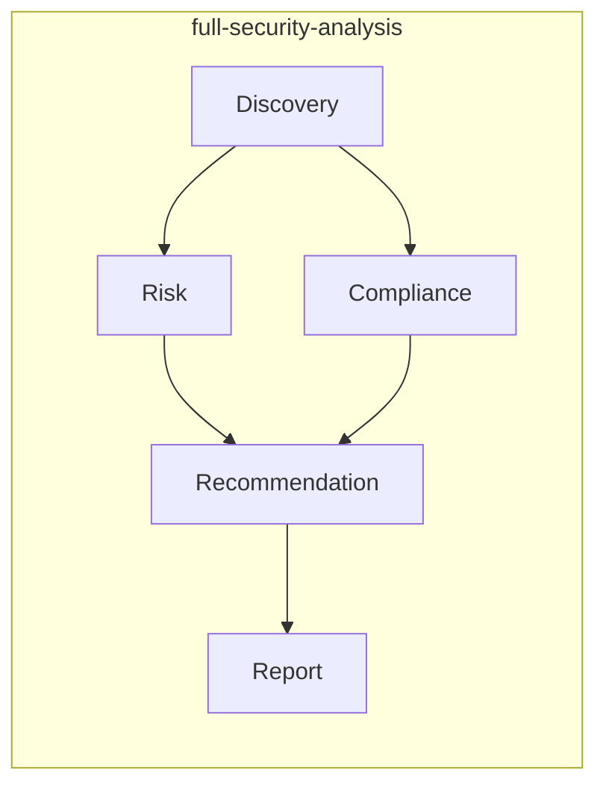
```mermaid
graph LR
    subgraph "full-security-analysis"
    D1[Discovery] --> R1[Risk]
    D1 --> C1[Compliance]
    R1 --> Rec1[Recommendation]
    C1 --> Rec1
    Rec1 --> Rep1[Report]
    end
```

Plus four smaller workflows: `risk-only` (Discovery→Risk), `compliance-only` (Discovery→Compliance), `discovery-recommendation` (Discovery→Recommendation, skipping Risk/Compliance), `risk-recommendation` (Discovery→Risk→Recommendation, skipping Compliance).

### 8.3 Workflow Builder / Engine

`WorkflowEngine.run()` partitions `WorkflowStepDefinition[]` into dependency "waves" via a Kahn's-algorithm-style topological sort (`buildWaves`), then executes each wave with `Promise.all(wave.map(runStep))` — true parallel execution within a wave, sequential across waves. Each step: evaluates its `condition` (skip if false) → checks agent registration → `withRetry` (configurable `maxAttempts`) → optional `timeoutMs` race. Circular/unresolved dependencies throw `WorkflowError` at build time.

### 8.4 Execution Context

`OrchestrationContext` (§6.1's shared substrate) is what every planner ultimately hands to every agent — `agentOutputs`, `toolOutputs`, `previousDecisions`, `memoryReferences`, threaded and mutated in place across the whole run.

### 8.5 Reflection Loop & Revision Loop

Two different loops, easy to conflate:

- **Reflection** (single pass, always runs): after execution, `Critic.evaluateExecution()` → `ReflectionEngine.reflect()` → `ReflectionStore.save()` — one report per run, no looping.
- **Revision loop** (LLM Planner only, Phase 28, §8.7): a genuinely *iterative* loop that re-plans based on reflection feedback, capped at 3 iterations.

### 8.6 Confidence

Confidence is computed at multiple layers and never collapses to a single number arbitrarily — `aggregateConfidence()` (`ai/critic/confidence.ts`) blends `toolSuccessRatio*0.15 + agentConfidenceAvg*0.3 + retrievalConfidence*0.2 + criticScore*0.35` (retrieval defaults to a neutral 0.7 when not supplied — which is always, in `ReflectionEngine.reflect()`'s own call). This is the single confidence formula reused by Reflection; the LLM Planner's own plan-level `overallConfidence` is a separate, self-reported LLM output, validated only for being in `[0,1]`, not cross-checked against this formula.

### 8.7 LLM Planner — Dynamic Planning

`ai/llm-planner/` (Phase 28) is the one genuinely LLM-driven planner in the codebase.

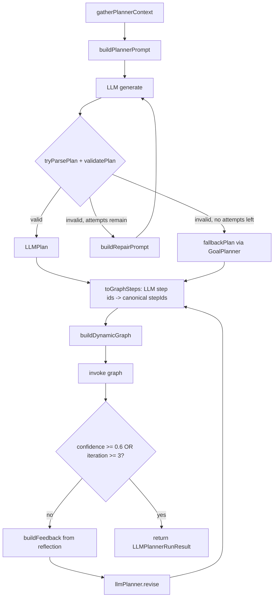
```mermaid
flowchart TD
    A[gatherPlannerContext] --> B[buildPlannerPrompt]
    B --> C[LLM generate]
    C --> D{tryParsePlan + validatePlan}
    D -->|valid| E[LLMPlan]
    D -->|invalid, attempts remain| F[buildRepairPrompt] --> C
    D -->|invalid, no attempts left| G[fallbackPlan via GoalPlanner]
    E --> H[toGraphSteps: LLM step ids -> canonical stepIds]
    G --> H
    H --> I[buildDynamicGraph]
    I --> J[invoke graph]
    J --> K{confidence >= 0.6 OR iteration >= 3?}
    K -->|no| L[buildFeedback from reflection] --> M[llmPlanner.revise] --> H
    K -->|yes| N[return LLMPlannerRunResult]
```

**Context gathering** (`planner.memory.ts`'s `gatherPlannerContext`) runs 5 lookups in parallel: conversation turns, session state, knowledge summary + version (a cheap `"count:latestTimestamp"` proxy, not a content hash — used as part of the cache key), reflection summary (only if `metadata.previousExecutionId` is given — no scan-by-goal exists), and **episode summary** (Phase 30, `episodeSearch.search({goal, assetId, topK:3})`) — every lookup fails soft.

**Validation** (`planner.validator.ts`) is strict and all-or-nothing: empty steps, out-of-range confidence, duplicate ids (auto-assigned), unknown agent (normalized via aliases, e.g. `risk`→`risk-agent`), unknown tool category, missing dependency, and a DFS-based dependency-cycle check — any one failure invalidates the whole plan (`PlanValidationError`).

**Caching** (`planner.cache.ts`) — key = SHA-256 of `goal|assetId|knowledgeVersion|model`, 15-minute default TTL.

**Execution** (`planner.executor.ts`'s `LLMPlannerExecutor`) — `toGraphSteps()` translates the LLM's arbitrary step ids onto the fixed canonical stepIds each pre-built LangGraph node expects (`discovery-agent→'discovery'`, etc.), since a hand-authored plan can't be relied on to name steps the way `withDependencyGate` requires; duplicate-agent steps are deduped. `buildDynamicGraph(graphId, steps)` needs **no `WorkflowRegistry` entry** — this is what makes the plan genuinely dynamic rather than a lookup into the same five registered workflows.

**Revision loop** — while status isn't `WAITING_FOR_APPROVAL` and `confidenceOf(state, plan) < 0.6` and `iteration < 3`: build feedback from the reflection report (overallConfidence, failedSteps, missingEvidence, criticScore), call `llmPlanner.revise(...)` with that feedback, re-run. `confidenceOf()` prefers the **reflection's** confidence over the plan's own self-reported one once a reflection exists — the loop trusts its own post-hoc judgment over the LLM's initial optimism.

***
## 9. Tool Calling Architecture

### 9.1 Two Layers, Deliberately Distinct

`ai/tools/tool-registry.ts`'s `ToolRegistry.execute()` is the **low-level, unopinionated** execution path: validate input against `inputSchema` (zod) → run `tool.execute()` → validate output against `outputSchema` → append to `context.toolHistory` → return. It **throws** on any failure and knows nothing about which agent is calling it.

`ai/tools/tool-executor.ts`'s `ToolExecutor.run()` is the **policy-enforcing** path every agent and Copilot actually call: it never throws, always resolves a `ToolResult{success, output?, error?, durationMs}`, and adds two checks *before* delegating to the registry:

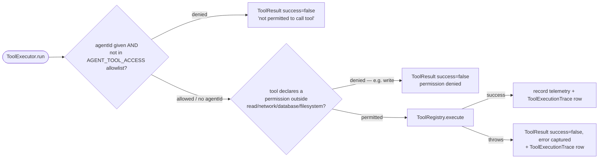
```mermaid
flowchart LR
    Start([ToolExecutor.run]) --> A{agentId given AND\nnot in AGENT_TOOL_ACCESS allowlist?}
    A -->|denied| Fail1[ToolResult success=false\n'not permitted to call tool']
    A -->|allowed / no agentId| B{tool declares a\npermission outside\nread/network/database/filesystem?}
    B -->|denied — e.g. write| Fail2[ToolResult success=false\npermission denied]
    B -->|permitted| C[ToolRegistry.execute]
    C -->|success| D[record telemetry + ToolExecutionTrace row]
    C -->|throws| E[ToolResult success=false, error captured\n+ ToolExecutionTrace row]
```

Order matters: the agent-allowlist check runs before the permission check, so a denied call is recorded precisely as "not permitted for this agent," not folded into a generic failure.

### 9.2 Permission Model

`ai/tools/tool-permissions.ts`: `ALLOWED_PERMISSIONS = {read, network, database, filesystem}`. **`write` is not in the allowed set** — any tool declaring `write` is refused by `assertPermitted()` before it can run. This is the deliberate, current-state posture: **the entire tool framework is read-only**. `ApprovalPolicy.decideForToolPermissions()` exists as forward-looking infrastructure (a tool declaring `write` would map to `MANUAL` approval) but has no live caller today, since no tool actually declares it.

### 9.3 Per-Agent Tool Access

`ai/tools/agent-tool-access.ts`'s `AGENT_TOOL_ACCESS` is a static allowlist, checked only by `ToolExecutor` (not `ToolRegistry`, which stays permission-agnostic for callers that bypass the executor entirely, e.g. internal `callTool()` helpers):

| Agent | Allowed tools |
|---|---|
| discovery-agent | 4 `github_*` discovery tools |
| risk-agent | `risk_engine_score`, `risk_asset_lookup`, `risk_finding_store_list`, `risk_repository_aggregate`, `knowledge_search` |
| compliance-agent | 7 `compliance_*` tools + `postgres_query`/`list_tables`/`table_info` + `knowledge_search` |
| recommendation-agent | 3 `recommendation_*` tools + `knowledge_search` |
| report-agent | `report_asset_lookup` + `knowledge_search` |
| copilot-agent | 4 `copilot_*` lookups + `knowledge_search` + 6 generic `github_*` tools + Postgres tools + `web_search` |

An unrecognized `agentId` is denied by default.

### 9.4 Builtin Tools

| Tool file | Tools | Permissions | Notes |
|---|---|---|---|
| `postgres.tool.ts` | `postgres_query`, `postgres_list_tables`, `postgres_table_info` | `read, database` | `postgres_query` enforces read-only via `assertReadOnlySelect()`: rejects multi-statement SQL, requires the statement start with `SELECT`/`WITH`, and rejects `INSERT/UPDATE/DELETE/DROP/ALTER/CREATE/TRUNCATE/GRANT/REVOKE/COPY/EXECUTE/CALL/MERGE/VACUUM/REINDEX` anywhere in the text. Grants access to the **entire application database**, no per-row authorization — deliberately excluded from Copilot's automatic free-text tool selection for that reason. `table_info`'s row-count query interpolates a table name only after verifying it against `information_schema.tables` first, closing an injection gap. |
| `filesystem.tool.ts` | `fs_read_file`, `fs_list_directory`, `fs_search_files` | `read, filesystem` | Sandboxed under `<cwd>/var/fs-tool-root`; `resolveSandboxed()` compares resolved absolute paths (not string matching) to reject traversal. `fs_read_file` caps at 200KB. No write operation exists in the API surface at all. |
| `github.tool.ts` | `github_repository_info`, `github_repo_branches`, `github_list_files`, `github_commit_history`, `github_list_pull_requests`, `github_list_issues` | `read, network` | Distinct from Discovery Agent's own `discovery/github.tool.ts` (wraps persisted resources) — this makes **live** GitHub REST calls, using a credential resolved via `getOwnedAccount()` (ownership-checked first) + AES-256-GCM decryption. |
| `websearch.tool.ts` | `web_search` | `read, network` | Built over an injectable `WebSearchProvider` interface; the only shipped implementation is `MockWebSearchProvider` — deterministic, no network call, results clearly labeled `example.com` placeholders. **Real web search is not implemented.** |
| `knowledge.tool.ts` | `knowledge_search` | `read, database` | Thin wrapper over `RetrievalService.search()` — Copilot's RAG grounding goes through the standard tool-call path (validation, telemetry, trace) rather than importing `RetrievalService` directly. |

### 9.5 Registration

`registerBuiltinTools()` (`ai/tools/builtin/index.ts`) is called exactly once — `apps/api/src/server.ts:162` at process startup — against the shared `aiFoundation.toolRegistry`, the same registry every agent's own `.tool.ts` file self-registers into. There is no HTTP route for tool execution; tools are strictly an internal agent capability.

***

## 10. RAG Architecture

### 10.1 Pipeline

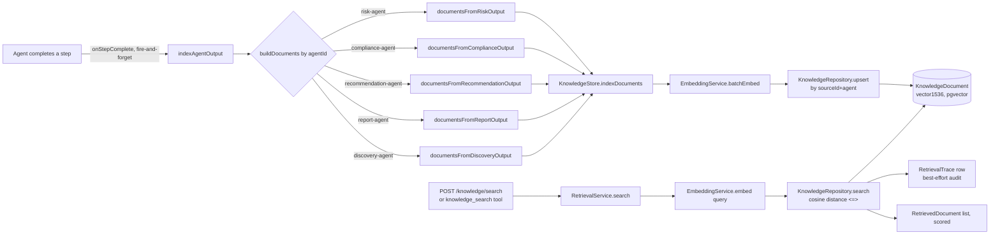
```mermaid
flowchart LR
    A[Agent completes a step] -->|onStepComplete, fire-and-forget| B[indexAgentOutput]
    B --> C{buildDocuments by agentId}
    C -->|risk-agent| D1[documentsFromRiskOutput]
    C -->|compliance-agent| D2[documentsFromComplianceOutput]
    C -->|recommendation-agent| D3[documentsFromRecommendationOutput]
    C -->|report-agent| D4[documentsFromReportOutput]
    C -->|discovery-agent| D5[documentsFromDiscoveryOutput]
    D1 & D2 & D3 & D4 & D5 --> E[KnowledgeStore.indexDocuments]
    E --> F[EmbeddingService.batchEmbed]
    F --> G[KnowledgeRepository.upsert\nby sourceId+agent]
    G --> H[(KnowledgeDocument\nvector1536, pgvector)]

    I[POST /knowledge/search\nor knowledge_search tool] --> J[RetrievalService.search]
    J --> K[EmbeddingService.embed query]
    K --> L[KnowledgeRepository.search\ncosine distance <=>]
    L --> H
    L --> M[RetrievalTrace row\nbest-effort audit]
    L --> N[RetrievedDocument list, scored]
```

### 10.2 Embedding Generation

`EMBEDDING_DIMENSION = 1536`, fixed regardless of provider. Two providers (`ai/embeddings/providers/`):

- **`LocalHashEmbeddingProvider`** (default, `id: 'local'`) — a deterministic hashing-trick embedding, zero external dependency. Tokenizes lowercase `[a-z0-9]+` words, SHA-256-hashes each token, buckets into 1536 slots (`digest.readUInt32BE(0) % 1536`), signs each contribution from `digest[4] % 2`, L2-normalizes. This captures **token overlap**, not semantic meaning — good enough for dev/CI/verification without an API key, not a substitute for a real embedding model in production.
- **`OpenAIEmbeddingProvider`** (`id: 'openai'`) — real `/v1/embeddings` calls via raw `fetch` (no vendor SDK); pads/truncates the model's native width to exactly 1536.

`EmbeddingService` wraps either with retry (`withRetry`, 2 attempts, 250ms backoff, retries only on `RateLimitError`) and telemetry.

### 10.3 Knowledge Store

`ai/knowledge/knowledge.store.ts`'s `KnowledgeStore.indexDocuments(inputs)` batch-embeds every text in **one** embedding call, then loops `knowledgeRepository.upsert()` per document. `upsert()`'s semantics: if `sourceId` is given, look up an existing row by `(sourceId, agent)` — found → `UPDATE` in place; not found → `INSERT`. This is what lets a re-run of the same agent on the same asset **update** its knowledge document rather than duplicate it, while snapshot-style documents (risk/compliance/report overviews) deliberately embed the run's timestamp *into* `sourceId` so each run adds a new point-in-time snapshot instead of overwriting — enabling "what changed since the last scan" via `getHistory(assetId)`.

### 10.4 Vector Search

`ai/knowledge/knowledge.repository.ts`, entirely raw SQL (`$queryRaw`/`$executeRaw`) since Prisma has no typed field for `Unsupported("vector(1536)")`. Cosine distance via pgvector's `<=>` operator, `score = 1 - distance` (higher = more relevant, matching every other score's orientation in the codebase), `ORDER BY embedding <=> $vector LIMIT topK`. Filterable by `assetId`, `documentTypes[]`, `agent`, `tags[]`.

### 10.5 Retrieval

`ai/retrieval/retrieval.service.ts`'s `RetrievalService.search(query)`: embed the question → `knowledgeRepository.search()` → best-effort `RetrievalTrace` persistence (a trace-write failure is swallowed, never breaks the actual search result — the same failure-isolation pattern used throughout the codebase) → telemetry → return `{documents, embeddingVersion, latencyMs}`.

### 10.6 Grounding & Citation

Copilot's `retrieveGrounding()` calls the `knowledge_search` tool (not `RetrievalService` directly — goes through the standard tool-call path for validation/telemetry/trace), folds matched document text into `CopilotExplanation.evidence[]` and document ids into `citations[]`. This is the mechanism that lets Copilot answer with reference to prior agent runs it didn't itself just execute.

### 10.7 Episode Indexing

Phase 30's `EpisodeIndexer` reuses this exact pipeline — episodes are indexed as `documentType: 'EPISODE'` (an additive enum value, not a second vector table), with `sourceId = episode.episodeId`. `EpisodeSearch.search()` calls `RetrievalService.search({documentTypes:['EPISODE']})` and then resolves each hit's `KnowledgeDocument.sourceId` back to the full `Episode` via `EpisodeStore.get()` — see §13.5 for the full flow.

### 10.8 What Is Not Implemented

No reranking step, no hybrid (keyword + vector) search, no chunking strategy for long documents (each indexed document is embedded as a single unit), and no embedding-provider migration/backfill tool if `EMBEDDING_PROVIDER` is ever switched mid-flight — existing `KnowledgeDocument` rows keep whatever `embeddingVersion` they were written with, and nothing re-embeds them.

***
## 11. Human In The Loop

Two structurally independent implementations share the same underlying `ApprovalPolicy`/`ApprovalStore`/`ApprovalEngine`.

### 11.1 Shared Policy Layer

`ai/approval/approval-policy.ts`'s `ApprovalPolicy` is a mutable `Map<agentId, decision>` seeded with:

```
discovery-agent: NEVER   risk-agent: NEVER      compliance-agent: NEVER
recommendation-agent: AUTO   report-agent: NEVER   copilot-agent: NEVER
```

`AUTO` means an `ApprovalRequest` is still created (for audit purposes) but immediately marked `APPROVED` by the system, with reason `"auto-approved by policy (AUTO decision)"`. **No agent is `MANUAL` by default today** — this is infrastructure with no live trigger yet; a future write-capable agent would `register()` itself as `MANUAL`.

### 11.2 Approval Lifecycle (shared)

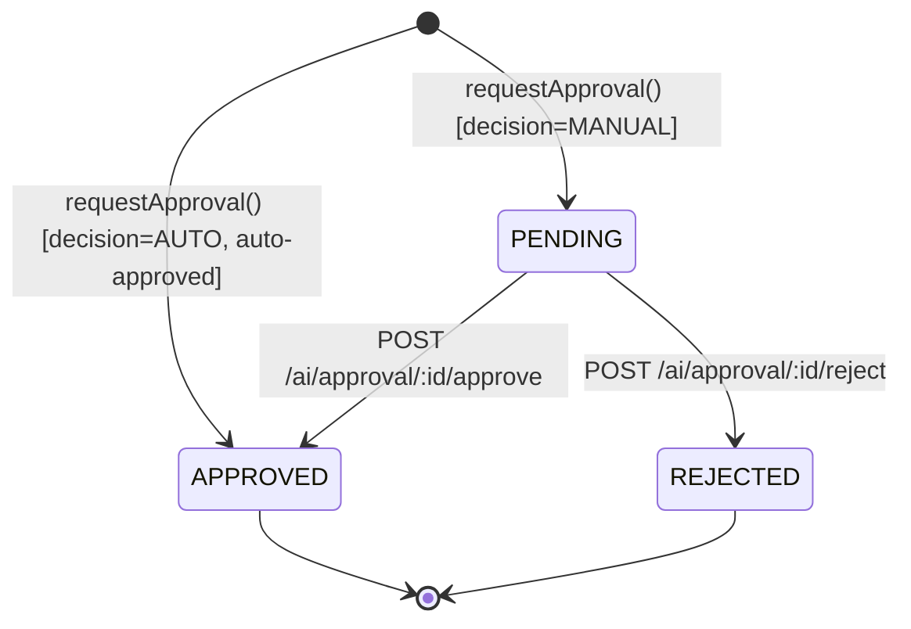
```mermaid
stateDiagram-v2
    [*] --> PENDING: requestApproval() [decision=MANUAL]
    [*] --> APPROVED: requestApproval() [decision=AUTO, auto-approved]
    PENDING --> APPROVED: POST /ai/approval/:id/approve
    PENDING --> REJECTED: POST /ai/approval/:id/reject
    APPROVED --> [*]
    REJECTED --> [*]
```

`ApprovalStore` (30-day TTL — the longest retention window of any store in the codebase, explicitly because this is an audit trail, not working state).

### 11.3 Path A — `HitlOrchestrator` (plain WorkflowEngine, condition-gated)

No native pause primitive exists in `WorkflowEngine`, so `HitlOrchestrator` (`ai/approval/hitl-orchestrator.ts`) simulates one by re-deriving a `Gate` (`RUN`/`HOLD`/`BLOCKED`) for every step, every round, from the *current* `ApprovalRequest.status` — never cached:

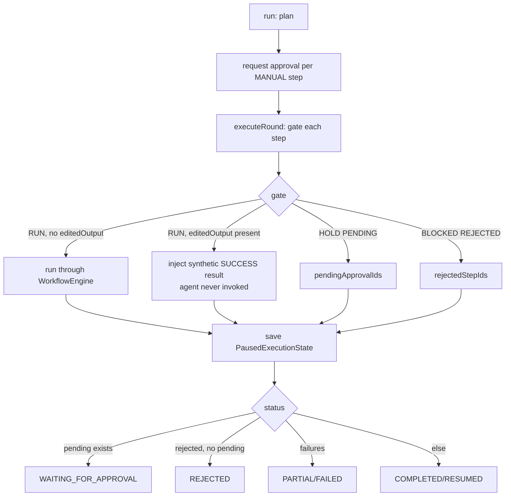
```mermaid
flowchart TD
    A[run: plan] --> B[request approval per MANUAL step]
    B --> C[executeRound: gate each step]
    C --> D{gate}
    D -->|RUN, no editedOutput| E[run through WorkflowEngine]
    D -->|RUN, editedOutput present| F[inject synthetic SUCCESS result\nagent never invoked]
    D -->|HOLD PENDING| G[pendingApprovalIds]
    D -->|BLOCKED REJECTED| H[rejectedStepIds]
    E & F --> I[save PausedExecutionState]
    G --> I
    H --> I
    I --> J{status}
    J -->|pending exists| K[WAITING_FOR_APPROVAL]
    J -->|rejected, no pending| L[REJECTED]
    J -->|failures| M[PARTIAL/FAILED]
    J -->|else| N[COMPLETED/RESUMED]
```

`resume(executionId)` loads `PausedExecutionState`, marks every already-succeeded step terminal (so it's never re-run), re-derives gates, runs another round. `cancel(executionId)` rejects every still-`PENDING` request tied to the execution and deletes the paused state.

**Reviewer output editing** — if an `ApprovalRequest.editedOutput` is present, `HitlOrchestrator` injects it directly as the step's `SUCCESS` result and the underlying agent is **never actually invoked** for that step — the reviewer's edit is authoritative.

### 11.4 Path B — LangGraph `interrupt()` (native)

Detailed in §7.5/§7.6. The key structural difference from Path A: LangGraph's `interrupt()` genuinely suspends the coroutine (Python-style generator semantics ported into the graph's execution model) rather than re-deriving state across independent synchronous "rounds" — but it needs the deterministic approval-id trick (`appr-graph-${executionId}-${stepId}`) precisely because a throw-based pause can't carry mutated state forward the way a returned value can.

### 11.5 Approve / Reject / Resume — HTTP Surface

`POST /ai/approval/:id/approve` and `/reject` both **auto-resume** the paused execution as part of the same call — there is no separate "resume" endpoint for the `HitlOrchestrator` path (`routes/approval.ts`). The LangGraph path does expose an explicit `POST /ai/langgraph/:executionId/resume`, called after the approval decision lands, since a graph resume needs to reconstruct `Command({resume})` from the live `ApprovalRequest`.

### 11.6 Audit

Every `ApprovalRequest` (`decidedBy`, `decidedAt`, `decisionReason`, `comment`, `editedOutput`) is retained for 30 days regardless of path — this is the single audit trail both HITL implementations write to.

### 11.7 Workflow Continuation

In both paths, an already-succeeded step is never re-invoked on resume — the guard differs mechanically (idempotency check on `executionTrace` in LangGraph vs. explicit terminal-step tracking in `PausedExecutionState`) but the invariant is identical: **no agent call is ever duplicated by a pause/resume cycle.**

***

## 12. Debate Engine

`ai/debate/` (Phase 29) — a debate/consensus layer over three existing agents, with zero new business logic and zero mutation of any participant's output.

### 12.1 The "Critique" Problem and Its Resolution

The spec's own language ("Recommendation Agent critiques Risk output") implies a capability no agent's fixed `.execute()` contract actually has — there is no "critique this" input shape. The resolution: every participant just runs its own **existing, unmodified** analysis over the same `assetId`. Because each agent's output is recorded into the shared `OrchestrationContext` *before* the next one runs, Recommendation Agent's own pre-existing cross-referencing logic (§6.5) becomes naturally "aware of" Risk's output for free — no new agent-level code. The actual critiquing — detecting *where* two agents' structured outputs disagree — happens entirely in new, independent code (`consensus.scoring.ts`), never inside an agent. `DebateTurn.critiques` is a purely informational label matching the spec's diagram; it never drives control flow.

### 12.2 Flow

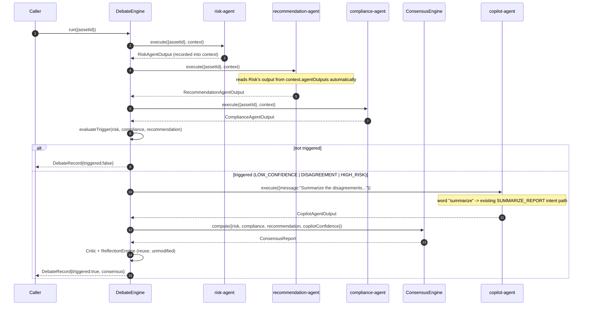
```mermaid
sequenceDiagram
    autonumber
    participant Caller
    participant DE as DebateEngine
    participant Risk as risk-agent
    participant Rec as recommendation-agent
    participant Comp as compliance-agent
    participant CE as ConsensusEngine
    participant Cop as copilot-agent

    Caller->>DE: run({assetId})
    DE->>Risk: execute({assetId}, context)
    Risk-->>DE: RiskAgentOutput (recorded into context)
    DE->>Rec: execute({assetId}, context)
    Note over Rec: reads Risk's output from context.agentOutputs automatically
    Rec-->>DE: RecommendationAgentOutput
    DE->>Comp: execute({assetId}, context)
    Comp-->>DE: ComplianceAgentOutput
    DE->>DE: evaluateTrigger(risk, compliance, recommendation)
    alt not triggered
        DE-->>Caller: DebateRecord{triggered:false}
    else triggered (LOW_CONFIDENCE | DISAGREEMENT | HIGH_RISK)
        DE->>Cop: execute({message:"Summarize the disagreements..."})
        Note over Cop: word "summarize" -> existing SUMMARIZE_REPORT intent path
        Cop-->>DE: CopilotAgentOutput
        DE->>CE: compute({risk, compliance, recommendation, copilotConfidence})
        CE-->>DE: ConsensusReport
        DE->>DE: Critic + ReflectionEngine (reuse, unmodified)
        DE-->>Caller: DebateRecord{triggered:true, consensus}
    end
```

### 12.3 Trigger Conditions (`evaluateTrigger`, all OR'd)

| Reason | Condition |
|---|---|
| `LOW_CONFIDENCE` | average of `risk`/`compliance`/`recommendation` `confidenceScore` < 0.6 |
| `DISAGREEMENT` | `deriveConflicts(risk, compliance, recommendation).length > 0` |
| `HIGH_RISK` | `risk.businessImpact` rank ≥ `HIGH` |

### 12.4 Consensus Scoring (`consensus.scoring.ts` — pure functions, no LLM)

- **`classifyFindings`** — a Risk finding is "accepted" only if its `id` is cited as a `findingId` by any Recommendation; else "rejected." Single-factor corroboration (Compliance evidence alone, with no matching Recommendation, still counts as rejected — a documented limitation).
- **`computeAgreementScore`** = `accepted / (accepted + rejected)`, `1` if Risk raised nothing.
- **`deriveConflicts`** — exactly four structural checks, reused verbatim by both the trigger check and the final `ConsensusReport`:
  1. High/severe risk **and** compliance score ≥ 80 (risk vs. compliance).
  2. Critical/high findings exist **and** zero recommendations (risk vs. recommendation).
  3. Compliance failures exist **and** zero recommendations (compliance vs. recommendation).
  4. Any rejected finding exists — severity `HIGH` if more than half of all findings were rejected, else `LOW` (risk vs. recommendation).
- **`computeConsensusConfidence`** = `mean(participant confidences)*0.6 + agreementScore*0.4`, clamped [0,1]; falls back to `agreementScore` alone with no confidences.

### 12.5 Conflict Resolution

There is **no automated conflict resolution** — the Consensus Engine's job is to *surface* disagreement (as a `ConsensusReport.conflicts[]` list with severity and the agents involved), not to arbitrate a winner. Resolution remains a human/downstream decision; the report is designed to be read, not obeyed.

### 12.6 Reflection Integration

The debate builds a synthetic 4-step `ReasoningPlan` (`workflowId: 'debate'`) and a synthetic `ExecutionResult` from its own turns, then reuses `Critic.evaluateExecution()` + `ReflectionEngine.reflect()` **unmodified**, passing an optional `DebateReflectionSummary{debateSummary, disagreements, consensusConfidence}` — the only reason `ReflectionReport` (§13.4) has those three optional fields at all. `GET /ai/reflection/:executionId` works unchanged for a debate run, using `debateId` as the executionId.

### 12.7 Design Notes

- No resume/checkpoint story — a debate is one short synchronous call with no pause point.
- Zero dependency on `ai/langgraph` — `DebateEngine` builds its own local `ExecutionResult`/`ReasoningPlan`, mirroring but not importing LangGraph's equivalent helpers, so "existing LangGraph must remain unchanged" is trivially true (LangGraph files were not touched by Phase 29 at all).

***

## 13. Memory Architecture

### 13.1 The Shared Abstraction

Every memory type in the codebase — Redis-backed or not — implements or wraps `ai/interfaces/memory-store.interface.ts`'s `MemoryStore { get, set, append, getList, delete }`. `RedisMemoryStore` is the production implementation (all keys under `ai:memory:`); `InMemoryStore` exists for tests. This single interface is what lets roughly a dozen independent higher-level stores (§4.6's table) share one storage contract while choosing their own key prefix and TTL.

### 13.2 Conversation Memory & Session Memory

`ai/memory/conversation-memory.ts` / `session-memory.ts` — Phase 16 primitives. Conversation memory is an append-only turn log per `conversationId`; session memory is a single JSON blob per `(sessionId, namespace)`. Reused independently by: Copilot Agent's own conversation (`copilot.memory.ts`), the LLM Planner's context gathering (`planner.memory.ts` — a *separate instance*, deliberately, since the LLM Planner has no dependency on LangGraph), and LangGraph's own graph-scoped memory (`graph.memory.ts`, session keyed by `executionId` instead of `conversationId`) — three independent instantiations of the same two classes, all pointed at the same underlying Redis keyspace, so a conversation seen by one is visible to the others.

### 13.3 Knowledge Memory

Not a separate memory type — this is the Knowledge Store itself (§10), read by `planner.memory.ts`'s `summarizeKnowledge()` for planning context and by `RetrievalService` for RAG.

### 13.4 Reflection Memory

`ai/reflection/reflection.store.ts`'s `ReflectionStore` — one `ReflectionReport` per `executionId`, 7-day TTL. Every execution path writes exactly one.

```
ReflectionReport {
  executionId, planId, finalPlanId,
  succeededSteps[], failedSteps[], skippedSteps[],
  missingEvidence[], weakRecommendations[], incompleteReports[],
  criticScore, overallConfidence, notes[], createdAt,
  debateSummary?, disagreements?[], consensusConfidence?   // Phase 29, optional
}
```

### 13.5 Episode Memory

`ai/episodic-memory/` (Phase 30) — the most structurally complete memory subsystem, deliberately built to *learn from* past executions rather than just record them.

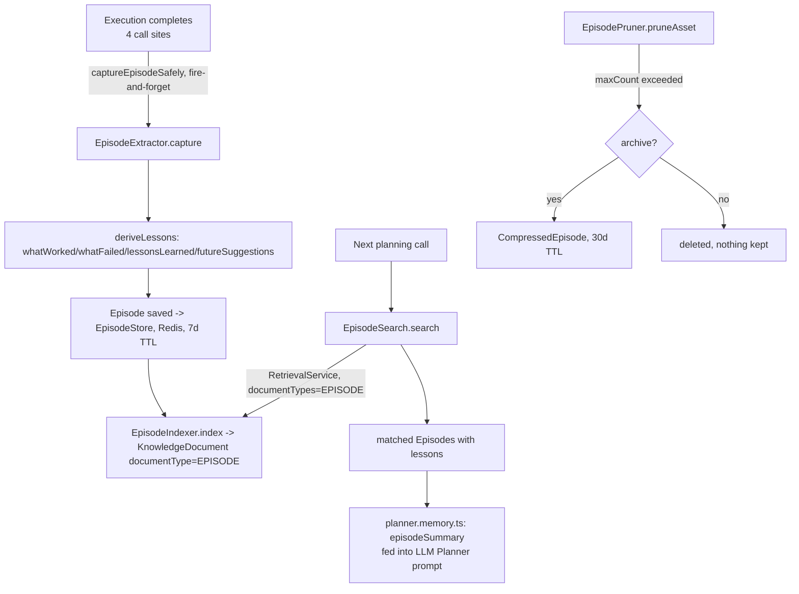
```mermaid
flowchart TD
    A[Execution completes\n4 call sites] -->|captureEpisodeSafely, fire-and-forget| B[EpisodeExtractor.capture]
    B --> C[deriveLessons: whatWorked/whatFailed/lessonsLearned/futureSuggestions]
    C --> D[Episode saved -> EpisodeStore, Redis, 7d TTL]
    D --> E[EpisodeIndexer.index -> KnowledgeDocument documentType=EPISODE]
    F[Next planning call] --> G[EpisodeSearch.search]
    G -->|RetrievalService, documentTypes=EPISODE| E
    G --> H[matched Episodes with lessons]
    H --> I[planner.memory.ts: episodeSummary\nfed into LLM Planner prompt]
    J[EpisodePruner.pruneAsset] -->|maxCount exceeded| K{archive?}
    K -->|yes| L[CompressedEpisode, 30d TTL]
    K -->|no| M[deleted, nothing kept]
```

**Capture call sites (exactly 4)**: `planner/reasoning-orchestrator.ts`, `langgraph/nodes.ts`'s `reflectionNode`, `debate/debate.engine.ts` (both triggered and untriggered paths), `orchestrator/executor.ts` (the plain path). All fire-and-forget — capture never delays or fails the execution it's observing.

**`Episode` shape**: `episodeId, executionId, assetId?, goal, workflowId, planId?, agentsInvolved[], toolUsage[], debateId?, consensusId?, disagreements[], durationMs, failedSteps[], retryCount, approvalEvents[], outcome, confidence, lessons{whatWorked,whatFailed,lessonsLearned,futureSuggestions}, createdAt`.

**Confidence calibration** (`episode.relevance.ts`) — `calibrateConfidence()` blends a base confidence with `historicalSuccessRate` (weight 0.25), `similarityScore` (0.15), `agentReliability`/`toolReliability` (0.1 each), base itself weighted 0.4; any missing signal is simply omitted and the rest implicitly renormalize. **Not wired into any live decision today** — computed and tested, but no agent or planner consults it yet (the codebase's own documented limitation).

**Pruning** — `EpisodePruner.pruneAsset(assetId, {maxCount=50, archive})`: history lists are stored as plain rewritable JSON arrays (not Redis-list `append`) specifically so arbitrary ids can be evicted from the middle; an optional archive mode compresses pruned episodes down to `{episodeId, goal, outcome, confidence, lessons}` with a 30-day TTL, outliving the live record. **No background job runs this automatically** — it must be called explicitly, a documented gap.

### 13.6 Planner Memory

`ai/llm-planner/planner.memory.ts`'s `gatherPlannerContext()` composes conversation + session + knowledge + reflection + episode summaries into one `PlannerContextSummary`, fed directly into the LLM Planner's prompt (§8.7).

### 13.7 TTL Summary

| Store | TTL | Reasoning |
|---|---|---|
| `PlannerCache` | 15 min | Short — plans should reflect fresh knowledge |
| `orchestrator:state:` | 6 h | Long enough to poll a finished run, short enough not to leak forever |
| `PlanStore` / `ReflectionStore` / `debate:*` / `episode:*` | 7 d | "Long enough to review, not forever" — the codebase's most common default |
| `ApprovalStore` | 30 d | Audit trail — deliberately longer |
| `episode:archive:` | 30 d | Outlives the live episode record it was pruned from |
| `oauth:state:` | 600 s, single-use | Security-sensitive, burned on first use regardless of remaining TTL |

### 13.8 Retrieval

All memory reads are either direct key lookups (conversation/session/plan/reflection/approval, by id) or semantic search (Knowledge/Episode, via `RetrievalService`) — there is no third retrieval mechanism.

***
## 14. Job System

### 14.1 Architecture

Not a dedicated queue product — `SyncJob` (Postgres) is the durable source of truth; a Redis list (`jobs:queue`) is a **fast-path signal only**. Losing the Redis entry costs latency (a worker falls back to polling), never correctness.

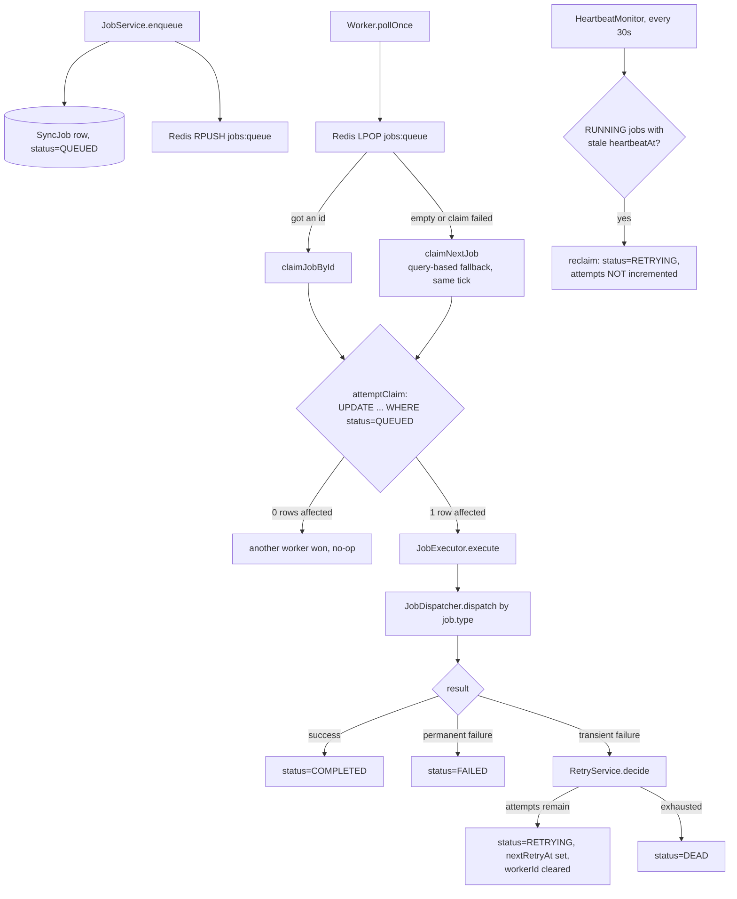
```mermaid
flowchart TD
    A[JobService.enqueue] --> B[(SyncJob row, status=QUEUED)]
    A --> C[Redis RPUSH jobs:queue]
    D[Worker.pollOnce] --> E[Redis LPOP jobs:queue]
    E -->|got an id| F[claimJobById]
    E -->|empty or claim failed| G[claimNextJob\nquery-based fallback, same tick]
    F --> H{attemptClaim:\nUPDATE ... WHERE status=QUEUED}
    G --> H
    H -->|0 rows affected| I[another worker won, no-op]
    H -->|1 row affected| J[JobExecutor.execute]
    J --> K[JobDispatcher.dispatch by job.type]
    K --> L{result}
    L -->|success| M[status=COMPLETED]
    L -->|permanent failure| N[status=FAILED]
    L -->|transient failure| O[RetryService.decide]
    O -->|attempts remain| P[status=RETRYING, nextRetryAt set,\nworkerId cleared]
    O -->|exhausted| Q[status=DEAD]

    R[HeartbeatMonitor, every 30s] --> S{RUNNING jobs with\nstale heartbeatAt?}
    S -->|yes| T[reclaim: status=RETRYING,\nattempts NOT incremented]
```

### 14.2 Atomic Claim (the concurrency-safety mechanism)

`JobRepository.attemptClaim()`: `UPDATE "SyncJob" SET status='RUNNING', workerId=$1 WHERE id=$2 AND status=$expectedStatus`. Postgres takes the row lock on `UPDATE` and **re-evaluates the WHERE clause after acquiring it** — a losing concurrent update simply matches zero rows. No explicit transaction, no isolation-level tuning, no `SELECT ... FOR UPDATE` needed.

### 14.3 Dispatcher

`job-dispatcher.ts` — a `Map<JobType, handler>`, no switch statement. Confirmed exact registration:

| JobType | Handler | Import style |
|---|---|---|
| `SYNC` | `syncService.sync()` | static |
| `DISCOVERY` | `discoveryService.discover()` | static |
| `AI_DISCOVERY` | `discoveryAgent.execute()` | **dynamic** (`await import(...)`) |
| `AI_RISK` | `riskAgent.execute()` | dynamic |
| `AI_COMPLIANCE` | `complianceAgent.execute()` | dynamic |
| `AI_RECOMMENDATION` | `recommendationAgent.execute()` | dynamic |
| `AI_REPORT` | `reportAgent.execute()` | dynamic |
| `REFRESH_TOKEN`, `OAUTH_CALLBACK`, `WEBHOOK`, `AI_ANALYSIS`, `AI_COST`, `AI_NOTIFICATION`, `AI_ORCHESTRATOR_AGENT_TASK` | **none registered** | — throws `UnsupportedJobTypeError` immediately (permanent, no retry) |

The dynamic-import pattern exists to break a real import cycle: `observability/metrics.ts` eagerly imports `workerPool` (for a job-queue gauge) → `workers/worker.ts` → `job-executor.ts` → `job-dispatcher.ts`; a static top-level import of any `ai/agents/*/index.ts` here (which imports `observability/metrics.ts` transitively via its own telemetry file) would close the cycle and throw a TDZ error at startup.

### 14.4 Executor & Retry Classification

`JobExecutor.execute()` — heartbeat write, `JOB_STARTED` event, a `setInterval` ticker independent of dispatch duration, `dispatch()`, then on failure `handleFailure(job, err, durationMs, isPermanent)`.

`isPermanentFailure(err)` — exact `instanceof` checklist: `PermanentJobError`, `SyncProviderError`, `UnsupportedDiscoveryProviderError`, `UnsupportedAgentProviderError`, `MissingRiskTargetError`, `MissingComplianceTargetError`, `MissingRecommendationTargetError`, `MissingReportTargetError`. Permanent → `FAILED`, terminal, no retry. Not permanent → `RetryService.decide()`.

**Retry schedule** (`RetryService`, exponential, from `JOB_RETRY_BACKOFF_MS`): `1m, 5m, 15m, 30m, 1h, 6h, 24h` — the last value repeats indefinitely once `attempts` exceeds the schedule length. `shouldRetry = false` once `attempts + 1 >= maxAttempts` (default 5) → `DEAD`.

**Known architectural note**: `SyncService.sync()` and `DiscoveryService.discover()` both catch their own provider failures internally and return a result object (`{success:false, errors:[...]}`) rather than throwing — so `JobExecutor` always treats a SYNC/DISCOVERY failure as **retryable** (`isPermanent` hardcoded `false` for that branch), even for an unrecoverable bad credential. This means a permanently-invalid GitHub token retries the full schedule (up to 5 attempts) before going `DEAD`, rather than failing fast. Documented as a known inefficiency, not fixed as of this writing (out of scope for the phase that discovered it).

### 14.5 Worker & Worker Pool

`Worker.pollOnce()` self-reschedules via `setTimeout(JOB_POLL_INTERVAL_MS, default 2000ms)`. `WorkerPool.start(count)` spins up `JOB_WORKER_COUNT` (default 2) independent `Worker` instances **in-process** — no cross-worker or cross-process coordination beyond the shared Postgres/Redis state, which is what makes this horizontally scalable by just running more API processes.

### 14.6 Heartbeat & Dead-Job Reaping

`workers/heartbeat.ts`'s `startHeartbeatMonitor()` — every `JOB_HEARTBEAT_CHECK_INTERVAL_MS` (default 30s), reclaims any `RUNNING` job whose `heartbeatAt` is older than `JOB_HEARTBEAT_STALE_MS` (default 60s) back to `RETRYING` with `workerId: null` — **without incrementing `attempts`**, since an infrastructure failure (worker crash, process kill) is not the job's fault.

### 14.7 Failure Recovery Summary

| Failure class | Detection | Outcome |
|---|---|---|
| Permanent error (unsupported type/provider, missing target) | `instanceof` checklist | `FAILED`, no retry |
| Transient error, attempts remain | `RetryService.decide()` | `RETRYING`, exponential backoff |
| Transient error, attempts exhausted | `RetryService.decide()` | `DEAD` |
| Worker crash / process kill mid-job | Stale heartbeat | `RETRYING`, attempts unchanged |
| Redis list entry lost | N/A | Worker falls back to Postgres poll — no data loss, only latency |

***

## 15. AI Pipeline

### 15.1 End-to-End Flow

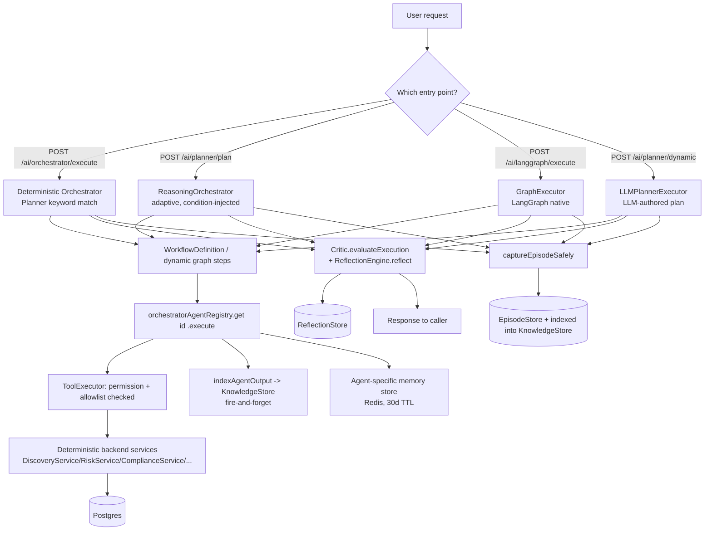
```mermaid
flowchart TD
    U[User request] --> P{Which entry point?}
    P -->|POST /ai/orchestrator/execute| O1[Deterministic Orchestrator\nPlanner keyword match]
    P -->|POST /ai/planner/plan| O2[ReasoningOrchestrator\nadaptive, condition-injected]
    P -->|POST /ai/langgraph/execute| O3[GraphExecutor\nLangGraph native]
    P -->|POST /ai/planner/dynamic| O4[LLMPlannerExecutor\nLLM-authored plan]

    O1 & O2 & O3 & O4 --> WF[WorkflowDefinition / dynamic graph steps]
    WF --> AG[orchestratorAgentRegistry.get id .execute]
    AG --> TOOLS[ToolExecutor: permission + allowlist checked]
    TOOLS --> SVC[Deterministic backend services\nDiscoveryService/RiskService/ComplianceService/...]
    SVC --> DB[(Postgres)]

    AG --> RAG[indexAgentOutput -> KnowledgeStore\nfire-and-forget]
    AG --> MEM[Agent-specific memory store\nRedis, 30d TTL]

    O1 & O2 & O3 & O4 --> REFL[Critic.evaluateExecution\n+ ReflectionEngine.reflect]
    REFL --> RSTORE[(ReflectionStore)]
    O1 & O2 & O3 & O4 --> EPI[captureEpisodeSafely]
    EPI --> ESTORE[(EpisodeStore + indexed into KnowledgeStore)]

    REFL --> RESP[Response to caller]
```

### 15.2 Transition-by-Transition Explanation

1. **User → Planner**: every entry point resolves an intent/goal into either a registered `WorkflowDefinition` (deterministic path) or a freshly LLM-authored, validated `LLMPlan` (dynamic path). Both ultimately produce the same vocabulary: a list of `{stepId, agentId, dependsOn}`.
2. **Planner → Execution engine**: the same step list can be run by `WorkflowEngine` (wave-parallel), `ReasoningOrchestrator`'s adaptive wrapper (condition-injected skip-on-upstream-failure), or a LangGraph graph (native parallel edges + optional `interrupt()`).
3. **Execution engine → Agents**: always `orchestratorAgentRegistry.get(agentId).execute(input, context)` — the one call every engine makes, never varied.
4. **Agents → Tools**: through `ToolExecutor.run()`, which enforces the per-agent allowlist and the global read-only permission policy before ever reaching a tool's own `execute()`.
5. **Tools → Services → Database**: tools are thin wrappers; the actual read/write always happens in the pre-existing deterministic service layer, never duplicated.
6. **Agents → RAG**: every successful step is auto-indexed into the Knowledge Store (fire-and-forget); every agent optionally *reads* from it too (Copilot's grounding, planner context).
7. **Agents → Memory**: each agent's own Redis-backed memory records the run (history, last-run, seen-rule-codes, etc.) independent of the execution engine's own state tracking.
8. **Execution engine → Reflection**: after the run, `Critic` scores it and `ReflectionEngine` produces a report — always, regardless of which of the four engines ran it.
9. **Execution engine → Episodic Memory**: fire-and-forget capture of the whole run as a searchable `Episode`, feeding future planning.
10. **→ Response**: the caller gets back the raw `ExecutionResult`/`LLMPlannerRunResult`/`GraphRunResult` — reflection and episode capture happen *after* the response-shaping data is already assembled, never blocking the HTTP response.

***
## 16. API Documentation

34 route files register every endpoint below on the root Fastify instance, in this fixed order (`server.ts`): `authPlugin` and `observabilityPlugin` are attached directly (not via `app.register`, so their decorations reach every sibling route), followed by `helmet` → `cors` → `rate-limit` → `compress` → `health` → `metrics` → `auth` → `categories` → `assets` → `tags` → `accounts` → `oauth` → `jobs` → `resources` → `analysis` → `policies` → `agents` → `ai` → `orchestrator` → `discovery` → `risk-agent` → `compliance-agent` → `recommendation-agent` → `report-agent` → `copilot-agent` → `knowledge` (legacy) → `knowledge-rag` → `copilot` (legacy) → `planner` → `approval` → `langgraph` → `llm-planner` → `debate` → `episodes` → `registerBuiltinTools()` → `websocket`.

Unless noted, every route requires `Authorization: Bearer <accessToken>` (the `authenticate` preHandler). Validation failures return `400` with `{status:'error', message:'Validation failed', errors:[{path,message}]}`; ownership failures `403`; not-found `404`; conflicts `409`; unmapped `500`.

### 16.1 Health & Metrics — unauthenticated, exempt from rate limiting

| Route | Purpose | Response |
|---|---|---|
| `GET /health` | Liveness | `{status:'ok'}` |
| `GET /health/db` | Postgres connectivity | 200/503 |
| `GET /health/redis` | Redis connectivity | 200/503 |
| `GET /health/ready` | Full readiness (gates on DB+Redis only; AI/workers/queue/memory/disk are informational) | `{status, database, redis, ai, workers, queue, memory, disk}`, 503 if DB or Redis down |
| `GET /metrics` | Prometheus scrape | text/plain |

### 16.2 Auth

| Route | Auth | Request | Response |
|---|---|---|---|
| `POST /auth/register` | No | `{email, password≥8, firstName, lastName}` | 201 user / 409 `EmailAlreadyExistsError` |
| `POST /auth/login` | No | `{email, password}` | 200 `{accessToken, refreshToken, user}` / 401 |
| `GET /auth/me` | Yes | — | 200 user |
| `POST /auth/refresh` | No | `{refreshToken}` | 200 rotated tokens / 401 (reuse detection revokes the whole family) |
| `POST /auth/logout` | No (token itself is the credential) | `{refreshToken}` | 200 |

### 16.3 Categories, Assets, Tags, Events

| Route | Auth | Purpose |
|---|---|---|
| `GET /categories` | Yes | List (paginated + search) |
| `POST /categories` | Yes, admin | Create — 403 for non-admin, 409 duplicate |
| `GET /assets` | Yes | List, filterable by status/category/tag/risk-range/search/sort |
| `GET /assets/search` | Yes | Search (`search` required) |
| `GET /assets/:id` | Yes | Get one (ownership-checked) |
| `POST /assets` | Yes | Create |
| `PATCH /assets/:id` | Yes | Partial update, ≥1 field |
| `DELETE /assets/:id` | Yes | Soft-archive |
| `GET /assets/:id/events` | Yes | Paginated timeline |
| `POST /assets/:id/events` | Yes | Append event |
| `POST /assets/:id/tags` | Yes | Attach tag |
| `DELETE /assets/:id/tags/:tagId` | Yes | Detach |
| `GET /tags` | Yes | List |
| `POST /tags` | Yes | Create — 409 duplicate |

### 16.4 Accounts & OAuth

| Route | Purpose | Response |
|---|---|---|
| `GET /accounts` | List (paginated, filterable) | 200 |
| `POST /accounts/connect` | Manual credential connect | 201 / 409 duplicate |
| `PATCH /accounts/:id` | Update, ≥1 field | 200 |
| `POST /accounts/:id/sync` | **Async** — enqueues `SYNC` | 202 `{jobId,status,priority,queueDepth}` |
| `POST /accounts/:id/discover` | **Async** — enqueues `DISCOVERY` | 202 |
| `DELETE /accounts/:id` | Soft-disconnect | 200 |
| `GET /oauth/:provider` | Initiate flow (query `assetId`) | 302 |
| `GET /oauth/:provider/callback` | Token exchange (secured by state token, not header) | 200 `{account}` |

### 16.5 Jobs

| Route | Purpose |
|---|---|
| `GET /jobs` | List, filterable by asset/account/type/status |
| `GET /jobs/:id` | Poll status |
| `POST /jobs/:id/cancel` | Cancel — 409 if terminal |
| `POST /jobs/:id/retry` | Retry — 409 if not FAILED/DEAD |

### 16.6 Resources & Graph

| Route | Purpose |
|---|---|
| `GET /resources` | Search — filterable by asset/account/provider/type/name/metadata/relationship/includeDeleted |
| `GET /resources/:id` | Get one |
| `GET /resources/:id/neighbors` \| `/children` \| `/parents` \| `/connected` | Graph traversal |
| `GET /resources/:id/path/:targetId` | `{pathExists: boolean}` |

### 16.7 Analysis & Policies

| Route | Purpose |
|---|---|
| `GET /analysis/findings` \| `/analysis/findings/:id` | Findings list/get |
| `GET /analysis/recommendations` | Recommendations list |
| `GET /analysis/risk` \| `/analysis/risk/assets/:id` \| `/analysis/risk/accounts/:id` | Risk overviews |
| `GET /policies` \| `/policies/:id` | Policy catalog |
| `GET /compliance` \| `/compliance/assets/:id` \| `/compliance/accounts/:id` | Compliance reports |

### 16.8 Legacy AI (Phase 7 — distinct from the newer `ai/` orchestrator)

| Route | Purpose |
|---|---|
| `POST /agents/execute` | Legacy agent request plan (`requestType`, `aiMode` for reports) |
| `GET /agents` \| `/agents/plans/:id` | Introspection / plan execution lookup |
| `POST /ai/generate` | Direct legacy LLM call (real Claude/OpenAI/Gemini via `services/ai/`) — 502 on provider error |
| `GET /ai/providers` \| `/ai/models` | Introspection |
| `POST /knowledge/context` | Legacy context builder (distinct from RAG `/knowledge/*`) |
| `GET /knowledge/retrievers` | Introspection |
| `POST /copilot/chat` | Legacy copilot (distinct from `/ai/copilot/chat`) |

### 16.9 Orchestrator (newer AI system)

| Route | Purpose |
|---|---|
| `POST /ai/orchestrator/execute` | Run a workflow synchronously — `{intent, connectedAccounts?, assets?, metadata?}` |
| `GET /ai/orchestrator/workflows` \| `/workflows/:id` | List/inspect registered workflows + DAG visualization |
| `GET /ai/orchestrator/history` | Execution history |
| `GET /ai/orchestrator/status` | Overall or one execution's live state |

### 16.10 Per-Agent Routes

All async agents share the enqueue contract `202 {jobId, status, priority, queueDepth}`, poll via `GET /jobs/:id`.

| Agent | Trigger route(s) | History / Summary |
|---|---|---|
| Discovery | `POST /ai/discovery/start` \| `/refresh` | `GET /ai/discovery/history` \| `/status` \| `/providers` |
| Risk | `POST /ai/risk/analyze` | `GET /ai/risk/history` \| `/findings` \| `/summary` |
| Compliance | `POST /ai/compliance/analyze` | `GET /ai/compliance/history` \| `/summary` \| `/frameworks` |
| Recommendation | `POST /ai/recommendation/analyze` | `GET /ai/recommendation/history` \| `/summary` |
| Report | `POST /ai/report/generate` | `GET /ai/report/history` \| `/summary` |
| Copilot (**synchronous**) | `POST /ai/copilot/chat` | `GET /ai/copilot/history` · `DELETE /ai/copilot/history/:conversationId` |

### 16.11 Knowledge RAG (Phase 23)

| Route | Purpose |
|---|---|
| `POST /knowledge/index` | Manual document index (auto-indexing is the primary path) |
| `POST /knowledge/search` | RAG search — `{question, assetId?, documentTypes?, topK?≤50}` |
| `GET /knowledge/document/:id` | Get one (ownership via document's assetId) |
| `GET /knowledge/history/:assetId` | Document history |

### 16.12 Planner & Approval

| Route | Purpose |
|---|---|
| `POST /ai/planner/plan` | Deterministic-plan **and run** a goal (`ReasoningOrchestrator`) |
| `GET /ai/planner/:id` | Fetch stored plan |
| `GET /ai/reflection/:executionId` | Fetch reflection |
| `POST /ai/approval/request` | Plan + run, pausing at `WAITING_FOR_APPROVAL` on any MANUAL step |
| `POST /ai/approval/:id/approve` \| `/reject` | Decide — auto-resumes execution |
| `GET /ai/approval/pending` \| `/ai/approval/:id` | List / get |

### 16.13 LangGraph & LLM Planner

| Route | Purpose |
|---|---|
| `POST /ai/langgraph/execute` | Plan+run as a LangGraph; may pause `WAITING_FOR_APPROVAL` |
| `POST /ai/langgraph/:executionId/resume` | Resume after approval decision |
| `GET /ai/langgraph/:executionId` \| `/state` | Execution record / live state |
| `POST /ai/planner/dynamic` | LLM-driven plan **and execute**, with reflection-gated revision loop |
| `POST /ai/planner/explain` | LLM plan only, no execution |
| `GET /ai/planner/history` | Planner run history |

### 16.14 Debate & Episodes

| Route | Purpose |
|---|---|
| `POST /ai/debate/start` | Run debate; computes consensus if triggered, in one call |
| `GET /ai/debate/:id` \| `/ai/consensus/:id` | Get record / report |
| `POST /ai/episodes/search` | Semantic search over episodes |
| `GET /ai/episodes/history` | Episode history for an asset |
| `GET /ai/episodes/statistics` | Agent/tool reliability, derived from last 100 episodes |
| `GET /ai/episodes/:id` | Get one episode |

### 16.15 WebSocket

`GET /ws` (upgrade), authenticated via `?token=` query param (`authenticateSocket`, closes `4401` on failure). Client→server: `{type:'subscribe'|'unsubscribe', assetId}` (ownership-checked identically to REST). Server→client: `{type:'connected'|'subscribed'|'unsubscribed'|'event'|'error', ...}` — `event` carries the exact same `AssetEvent` shape as `GET /assets/:id/events`, fanned out live by `realtimeBus`.

***
## 17. Security

### 17.1 JWT

`services/auth/jwt.service.ts` — HS256 (the `jsonwebtoken` library's default when no `algorithm` option is passed), signed with `JWT_SECRET` (Zod-validated, minimum 32 characters, fails process startup otherwise). Claims: `sub` (user id), `email`, `role`, plus standard `iss`/`aud`/`iat`/`exp`. `issuer`/`audience` are validated together on every verification, not just the signature. Default expiry `15m` (`JWT_EXPIRES_IN`). `verify-jwt.service.ts` collapses both `JsonWebTokenError` (bad signature) and `TokenExpiredError` into one generic `UnauthorizedError` — no information leak about *why* a token was rejected.

### 17.2 Refresh Token Rotation & Reuse Detection

`refresh-token.service.ts` — 64 random bytes (`crypto.randomBytes(64)`), stored as a **SHA-256 hash** (deterministic — needed for exact-match lookup, unlike bcrypt for passwords which is intentionally slow and non-deterministic). Every refresh is a strict rotate: validate → revoke the presented token → issue a new one. **Reuse detection**: if a token is presented that's already `revokedAt`-set (i.e., it was already rotated once before), that's direct proof of token theft (an attacker replaying a stolen, already-superseded token) — the service responds by revoking **every** refresh token belonging to that user (`revokeAllForUser`) and throwing `RefreshTokenReuseError`, forcing a full re-login. Default TTL 30 days (`REFRESH_TOKEN_TTL_DAYS`).

### 17.3 Credential Encryption

`services/credential-encryption.service.ts` — **AES-256-GCM**, Node's built-in `crypto`. Key: `CREDENTIAL_ENCRYPTION_KEY`, Zod-validated as exactly 64 hex characters (32 raw bytes), decoded directly with **no KDF** — the hex value *is* the AES key. IV: `crypto.randomBytes(12)` (96-bit, GCM-recommended), fresh per encryption call. Auth tag: 16 bytes via `cipher.getAuthTag()`. Stored format: `base64(iv[12] || authTag[16] || ciphertext[...])` — one concatenated buffer. Decryption slices the three segments back out by fixed offset; GCM's own tag verification is the tamper-detection mechanism (`decipher.final()` throws on mismatch) — no separate HMAC needed. This is what protects `Account.credentialCiphertext` (every connected GitHub PAT/OAuth token) at rest.

### 17.4 OAuth

Authorization Code flow against real GitHub endpoints (default `github.com`/`api.github.com`, overridable for enterprise/testing). State token: 32 random bytes, Redis-backed, TTL 600s, carrying the initiating user's identity (since the browser round-trip can't carry a bearer header) — **deleted immediately on read** in the callback handler, before any further processing, so a replayed callback can never succeed twice inside the TTL window regardless of remaining time. The exchanged access token flows directly into `credential-encryption.service.ts` before ever touching the database — never logged.

### 17.5 RBAC

Two roles only (`USER`/`ADMIN`). `services/assets/ownership.ts`'s `isOwnerOrAdmin(entity, requester)` = `requester.role === 'ADMIN' || entity.userId === requester.id` — a simple OR; `ADMIN` unconditionally bypasses ownership on every asset-scoped resource. `getOwnedAsset`/`getOwnedAccount` throw `AssetNotFoundError`/`AccountNotFoundError` (404) if the row doesn't exist at all, or `ForbiddenError` (403) if it exists but isn't owned — deliberately distinguished so a caller can't distinguish "doesn't exist" from "exists but isn't yours" via a 404-vs-403 timing/response difference... actually the codebase *does* distinguish them (404 vs 403), which is a normal, accepted tradeoff for this kind of resource-ownership model (not a user-enumeration-style leak, since asset ids aren't guessable emails).

### 17.6 Approval as a Security Control

The `ApprovalPolicy`/`ApprovalEngine`/two-implementation HITL system (§11) exists specifically so that a future write-capable agent or tool can be gated behind human review before anything destructive happens — currently inert (no agent is `MANUAL` by default, no tool declares `write`) but fully built and tested infrastructure, not a stub.

### 17.7 Secrets Handling

Every secret-shaped env var is Zod-validated at process startup (`config/env.ts`'s `envSchema`), with the process **failing fast** (`process.exit(1)`, printing every validation issue) rather than starting with a partially-invalid config: `JWT_SECRET` (min 32 chars), `CREDENTIAL_ENCRYPTION_KEY` (exactly 64 hex chars, regex-checked), `DATABASE_URL` (must parse as a `postgresql://` URL). AI provider API keys are `optional()` — a missing key fails per-request, not at startup, since not every deployment needs every provider configured.

### 17.8 Transport & Header Security

- **CORS** (`@fastify/cors`): `origin` from `CORS_ORIGIN` (`*` by default → resolved to `true`); `methods` **explicitly** listed as `GET, HEAD, POST, PUT, PATCH, DELETE, OPTIONS` (the library's own undocumented default is only `GET,HEAD,POST` — left implicit, this silently blocks every `DELETE`/`PATCH`/`PUT` request at the browser's preflight step).
- **Helmet**: registered with `contentSecurityPolicy: false` (a pure JSON API consumed by a separate frontend has no HTML response to protect with a CSP, and a default HTML-tuned CSP would only add response-header noise) — every other Helmet default (`X-Frame-Options`, HSTS, `X-Content-Type-Options`, etc.) stays active.
- **Rate limiting** (`@fastify/rate-limit`): `max`/`timeWindow` from `RATE_LIMIT_MAX`/`RATE_LIMIT_WINDOW_MS` (defaults 1000/60000ms), with `/health*` and `/metrics*` exempted so infra polling never trips it.
- **Trusted proxies**: `TRUSTED_PROXIES` env drives Fastify's `trustProxy` — `false` by default (no proxy in front), `true` in the production Docker Compose profile (trusts nginx's immediate `X-Forwarded-For`), or a CIDR allowlist for multi-hop topologies. This is what makes `request.ip` (and therefore per-IP rate-limit bucketing) reflect the real client rather than nginx's own address.

### 17.9 Input Validation (cross-cutting)

Every route file validates `body`/`query`/`params` via `zod`'s `safeParse` before invoking any service — confirmed as a structurally uniform pattern across all 34 route files, not an occasional convention. Combined with the tool framework's own input/output schema validation (§9.1) and the config schema (§17.7), Zod is the single validation mechanism used at every trust boundary in the codebase — HTTP requests, tool calls, and environment configuration alike.

### 17.10 Tool-Level Security

The Postgres tool's `assertReadOnlySelect()` (§9.4) is worth calling out here specifically: it is the one place in the codebase where an LLM-influenced code path (a tool an agent or Copilot might call, potentially in response to LLM-suggested arguments) has direct database access, and it is defended by rejecting anything but a single `SELECT`/`WITH` statement, with an explicit deny-list of destructive keywords checked anywhere in the string, not just at the start.

***

## 18. Complete Execution Walkthrough

**Scenario: a user clicks "Analyze GitHub" in the frontend.**

### 18.1 Step-by-Step

1. **Frontend** — `apps/web/src/app/assets/[id]/discovery/` (or wherever the button lives) calls `apiRequest('/ai/orchestrator/execute', {method:'POST', body:{intent:'full security analysis', assets:[{id: assetId}]}})` via `lib/api/client.ts`'s single chokepoint `doFetch()` — attaches `Authorization: Bearer <accessToken>`, sets `Content-Type: application/json` only when a body is actually present, retries once on 401 after a token refresh.
2. **Backend — Fastify routing** — the request lands on `routes/orchestrator.ts`'s `POST /ai/orchestrator/execute` handler, already past the plugin chain (helmet → cors preflight if needed → rate-limit → the `authenticate` preHandler decoded from `authPlugin`, which verifies the JWT and attaches `request.user`).
3. **Route → Service** — `executeBodySchema.safeParse(request.body)` validates shape; on success, calls `orchestratorFoundation.service.execute(input)` (`OrchestratorService`, the public composition root wired in `orchestrator.ts`).
4. **Service → Planner** — `OrchestratorService.execute()` calls `planner.createPlan({intent, metadata})`. `Planner.resolveWorkflowId()` regex-matches `"full security analysis"` against `/github|organization|org\b|full|complete|everything/i` → resolves to workflow id `full-security-analysis`. `workflowRegistry.get('full-security-analysis')` returns the 5-step `WorkflowDefinition` (Discovery → {Risk, Compliance} → Recommendation → Report).
5. **Service → Workflow (Executor + WorkflowEngine)** — `Executor.run(plan, context, {signal})` calls `WorkflowEngine.run(definition, context, {onStepStart, onStepComplete})`. `buildWaves()` partitions the 5 steps into 3 waves: `[discovery]`, `[risk, compliance]`, `[recommendation]`, `[report]` (4 waves actually, since recommendation depends on both risk and compliance and report depends on recommendation).
6. **Wave 1 — Discovery** — `runStep()` checks `orchestratorAgentRegistry.isRegistered('discovery-agent')`, then calls `discoveryAgent.execute({accountId}, context)` inside a `withRetry` wrapper. Internally: `getOwnedAccount` → tool `github_discover_repositories` → real GitHub API call → `Resource` rows upserted → LLM summary → returns `DiscoveryAgentOutput`. `onStepComplete` fires: `recordAgentOutput(context, {stepId:'discovery', agentId:'discovery-agent', status:'SUCCESS', output, confidence})` mutates the shared `OrchestrationContext.agentOutputs` in place, and `indexAgentOutput()` fires (fire-and-forget) to embed the discovery summary into the Knowledge Store.
7. **Wave 2 — Risk & Compliance (parallel)** — `Promise.all([runStep(risk), runStep(compliance)])`. Risk Agent reads `RiskScore`/`Finding` rows via `risk_engine_score` tool; Compliance Agent reads `PolicyResult` rows and joins the static framework catalog. Both write `recordAgentOutput` entries independently — genuinely concurrent, not just concurrently *scheduled*.
8. **Wave 3 — Recommendation** — `recommendationAgent.execute({assetId}, context)`. Its executor calls `resolveHandoffFromContext(context)`, which reads the just-written `risk-agent` and `compliance-agent` entries straight out of `context.agentOutputs` — no second database query for findings that were already computed this run. Merges with persisted `Recommendation` rows, computes per-item confidence, sorts by priority.
9. **Wave 4 — Report** — `reportAgent.execute({assetId}, context)`. Reads all four prior live context entries (all present this run, so no memory fallback needed), builds sections + an executive summary, calls the LLM once to narrate.
10. **Executor finalizes** — `StateManager.finalize()` computes `completedSteps`/`failedSteps`/`retryCount` from the five `AgentTaskResult`s, persists `WorkflowExecutionState` to Redis (6h TTL). `Executor` builds the final `ExecutionResult`, records Prometheus telemetry, persists to `ExecutionHistory`, and fires `captureEpisodeSafely()` — this whole execution becomes a searchable `Episode` for future planning, without blocking the response.
11. **Response** — `ExecutionResult{status:'COMPLETED', steps:[...], data:{'discovery-agent':..., 'risk-agent':..., ...}}` is returned as the HTTP 200 body.
12. **Frontend** — receives the aggregated result, renders it across the asset's Discovery/Risk/Compliance/Recommendations/Report tabs; a live WebSocket connection (subscribed to this `assetId`) has already been pushing `AssetEvent`s (e.g. `RESOURCE_CREATED`, `FINDING_CREATED`) throughout steps 6-9, so parts of the UI may have updated before the synchronous HTTP response even returns.

### 18.2 What Never Happens

No step in this walkthrough re-derives a fact another step already computed (Recommendation doesn't re-run the rule engine; Report doesn't re-score risk). No agent's `.execute()` call differs based on which of the four execution engines is driving it — the exact same call happens whether this ran through `OrchestratorService`, `ReasoningOrchestrator`, `GraphExecutor`, or `LLMPlannerExecutor`.

***
## 19. Sequence Diagrams

Focused, single-purpose sequence diagrams for each of the twelve requested flows. Several of these compose directly with the larger diagrams already shown in earlier sections (§5.2 onboarding flow, §7.6 checkpoint/resume, §12.2 debate) — this section isolates each one on its own.

### 19.1 OAuth

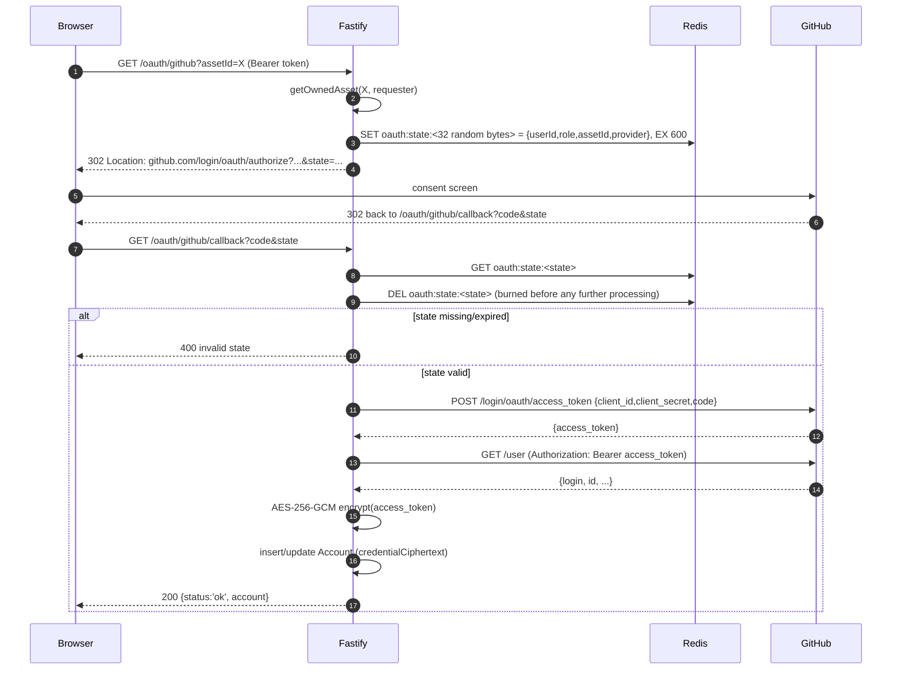
```mermaid
sequenceDiagram
    autonumber
    participant U as Browser
    participant API as Fastify
    participant R as Redis
    participant GH as GitHub

    U->>API: GET /oauth/github?assetId=X (Bearer token)
    API->>API: getOwnedAsset(X, requester)
    API->>R: SET oauth:state:<32 random bytes> = {userId,role,assetId,provider}, EX 600
    API-->>U: 302 Location: github.com/login/oauth/authorize?...&state=...
    U->>GH: consent screen
    GH-->>U: 302 back to /oauth/github/callback?code&state
    U->>API: GET /oauth/github/callback?code&state
    API->>R: GET oauth:state:<state>
    API->>R: DEL oauth:state:<state>  (burned before any further processing)
    alt state missing/expired
        API-->>U: 400 invalid state
    else state valid
        API->>GH: POST /login/oauth/access_token {client_id,client_secret,code}
        GH-->>API: {access_token}
        API->>GH: GET /user (Authorization: Bearer access_token)
        GH-->>API: {login, id, ...}
        API->>API: AES-256-GCM encrypt(access_token)
        API->>API: insert/update Account (credentialCiphertext)
        API-->>U: 200 {status:'ok', account}
    end
```

### 19.2 Sync

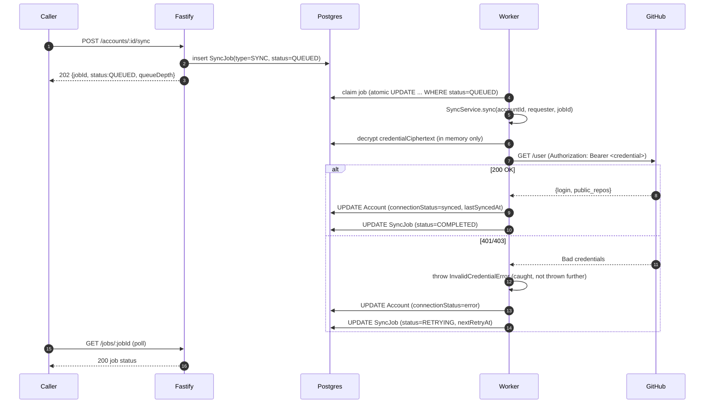
```mermaid
sequenceDiagram
    autonumber
    participant U as Caller
    participant API as Fastify
    participant DB as Postgres
    participant W as Worker
    participant GH as GitHub

    U->>API: POST /accounts/:id/sync
    API->>DB: insert SyncJob(type=SYNC, status=QUEUED)
    API-->>U: 202 {jobId, status:QUEUED, queueDepth}
    W->>DB: claim job (atomic UPDATE ... WHERE status=QUEUED)
    W->>W: SyncService.sync(accountId, requester, jobId)
    W->>DB: decrypt credentialCiphertext (in memory only)
    W->>GH: GET /user (Authorization: Bearer <credential>)
    alt 200 OK
        GH-->>W: {login, public_repos}
        W->>DB: UPDATE Account (connectionStatus=synced, lastSyncedAt)
        W->>DB: UPDATE SyncJob (status=COMPLETED)
    else 401/403
        GH-->>W: Bad credentials
        W->>W: throw InvalidCredentialError (caught, not thrown further)
        W->>DB: UPDATE Account (connectionStatus=error)
        W->>DB: UPDATE SyncJob (status=RETRYING, nextRetryAt)
    end
    U->>API: GET /jobs/:jobId (poll)
    API-->>U: 200 job status
```

### 19.3 Discovery

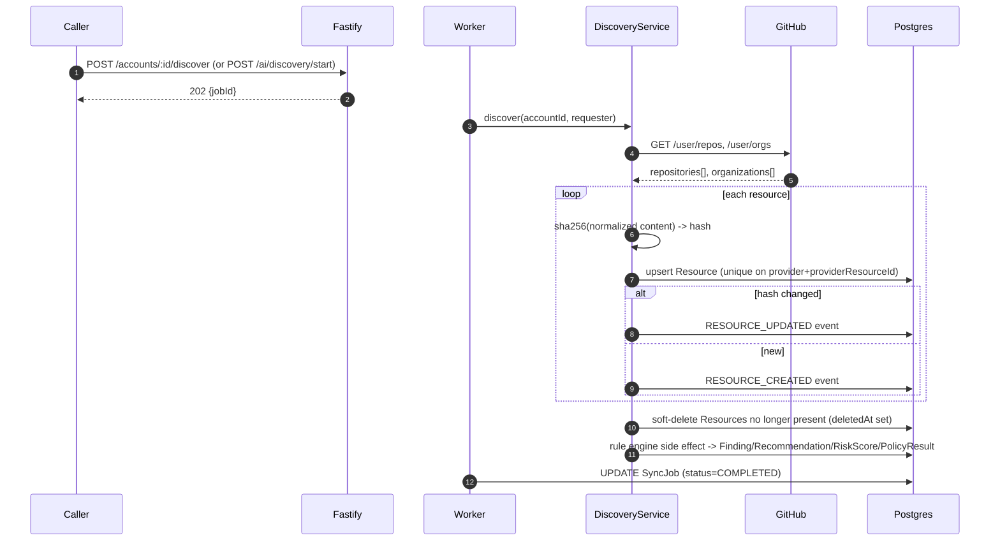
```mermaid
sequenceDiagram
    autonumber
    participant U as Caller
    participant API as Fastify
    participant W as Worker
    participant DS as DiscoveryService
    participant GH as GitHub
    participant DB as Postgres

    U->>API: POST /accounts/:id/discover  (or POST /ai/discovery/start)
    API-->>U: 202 {jobId}
    W->>DS: discover(accountId, requester)
    DS->>GH: GET /user/repos, /user/orgs
    GH-->>DS: repositories[], organizations[]
    loop each resource
        DS->>DS: sha256(normalized content) -> hash
        DS->>DB: upsert Resource (unique on provider+providerResourceId)
        alt hash changed
            DS->>DB: RESOURCE_UPDATED event
        else new
            DS->>DB: RESOURCE_CREATED event
        end
    end
    DS->>DB: soft-delete Resources no longer present (deletedAt set)
    DS->>DB: rule engine side effect -> Finding/Recommendation/RiskScore/PolicyResult
    W->>DB: UPDATE SyncJob (status=COMPLETED)
```

### 19.4 Risk

```mermaid
sequenceDiagram
    autonumber
    participant Eng as Execution Engine
    participant RA as RiskAgent
    participant Tool as ToolExecutor
    participant Svc as RiskService/FindingService
    participant Mem as RiskMemory
    participant LLM as LLM (gpt-4o-mini)

    Eng->>RA: execute({assetId}, context)
    RA->>RA: getOwnedAsset(assetId)
    RA->>Tool: risk_engine_score
    Tool->>Svc: read RiskScore(scope=ASSET)
    Svc-->>Tool: overallScore, counts
    RA->>Tool: risk_finding_store_list
    Tool->>Svc: read Finding[] (status=OPEN)
    Svc-->>Tool: findings[]
    RA->>Eng: recordAgentOutput(stepId=risk.scoring)
    RA->>Mem: rememberSeenRuleCodes, recordScoreSnapshot
    RA->>LLM: explainTopFindings (top 5, best-effort)
    RA->>LLM: riskSummaryPrompt
    RA->>Mem: recordRun()
    RA-->>Eng: RiskAgentOutput{overallScore, businessImpact, findings[], confidenceScore}
```

### 19.5 Report

```mermaid
sequenceDiagram
    autonumber
    participant Eng as Execution Engine
    participant RepA as ReportAgent
    participant Ctx as OrchestrationContext
    participant RiskM as riskMemory (dynamic import)
    participant LLM as LLM

    Eng->>RepA: execute({assetId}, context)
    RepA->>RepA: report_asset_lookup (ownership check)
    loop for discovery, risk, compliance, recommendation
        RepA->>Ctx: latestEntryFor(agentId)
        alt live SUCCESS entry
            RepA->>RepA: section = INCLUDED, origin=context
        else live FAILED entry
            RepA->>RepA: section = FAILED
        else no live entry (risk/compliance/recommendation only)
            RepA->>RiskM: getLastRun(assetId)  (dynamic import of sibling agent)
            alt found
                RepA->>RepA: section = INCLUDED, origin=memory
            else
                RepA->>RepA: section = MISSING, origin=unavailable
            end
        end
    end
    RepA->>Eng: recordAgentOutput(stepId=report.aggregating)
    RepA->>LLM: reportSummaryPrompt (composed purely from section content)
    RepA-->>Eng: ReportAgentOutput{sections[], executive, confidenceScore}
```

### 19.6 Planner (LLM Planner dynamic execution)

```mermaid
sequenceDiagram
    autonumber
    participant U as Caller
    participant LP as LLMPlanner
    participant LLM as LLM
    participant Val as Validator
    participant Exec as LLMPlannerExecutor
    participant G as Dynamic LangGraph

    U->>LP: plan({goal, assetId, ...})
    LP->>LP: gatherPlannerContext (conv/session/knowledge/reflection/episode)
    LP->>LP: computeCacheKey(goal, assetId, knowledgeVersion, model)
    alt cache hit
        LP-->>U: LLMPlanRecord (source=cache)
    else cache miss
        LP->>LLM: buildPlannerPrompt -> generate
        LLM-->>LP: raw JSON
        LP->>Val: validatePlan(draft)
        alt invalid, attempts remain
            LP->>LLM: buildRepairPrompt -> generate (retry)
        else invalid, exhausted
            LP->>LP: fallbackPlan() via GoalPlanner
        end
        LP-->>U: LLMPlanRecord (source=llm|fallback)
    end
    U->>Exec: execute(input)
    Exec->>Exec: toGraphSteps (canonical stepId translation)
    Exec->>G: buildDynamicGraph + invoke
    G-->>Exec: final GraphState
    Exec->>Exec: confidenceOf(state) < 0.6 and iteration < 3 ?
    alt needs revision
        Exec->>LP: revise(input, plan, feedback, iteration)
        LP->>LLM: buildRevisionPrompt -> generate
        Exec->>G: buildDynamicGraph + invoke (again)
    end
    Exec-->>U: LLMPlannerRunResult{planRecords[], status, iterations}
```

### 19.7 Copilot

```mermaid
sequenceDiagram
    autonumber
    participant U as User
    participant CA as CopilotAgent
    participant Sess as SessionMemory
    participant Tool as ToolExecutor
    participant Orc as OrchestratorService
    participant RAG as RetrievalService
    participant LLM as LLM

    U->>CA: execute({conversationId, message})
    CA->>Sess: load session
    CA->>CA: appendTurn(user, message)
    CA->>CA: classifyIntent(message)  (regex)
    CA->>CA: selectTool(message)  (regex)
    alt matched a specific tool (e.g. "list my PRs")
        CA->>Tool: run(matched tool)
        Tool-->>CA: ToolResult
    else needs fresh analysis (resourceCount=0 or intent=ANALYZE)
        CA->>Orc: tryTriggerWorkflow() -- re-enters public OrchestratorService.execute()
        Orc-->>CA: ExecutionResult
        CA->>CA: gatherExplanation(intent) -- dedicated lookup tools
    end
    CA->>RAG: retrieveGrounding() via knowledge_search tool
    RAG-->>CA: evidence[], citations[]
    CA->>LLM: generateAnswer(explanation)  -- rephrase only, no new facts
    CA->>CA: appendTurn(assistant, answer)
    CA->>Sess: setSessionState()
    CA-->>U: CopilotAgentOutput{answer, explanation, citations, sourceAgents}
```

### 19.8 Tool Calling

```mermaid
sequenceDiagram
    autonumber
    participant Agent
    participant TE as ToolExecutor
    participant Perm as tool-permissions.ts
    participant TR as ToolRegistry
    participant Tool as Concrete Tool
    participant DB as Postgres (ToolExecutionTrace)

    Agent->>TE: run(toolName, input, context, agentId)
    TE->>TE: isToolAllowedForAgent(agentId, toolName)?
    alt not allowed
        TE-->>Agent: ToolResult{success:false, error:'not permitted'}
    else allowed
        TE->>Perm: assertPermitted(tool)  -- rejects any 'write' permission
        alt denied
            TE-->>Agent: ToolResult{success:false, error:'permission denied'}
        else permitted
            TE->>TR: execute(toolName, input, context)
            TR->>TR: inputSchema.safeParse
            TR->>Tool: tool.execute(input, context)
            Tool-->>TR: output
            TR->>TR: outputSchema.safeParse
            TR-->>TE: validated output
            TE->>DB: insert ToolExecutionTrace{success:true}
            TE-->>Agent: ToolResult{success:true, output}
        end
    end
```

### 19.9 LangGraph (interrupt + resume)

See **§7.6** for the full checkpoint/resume/interrupt sequence diagram — reproduced here by reference as the canonical LangGraph sequence for this section.

### 19.10 Approval

```mermaid
sequenceDiagram
    autonumber
    participant Ex as Execution (either path)
    participant AE as ApprovalEngine
    participant AS as ApprovalStore
    participant U as Reviewer

    Ex->>AE: requestApproval({agentId, stepId, decision})
    alt decision = AUTO
        AE->>AS: save(status=APPROVED, decidedBy='system')
    else decision = MANUAL
        AE->>AS: save(status=PENDING)
        Ex->>Ex: pause (HOLD gate / LangGraph interrupt())
        U->>AE: POST /ai/approval/:id/approve {reason?, editedOutput?}
        AE->>AS: update(status=APPROVED, decidedBy, decidedAt)
        AE-->>Ex: resume triggered automatically
        Ex->>Ex: continue execution (editedOutput injected directly if present)
    end
```

### 19.11 Debate

See **§12.2** for the full debate sequence diagram (Risk → Recommendation → Compliance → trigger check → optional Copilot summarization → Consensus).

### 19.12 Memory (episodic capture + retrieval)

```mermaid
sequenceDiagram
    autonumber
    participant Eng as Any execution engine
    participant Cap as captureEpisodeSafely
    participant Ext as EpisodeExtractor
    participant ES as EpisodeStore (Redis)
    participant Idx as EpisodeIndexer
    participant KS as KnowledgeStore (pgvector)
    participant LP as LLMPlanner (future run)
    participant Search as EpisodeSearch

    Eng->>Cap: fire-and-forget, after execution completes
    Cap->>Ext: capture(executionId, goal, result, reflection?, debate?, consensus?)
    Ext->>Ext: deriveLessons() -- whatWorked/whatFailed/lessonsLearned/futureSuggestions
    Ext->>ES: save(Episode)
    Ext->>Idx: index(episode)
    Idx->>KS: indexDocument(documentType=EPISODE, sourceId=episodeId)

    Note over LP: --- later, a new goal on the same asset ---
    LP->>Search: search({goal, assetId, topK:3})
    Search->>KS: RetrievalService.search(documentTypes=[EPISODE])
    KS-->>Search: matched KnowledgeDocuments
    Search->>ES: get(sourceId) for each match
    ES-->>Search: full Episode
    Search-->>LP: EpisodeSearchMatch[]{episode, score}
    LP->>LP: episodeSummary fed into prompt
```

***
## 20. Component Diagrams

### 20.1 System-Level Components

```mermaid
graph TB
    subgraph Client
        WEB[Next.js Frontend\napps/web]
    end

    subgraph API["Fastify API — apps/api"]
        ROUTES[34 Route Files]
        SVC[Deterministic Services\nauth/assets/discovery/analysis/compliance]
        AI[AI Subsystem — ai/]
        JOBS[Job System\nservices/jobs + workers]
        WS[WebSocket Gateway]
    end

    subgraph Data
        PG[(PostgreSQL 16\n+ pgvector)]
        REDIS[(Redis 7)]
    end

    subgraph External
        GH[GitHub REST/OAuth API]
        LLM[Anthropic Claude /\nOpenAI]
    end

    WEB -->|REST + WS, JWT bearer| ROUTES
    ROUTES --> SVC
    ROUTES --> AI
    ROUTES --> JOBS
    ROUTES --> WS
    SVC --> PG
    AI --> SVC
    AI --> PG
    AI --> REDIS
    AI --> LLM
    JOBS --> PG
    JOBS --> REDIS
    SVC --> GH
    WS --> REDIS
    JOBS -.dispatches AI jobs.-> AI
```

### 20.2 AI Subsystem Components

```mermaid
graph TB
    subgraph "ai/ subsystem"
        REG[Agent Registry]
        subgraph Agents
            DA[Discovery]
            RA[Risk]
            CA[Compliance]
            RECA[Recommendation]
            REPA[Report]
            COPA[Copilot]
        end
        subgraph "Execution Engines"
            ORCH[Orchestrator\nWorkflowEngine]
            REAS[Reasoning Orchestrator]
            LG[LangGraph Executor]
            LLMP[LLM Planner Executor]
        end
        subgraph Reasoning
            CRIT[Critic]
            REFL[Reflection Engine]
            DEB[Debate Engine]
            CONS[Consensus Engine]
            APPR[Approval Engine]
        end
        subgraph Knowledge
            EMB[Embedding Service]
            KS[Knowledge Store]
            RET[Retrieval Service]
            EPI[Episodic Memory]
        end
        TOOLS[Tool Registry + Executor]
    end

    ORCH & REAS & LG & LLMP --> REG
    REG --> DA & RA & CA & RECA & REPA & COPA
    DA & RA & CA & RECA & REPA & COPA --> TOOLS
    ORCH & REAS & LG & LLMP --> CRIT --> REFL
    LG --> APPR
    REAS --> APPR
    DEB --> REG
    DEB --> CONS
    DA & RA & CA & RECA & REPA -->|auto-index| KS
    KS --> EMB
    RET --> KS
    COPA --> RET
    EPI --> KS
    ORCH & REAS & LG & DEB -->|capture| EPI
    LLMP --> EPI
```

### 20.3 Frontend Component Structure

```mermaid
graph LR
    subgraph "apps/web/src"
        APP[app/ — route-per-folder pages]
        LIB[lib/api/ — typed client]
        CLIENT[client.ts — single fetch chokepoint]
    end
    APP --> LIB
    LIB --> CLIENT
    CLIENT -->|JWT bearer, single retry-on-401| API[Fastify API]
    APP -->|/ws| WSAPI[WebSocket Gateway]
```

The frontend has exactly one fetch chokepoint (`client.ts`'s `doFetch()`): every domain file (`accounts.ts`, `assets.ts`, `jobs.ts`, ...) calls the shared `apiRequest()`, which attaches the bearer token, retries exactly once on `401` after a token refresh, and normalizes every non-2xx response into a single `ApiError`/`SessionExpiredError` shape.

***

## 21. Class Diagrams

### 21.1 Orchestration Core

```mermaid
classDiagram
    class Planner {
        +createPlan(request) ExecutionPlan
        -resolveWorkflowId(intent) string
    }
    class WorkflowRegistry {
        -Map~string,WorkflowDefinition~ workflows
        +register(def)
        +get(id) WorkflowDefinition
        +list() WorkflowDefinition[]
    }
    class WorkflowEngine {
        +run(definition, context, options) WorkflowRunResult
        -buildWaves(steps) steps[][]
        -runStep(step, context) AgentTaskResult
    }
    class Executor {
        -StateManager stateManager
        -ExecutionHistory history
        +run(plan, context, options) ExecutionResult
    }
    class StateManager {
        +create(input)
        +touchCurrentStep(id, stepId)
        +finalize(id, steps, status, finishedAt, context) WorkflowExecutionState
    }
    class OrchestratorService {
        -Planner planner
        -Executor executor
        -Map~string,AbortController~ controllers
        +execute(input) ExecutionResult
        +cancel(executionId)
        +getStatus(executionId)
    }
    OrchestratorService --> Planner
    OrchestratorService --> Executor
    Executor --> WorkflowEngine
    Executor --> StateManager
    Planner --> WorkflowRegistry
```

### 21.2 Agent Layer

```mermaid
classDiagram
    class OrchestratorAgent {
        <<interface>>
        +id string
        +execute(input, context) Promise
    }
    class DiscoveryExecutor {
        +run(input) DiscoveryAgentOutput
        -confidenceFor(...) number
        -callTool(name, input) unknown
    }
    class DiscoveryMemory {
        +recordRun(accountId, output)
        +rememberDiscoveredResourceIds(accountId, ids)
        +getLastRun(accountId)
    }
    class DiscoveryAgentImpl {
        +execute(input, context)
    }
    DiscoveryAgentImpl ..|> OrchestratorAgent
    DiscoveryAgentImpl --> DiscoveryExecutor
    DiscoveryExecutor --> DiscoveryMemory
    DiscoveryExecutor --> ToolRegistry

    class ToolRegistry {
        +register(tool)
        +execute(name, input, context) unknown
    }
    class ToolExecutor {
        -ToolRegistry registry
        +run(name, input, context, agentId) ToolResult
    }
    ToolExecutor --> ToolRegistry
```

*(The other five agents — `RiskAgentImpl`/`RiskExecutor`/`RiskMemory`, `ComplianceAgentImpl`/.../`ComplianceMemory`, etc. — are structurally identical to this Discovery example: one `<Agent>Executor`, one `<Agent>Memory`, one thin `<Agent>Impl` wrapper. Omitted here for brevity; see §6 for their individual field-level shapes.)*

### 21.3 Reasoning Layer

```mermaid
classDiagram
    class Critic {
        +evaluateExecution(result, plan) CriticReport
        -evaluateStep(step) CriticFinding[]
        -isEmptyEvidence(output) bool
    }
    class ReflectionEngine {
        +reflect(result, plan, finalPlan, criticReport, context, debate?) ReflectionReport
    }
    class ReflectionStore {
        +save(report)
        +get(executionId) ReflectionReport
    }
    class DebateEngine {
        +run(input) DebateRecord
        -evaluateTrigger(risk, compliance, recommendation) TriggerResult
    }
    class ConsensusEngine {
        +compute(input) ConsensusReport
    }
    class ApprovalPolicy {
        -Map~string,Decision~ policies
        +decideForAgent(agentId) Decision
        +register(agentId, decision)
    }
    class ApprovalEngine {
        -ApprovalStore store
        +requestApproval(input) ApprovalRequest
        +decide(id, outcome, input) ApprovalRequest
    }
    class HitlOrchestrator {
        +run(input) HitlResult
        +resume(executionId) HitlResult
        +cancel(executionId)
        -gateFor(request) Gate
    }
    ReflectionEngine --> ReflectionStore
    DebateEngine --> ConsensusEngine
    DebateEngine --> Critic
    DebateEngine --> ReflectionEngine
    HitlOrchestrator --> ApprovalEngine
    ApprovalEngine --> ApprovalPolicy
```

### 21.4 Episodic Memory

```mermaid
classDiagram
    class EpisodeExtractor {
        +capture(input) Episode
    }
    class EpisodeStore {
        +save(episode)
        +get(id) Episode
        +getHistory(assetId, limit) Episode[]
    }
    class EpisodeIndexer {
        +index(episode)
    }
    class EpisodeSearch {
        +search(input) EpisodeSearchMatch[]
    }
    class EpisodePruner {
        +pruneAsset(assetId, options) PruneResult
    }
    class EpisodeTelemetry {
        +recordCapture(input)
        +recordRetrieval(input)
    }
    EpisodeExtractor --> EpisodeStore
    EpisodeExtractor --> EpisodeIndexer
    EpisodeExtractor --> EpisodeTelemetry
    EpisodeSearch --> EpisodeStore
    EpisodeSearch --> RetrievalService
    EpisodePruner --> EpisodeStore
    EpisodeIndexer --> KnowledgeStore
```

### 21.5 Job System

```mermaid
classDiagram
    class JobService {
        +enqueue(input) EnqueueResult
        +enqueueForAccount(type, accountId, requester)
        +retry(id)
        +cancel(id)
        +getQueueHealth()
    }
    class JobDispatcher {
        -Map~string,JobHandler~ handlers
        +register(type, handler)
        +dispatch(job) JobExecutionResult
    }
    class JobExecutor {
        +execute(job, workerId)
        -handleFailure(job, err, durationMs, isPermanent)
        -isPermanentFailure(err) bool
    }
    class RetryService {
        +decide(job) RetryDecision
    }
    class JobRepository {
        +claimNextJob(workerId) SyncJob
        +attemptClaim(id, expectedStatus) bool
        +reclaimStaleJobs(staleBeforeMs)
    }
    class Worker {
        +pollOnce()
        -id string
        -status string
    }
    class WorkerPool {
        -Worker[] workers
        +start(count)
        +stats()
    }
    JobService --> JobRepository
    JobExecutor --> JobDispatcher
    JobExecutor --> RetryService
    JobExecutor --> JobRepository
    Worker --> JobExecutor
    Worker --> JobRepository
    WorkerPool --> Worker
```

***
## 22. Deployment Diagram

Three Docker Compose profiles exist at the repo root: `docker-compose.yml` (infra-only — Postgres + Redis, for running the API natively via `pnpm dev` against dockerized backing services), `docker-compose.dev.yml` (infra + `api` + `web`, hot-reload bind mounts, `target: dev`), and `docker-compose.prod.yml` (full stack + `nginx`, `target: runtime`).

```mermaid
graph TB
    subgraph Internet
        Client[Browser]
    end

    subgraph "Docker Compose (prod profile)"
        NGINX[nginx:1.27-alpine\nTLS termination, WS upgrade,\ncompression, security headers\n:80 published]
        subgraph "api container"
            APIRT[Fastify runtime\ntarget=runtime\nnode dist/server.js\nno published port]
        end
        subgraph "web container"
            WEBRT[Next.js standalone\ntarget=runtime\n:3001 internal]
        end
        subgraph "postgres container"
            PG[(pgvector/pgvector:pg16\ninternal network only)]
        end
        subgraph "redis container"
            REDIS[(redis:7\ninternal network only)]
        end
    end

    subgraph External
        GH[GitHub API]
        LLM[Claude / OpenAI]
    end

    Client -->|HTTPS| NGINX
    NGINX -->|/api/*| APIRT
    NGINX -->|/ , static| WEBRT
    NGINX -->|/ws upgrade| APIRT
    APIRT --> PG
    APIRT --> REDIS
    APIRT --> GH
    APIRT --> LLM
    WEBRT -->|NEXT_PUBLIC_API_URL, baked at build time| NGINX
```

### 22.1 Build Pipeline

Both `apps/api/Dockerfile` and `apps/web/Dockerfile` are multi-stage: `base` (Node 20 Alpine, `libc6-compat`/`openssl` for Prisma/bcrypt native addons, corepack for pnpm) → `deps` (full install) → `dev` (bind-mounted source, hot reload) or `build` (`pnpm prisma:generate && pnpm build` for the API; Next's standalone output for the web app) → `runtime` (only compiled `dist/`/`.next/standalone` + production `node_modules`, `USER node`, a `HEALTHCHECK` against `/health` or `/`). The API's `prisma`/`tsx` packages are deliberately kept as real `dependencies` (not `devDependencies`) so the `--prod`-only install used for the runtime image still has what `pnpm prisma:deploy`/`pnpm prisma:seed` need.

### 22.2 Health Checks

| Container | Check |
|---|---|
| postgres | `pg_isready -U estateai -d estateai` |
| redis | `redis-cli ping` |
| api | `wget -qO- http://localhost:3000/health` (or, at the application layer, `GET /health/ready` for full DB+Redis+queue readiness) |
| web | request against `/` |

### 22.3 What Is Not Yet Automated

No Kubernetes manifests exist (documented as future work). The Compose setup is single-replica per service — no horizontal scaling config, though the job worker pool and the WebSocket gateway are both designed to tolerate multiple API processes sharing Postgres/Redis if that were added (the codebase's own comments note the WebSocket event bus, `realtime-bus.ts`, is a single-process `EventEmitter` today and would need a Redis pub/sub fan-out to actually work correctly across multiple replicas).

***

## 23. Data Flow Diagram

```mermaid
flowchart LR
    subgraph Ingress
        HTTP[HTTP Request]
        WSIn[WebSocket Frame]
    end

    HTTP --> AuthCheck{JWT valid?}
    AuthCheck -->|no| R401[401]
    AuthCheck -->|yes| ZodValidate[Zod schema validate]
    ZodValidate -->|invalid| R400[400]
    ZodValidate -->|valid| Ownership{Ownership check\nrequired?}
    Ownership -->|fails| R403[403]
    Ownership -->|passes / n/a| Route[Route Handler]

    Route --> DomainSvc[Deterministic Service]
    Route --> AISub[AI Subsystem]
    Route --> JobEnqueue[Job Enqueue]

    DomainSvc --> PGWrite[(Postgres write)]
    DomainSvc --> EventEmit[AssetEvent created]
    EventEmit --> Bus[realtime-bus EventEmitter]
    Bus --> WSOut[WebSocket push to subscribers]

    JobEnqueue --> PGJob[(SyncJob row)]
    JobEnqueue --> RedisSignal[(Redis jobs:queue)]
    RedisSignal --> WorkerPoll[Worker poll loop]
    PGJob --> WorkerPoll
    WorkerPoll --> Dispatch[JobDispatcher]
    Dispatch --> AISub
    Dispatch --> DomainSvc

    AISub --> AgentCall[Agent.execute]
    AgentCall --> ToolCall[ToolExecutor]
    ToolCall --> DomainSvc
    ToolCall --> ExternalAPI[GitHub / LLM providers]
    AgentCall --> Embed[Auto-index -> Embeddings -> pgvector]
    AgentCall --> AgentMemWrite[(Agent memory, Redis)]
    AISub --> ReflectWrite[(ReflectionStore)]
    AISub --> EpisodeWrite[(EpisodeStore + KnowledgeDocument)]

    Route --> HTTPResp[HTTP Response]
    WSOut --> WSClient[Connected WebSocket clients]
```

**Key property**: every write path (Postgres, Redis, pgvector) is reachable from exactly one layer above it — routes never write to Postgres directly (always through a service), services never write to Redis-backed AI stores (that's exclusively the `ai/` layer's job), and the job system is the only thing that can move work from a synchronous HTTP request into asynchronous background execution.

***

## 24. Complete End-to-End Workflow

One master diagram covering every phase from a cold start to a fully reflected-on, debated, episodically-remembered execution — the synthesis of everything in Sections 5 through 15.

```mermaid
flowchart TD
    Start([User action in browser]) --> Auth[JWT auth + Zod validation]
    Auth --> Entry{Entry point}

    Entry -->|"POST /accounts/:id/sync\n/discover"| JobPath[Async Job Path]
    Entry -->|"POST /ai/orchestrator/execute"| DetPath[Deterministic DAG]
    Entry -->|"POST /ai/planner/plan"| ReasPath[Reasoning-first Adaptive]
    Entry -->|"POST /ai/langgraph/execute"| GraphPath[LangGraph Native]
    Entry -->|"POST /ai/planner/dynamic"| LLMPath[LLM-authored Dynamic Plan]
    Entry -->|"POST /ai/copilot/chat"| CopPath[Copilot Conversational]
    Entry -->|"POST /ai/debate/start"| DebPath[Multi-Agent Debate]

    JobPath --> Worker[Worker claims SyncJob] --> Dispatch[JobDispatcher]
    Dispatch --> DetSvc[SyncService / DiscoveryService] --> GH1[(GitHub)]
    GH1 --> Rows[(Resource / Finding / Recommendation\nRiskScore / PolicyResult)]

    DetPath & ReasPath & GraphPath & LLMPath --> Steps[Workflow steps:\nDiscovery -> Risk+Compliance -> Recommendation -> Report]
    Steps --> AgentExec[orchestratorAgentRegistry.get id .execute]
    AgentExec --> ToolLayer[ToolExecutor: allowlist + permission]
    ToolLayer --> Rows
    AgentExec --> AutoIndex[Auto-index into Knowledge Store]
    AutoIndex --> Vec[(pgvector KnowledgeDocument)]
    AgentExec --> AgentMem[(Per-agent Redis memory)]

    CopPath --> Intent[classifyIntent regex] --> NeedsData{Data exists?}
    NeedsData -->|no| DetPath
    NeedsData -->|yes| Ground[RAG grounding via knowledge_search]
    Ground --> Vec
    Ground --> CopAnswer[LLM narrates deterministic explanation]

    DebPath --> ThreeAgents[Risk -> Recommendation -> Compliance\nsequential, shared context]
    ThreeAgents --> Trigger{Trigger?\nLOW_CONFIDENCE / DISAGREEMENT / HIGH_RISK}
    Trigger -->|yes| CopSum[Copilot summarizes] --> Consensus[ConsensusEngine]
    Trigger -->|no| DebDone[DebateRecord triggered=false]
    Consensus --> DebDone2[DebateRecord + ConsensusReport]

    DetPath & ReasPath & GraphPath & LLMPath & DebPath2[DebPath] --> Critic[Critic.evaluateExecution]
    Critic --> Reflect[ReflectionEngine.reflect]
    Reflect --> RStore[(ReflectionStore)]

    GraphPath -->|MANUAL approval step| Interrupt[LangGraph interrupt] --> ApprovalWait[WAITING_FOR_APPROVAL]
    ReasPath -->|MANUAL approval step| HitlHold[HitlOrchestrator HOLD gate] --> ApprovalWait
    ApprovalWait --> HumanDecision[Human: approve / reject / edit] --> Resume[Resume execution]
    Resume --> Critic

    Reflect --> EpisodeCap[captureEpisodeSafely, fire-and-forget]
    EpisodeCap --> Episode[(Episode: lessons, outcome, confidence)]
    Episode --> AutoIndex

    LLMPath -->|confidence < 0.6, iteration < 3| ReviseFeedback[Feedback from reflection] --> LLMPath

    Episode -.future planning context.-> LLMPath

    Reflect --> Response([HTTP Response to caller])
    ApprovalWait -.-> Response
```

This diagram is the single authoritative map of the platform: every arrow in it corresponds to a real, cited code path documented in Sections 5–15 — nothing here is aspirational.

***
## 25. Future Improvements

Every item below is a genuine, currently-true limitation found in the code during this document's research — not speculation.

### 25.1 Not Implemented At All

- **Real web search** — `MockWebSearchProvider` is the only shipped `WebSearchProvider`; results are clearly-labeled `example.com` placeholders, never a real search.
- **Write-capable tools/agents** — the entire tool framework refuses any tool declaring the `write` permission (`ai/tools/tool-permissions.ts`). No agent registers as `MANUAL` in `ApprovalPolicy` by default. The whole Human-in-the-Loop system is therefore fully built, fully tested, and currently inert — there is nothing destructive in the platform for it to gate yet.
- **6 Discovery Agent tools and 5 Risk Agent tools are placeholders** that always reject (`ToolExecutionError`): branches, contributors, releases, workflows, security advisories, secret scanning (Discovery); secrets scanner, branch protection, workflow risk, dependency risk, security alerts (Risk). Only Compliance Agent has zero placeholder tools.
- **Only GitHub is a real provider.** `Account.provider` and `Resource.provider` are modeled generically enough for AWS/Gmail/Google Drive/Stripe/domains/Notion/Dropbox/Slack/Cloudflare, but no other provider has a discovery/sync implementation.
- **No embedding-provider migration/backfill tool.** If `EMBEDDING_PROVIDER` is switched (e.g. local → OpenAI) mid-flight, existing `KnowledgeDocument` rows keep their old `embeddingVersion` forever; nothing re-embeds them.
- **No reranking, hybrid search, or document chunking** in the RAG pipeline — each indexed document is a single embedded unit.

### 25.2 Architectural Debt (working, but with known sharp edges)

- **Two parallel AI provider stacks exist.** The legacy `services/ai/` system (Phase 7B) has a real, working Claude/OpenAI/Gemini integration behind `/ai/generate` and `/copilot/chat`. The newer `ai/llm/` foundation (Phase 16+, used by all six agents) has only OpenAI concretely implemented — its own `AnthropicProvider` is a placeholder that throws if selected, and its default provider is hardcoded to `openai`, **independent of** the `AI_PROVIDER` env var. A reader who assumes `AI_PROVIDER=claude` controls agent behavior would be wrong — it only controls the legacy path.
- **`SyncService`/`DiscoveryService` swallow provider errors into a result object** rather than throwing, which means `JobExecutor` always treats their failures as retryable (§14.4) — a permanently-bad credential burns the full retry schedule (up to 5 attempts across hours) before going `DEAD`, instead of failing fast.
- **Confidence calibration is computed but never consulted.** `episode.relevance.ts`'s `calibrateConfidence()`/`computeAgentReliability()`/`computeToolReliability()` are fully implemented and unit-tested but have zero live callers — no agent or planner adjusts its behavior based on historical reliability yet.
- **No background job runs `EpisodePruner`.** Episodes accumulate up to Redis's passive 7-day TTL with no active per-asset cap unless something calls `pruneAsset()` explicitly.
- **Episode confidence is whole-execution, not per-agent** — `computeAgentReliability()`'s "average confidence per agent" is a coarser signal than a true per-agent score, since per-agent confidence isn't retained on the `Episode` record itself.
- **`GraphExecutor.resume()` supports only one concurrently-pending `interrupt()` per execution** (LangGraph's simple `Command({resume: value})` form, not the id-keyed multi-interrupt map) — fine today since at most one policy is ever `MANUAL`, but a graph with two simultaneously `MANUAL`-gated parallel branches would need it.
- **`GraphCheckpointStore` is not a real `BaseCheckpointSaver`** — it persists plain `GraphState` JSON, not LangGraph's own internal `Checkpoint`/`channel_versions` format, so it can't be swapped into a different official checkpointer package without a translation layer.
- **Debate's corroboration signal is single-factor** — a Risk finding is only "accepted" if a Recommendation explicitly cites it; Compliance evidence for the same issue with no matching Recommendation still counts as "rejected," which may over-report disagreement.
- **`DebateEngine` never re-runs Discovery** — it analyzes whatever Risk/Compliance/Recommendation currently compute for an asset's *existing* resources; a debate on a stale or never-discovered asset reflects that stale/empty state.

### 25.3 Missing Safety/Ops Polish

- **No ownership checks on several internal ids** — `debateId`, `episodeId`, `executionId` (orchestrator/LangGraph/LLM Planner) follow a "possession implies access" model consistently, but none of them verify the caller is the original requester the way `Asset`/`Account` ownership does.
- **Several Redis-backed stores have no size cap or archive beyond TTL** — `PlannerCache`/`PlannerHistoryStore`, `PlanStore`/`ReflectionStore`, `DebateMemory`/`ConsensusStore` are all TTL-only; `PlannerHistoryStore.list()` and `DebateMemory.getHistory()` both read their *entire* list into memory before slicing, which won't scale past a modest call volume.
- **No `(executionId, stepId)` composite index on `ApprovalStore`** — `GET /ai/approval/pending` does a full scan of its append-only index list.
- **`realtime-bus.ts` is a single-process `EventEmitter`** — horizontal scaling of the API beyond one process would need a Redis pub/sub (or similar) fan-out for WebSocket events to reach a connection parked on a different instance.
- **No OpenTelemetry / distributed tracing** — Prometheus metrics and structured `pino` logs exist, but there's no end-to-end correlation-id trace across HTTP → job → AI → orchestrator spans beyond the `requestId`/`correlationId` header propagation already in place.
- **No Kubernetes manifests** — Docker Compose only.

### 25.4 Phase 31+ Possibilities

Directly implied by the gaps above, roughly in order of how naturally they follow from what already exists:

1. Wire `calibrateConfidence()` into the LLM Planner's own confidence output and/or the Reflection loop's continuation decision — the infrastructure is already built (§13.5), it just has no caller.
2. Schedule `EpisodePruner.pruneAsset()` as a recurring background job (the job platform already exists — this would just be a new `JobType` with a cron-style trigger).
3. Implement a real, non-mock `WebSearchProvider` (the interface already exists — `websearch.provider.ts`).
4. Promote a second real provider (AWS, Google Drive, or Slack are the most-mentioned in the product vision) through Discovery/Sync/Risk end to end, proving the generic `provider: string` design actually generalizes.
5. Introduce the first real write-capable tool (e.g. "close this GitHub issue," "revoke this token") behind a `MANUAL` approval policy — this would be the first genuine exercise of the entire HITL system outside synthetic test fixtures.
6. Multi-factor corroboration for Debate's `classifyFindings()` (weight Compliance evidence alongside Recommendation citations).
7. A real `BaseCheckpointSaver`-compatible checkpointer for LangGraph, enabling official LangGraph tooling (e.g. time-travel debugging) against this project's executions.

***

## 26. Resume Highlights

Framed for an engineering interview — each bullet is a real, load-bearing decision found in this codebase, not a marketing gloss.

- **Designed and shipped a multi-agent AI backend where four independent execution engines (a hand-rolled DAG scheduler, an adaptive condition-injected orchestrator, LangGraph, and an LLM-authored dynamic planner) all drive the same six agents through one shared registry interface — zero agent logic duplicated across any of them, verified across ~30 incremental phases without regressing an earlier one.**
- **Built a genuine multi-agent collaboration and debate system**: agents cross-reference each other's live output via a shared execution context (not a second database round-trip); a downstream Consensus Engine applies four deterministic structural conflict checks to surface disagreement between agents without ever mutating their outputs or duplicating their business logic.
- **Implemented Retrieval-Augmented Generation from scratch on pgvector** — embedding generation (with a zero-dependency deterministic fallback provider for CI/dev), cosine-similarity vector search, automatic fire-and-forget indexing of every successful agent step, and a long-term episodic memory system that feeds an LLM planner's own prompt with lessons learned from its own past executions.
- **Implemented two independent Human-in-the-Loop mechanisms** for the same underlying approval model — one via condition-injection over a plain DAG engine, one via LangGraph's native `interrupt()`/`Command(resume)` primitive, including the deterministic-approval-id trick required to make a throw-based pause replay-safe.
- **Built a durable, horizontally-scalable async job platform on plain Postgres** (no external queue product) using an atomic conditional-UPDATE claim pattern that requires no explicit transaction or row-lock tuning, with a Redis list as a pure latency optimization layered on top, exponential backoff, heartbeat-based stale-job reclamation, and a documented, deliberate permanent-vs-retryable failure taxonomy.
- **Designed a consistent generic memory-store abstraction** (`get/set/append/getList/delete`) reused independently by roughly a dozen different Redis-backed stores across the codebase (plans, reflections, debates, episodes, checkpoints, approvals, planner cache), each choosing its own key prefix and TTL based on how long its data stays useful — a single interface, no shared mutable state between subsystems.
- **Implemented AES-256-GCM credential encryption and JWT refresh-token rotation with reuse detection** (an already-rotated token being replayed revokes the user's entire token family) from first principles using only Node's built-in `crypto`, no third-party auth library.
- **Wrote and enforced a permissioned tool-calling framework** with per-agent allowlists and a hard read-only policy (`write` permissions are refused before a tool ever runs) — including a Postgres query tool that parses and rejects any non-`SELECT`/`WITH` statement server-side, not just via prompt instruction.
- **Consistently applied a "soft-reference, not foreign key" pattern** across every audit/trace table in the schema (jobs, resources, findings, knowledge documents, retrieval traces) with the same explicit, documented rationale everywhere — a schema-design decision applied with unusual discipline across 20 models and 14 migrations.
- **Delivered incrementally across ~30 phases with a strict "additive, never regress the last phase" discipline**, each one closing with a full build + lint + targeted verification-script run + a full regression sweep of every prior phase's own test scripts before being considered done.

***

*End of document. This architecture reference reflects the repository at `/Users/abhiparsaniya/Documents/EStateAI` as read in full during its preparation — every file path, class name, function name, and API route cited above was confirmed to exist in the source, not inferred.*
