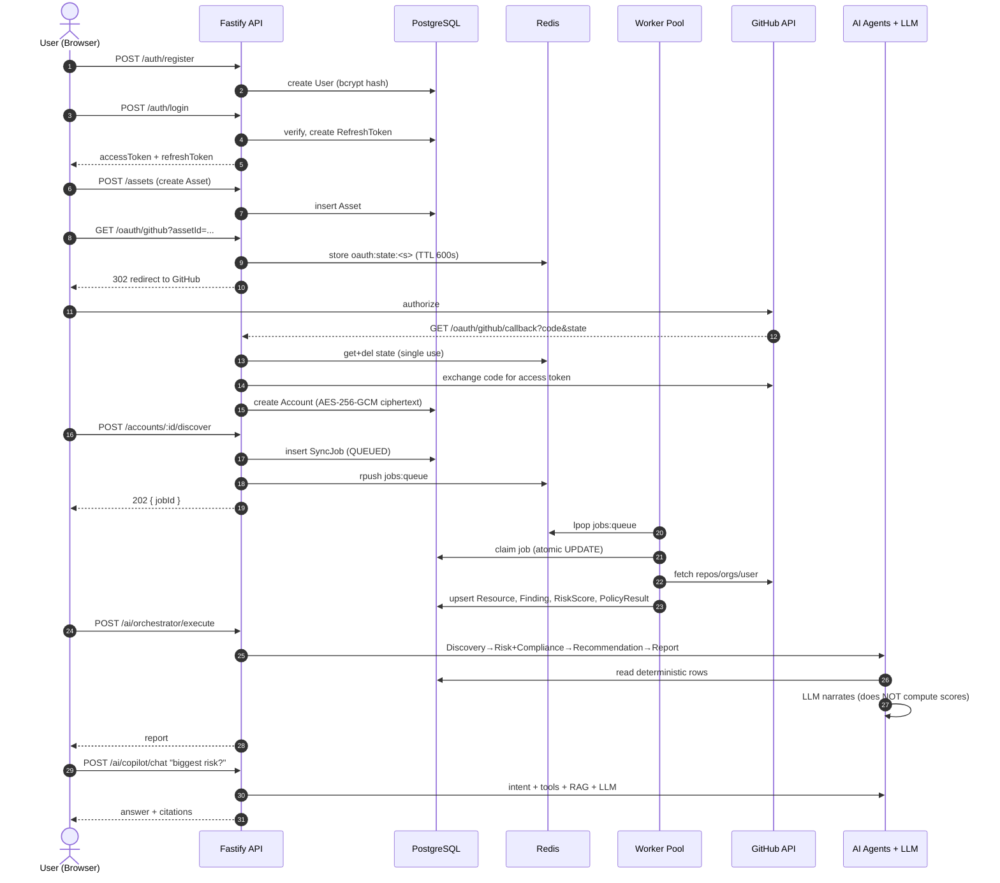
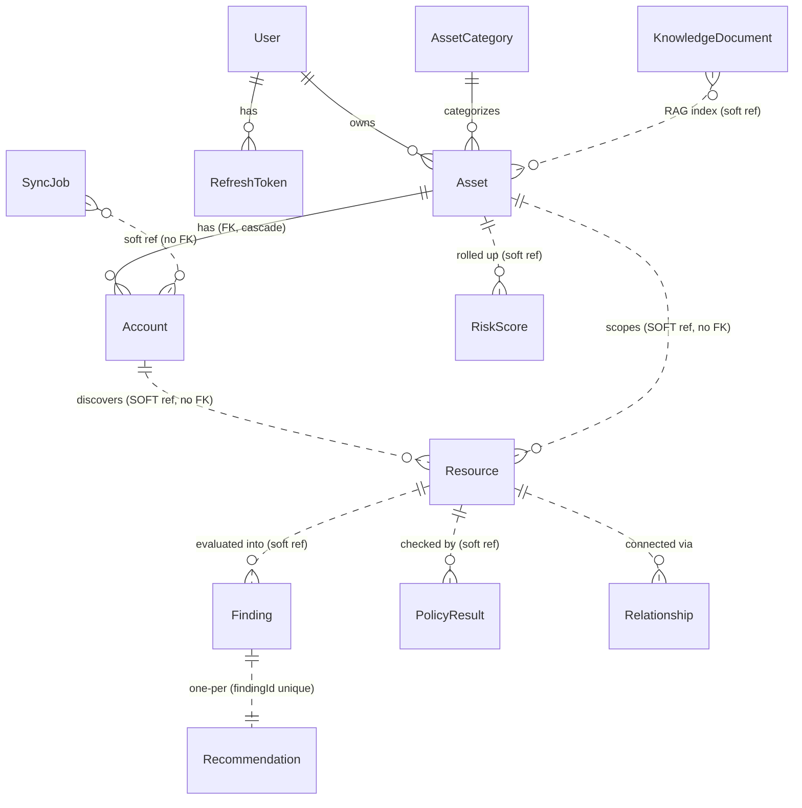
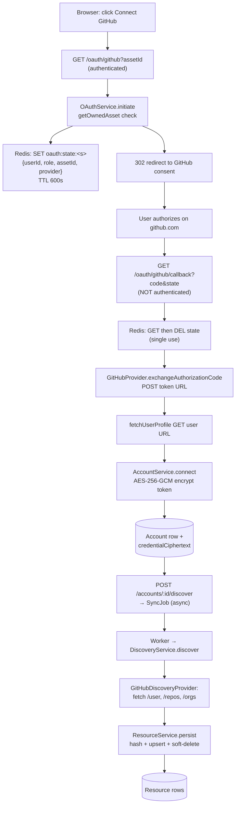
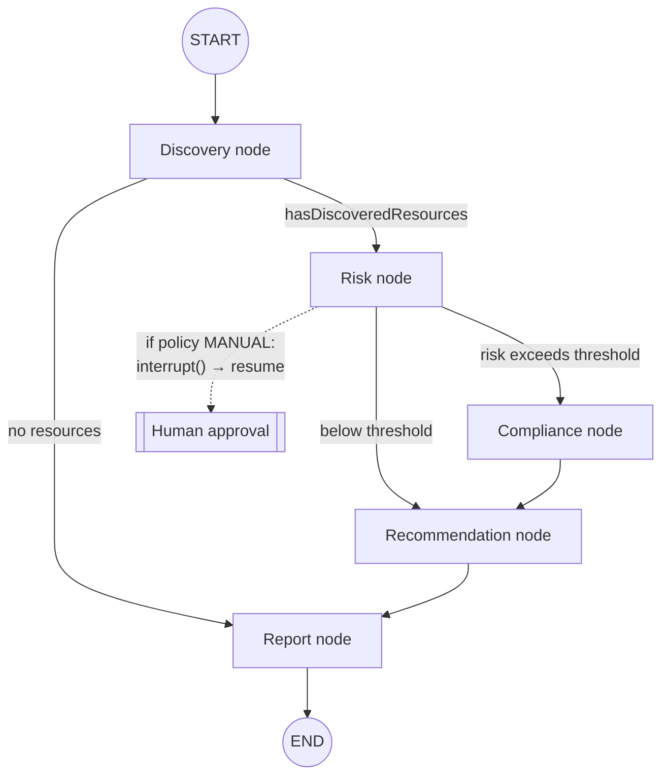
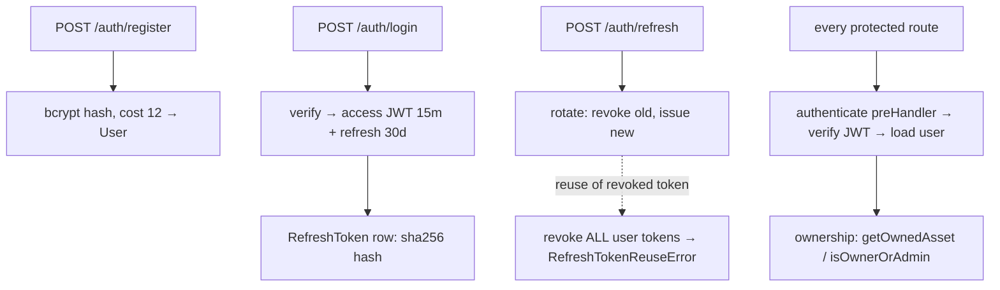
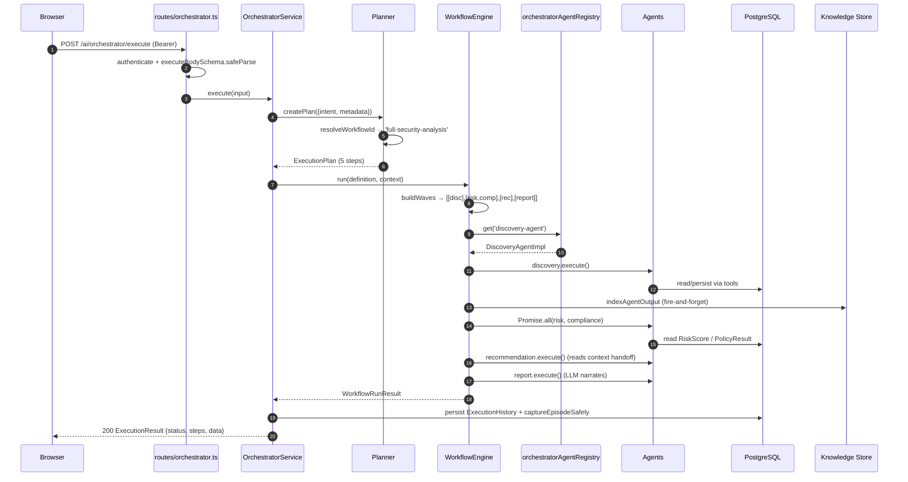
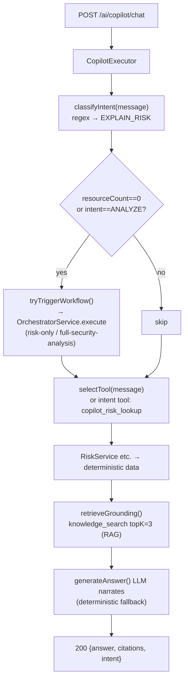
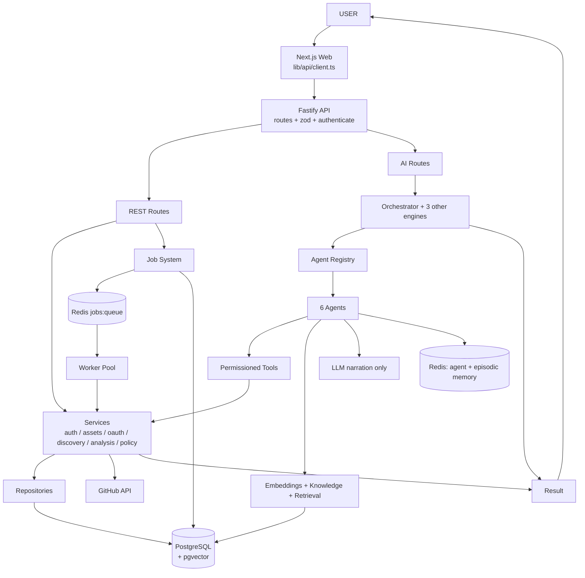

# EstateAI — Complete Project Understanding Guide

From User Request to Backend, AI Agents, LangGraph, RAG and Copilot

***

## How To Use This Guide

This is a **study guide**, not a corporate architecture document. It teaches you the project through **one real user story**, then connects every step to the **actual code** — real filenames, classes, functions, and endpoints that I verified by reading the repository at `/Users/abhiparsaniya/Documents/EStateAI`.

**Every claim carries a verification tag so you always know how much to trust it:**

| Tag | Meaning |
|---|---|
| ✅ **Verified** | I read this in the source code. Filenames/classes/functions are real. |
| ⚠️ **Flag** | The code and the architecture docs disagree, *or* a common assumption is wrong. Read these carefully — they are the questions that separate "memorized the diagram" from "understands the code." |
| 🔎 **Inference** | Reasonable conclusion from the code, but not stated verbatim. |
| 📄 **Doc-only** | Claimed in docs; treat as design intent, not proof. |

> **Remember this:** When an interviewer digs in, the ⚠️ flags are where you win or lose credibility. There are ~10 of them in this guide. Learn them.

After each major part there is a **"Can you explain this?"** checkpoint with questions. Don't peek — the **Answer Key** is the last section.

***

## PART 1 — The Project In One Page

### What is EstateAI?

EstateAI is a **digital-asset security and continuity platform**. A user connects an external account they own (today: **GitHub** ✅ — it is the only fully-working provider), and EstateAI automatically **discovers** the resources inside it (repositories, organizations, the user profile), **analyzes** them for security problems using **deterministic rules**, **scores** the risk, **checks** them against compliance frameworks, **generates** fix recommendations, and **writes** a report.

On top of that deterministic core sits an **AI layer**: six specialized agents (Discovery, Risk, Compliance, Recommendation, Report, Copilot) that *read* the deterministic results and *narrate* them in plain language, plus a conversational **Copilot** you can ask questions like "What is my biggest risk?"

The critical design idea: **the AI never invents security facts.** Rules, severities, and scores are computed by ordinary backend code. The LLM only explains what the code already decided. ✅ (verified — see Part 6.)

Under the hood it is a **Fastify + TypeScript + Prisma + PostgreSQL + Redis** backend with a **Next.js** frontend, in a pnpm monorepo.

### Project In One Diagram

```
        User
          ↓
       EstateAI
          ↓
     Connect GitHub          ← OAuth: prove you own the account, store an encrypted token
          ↓
    Discover Resources       ← call GitHub API, save repos/orgs/user as Resource rows
          ↓
  Analyze Risk & Compliance  ← deterministic rule engine → Findings → RiskScore + PolicyResult
          ↓
  Generate Recommendations   ← deterministic templates, one per Finding
          ↓
    Generate Report          ← aggregate everything; LLM writes the narrative
          ↓
      Ask Copilot            ← question → intent + tools + RAG → LLM answer with citations
```

**Each box in one sentence:**

- **Connect GitHub** — an OAuth Authorization-Code flow proves the user owns the account; the access token is encrypted with AES-256-GCM and stored on an `Account` row. ✅
- **Discover Resources** — `DiscoveryService` calls the GitHub REST API and upserts each repo/org/user as a `Resource` row (with a content hash for change-detection and soft-delete for things that vanish). ✅
- **Analyze Risk & Compliance** — a `RuleEngine` turns resources into `Finding` rows; `RiskService` sums severity weights into a `RiskScore`; `PolicyEngine` produces `PolicyResult` rows per compliance policy. All deterministic. ✅
- **Generate Recommendations** — `RecommendationService` looks up a fixed template per finding rule-code and creates one `Recommendation` per `Finding`. ✅
- **Generate Report** — the Report agent aggregates the four upstream outputs and asks the LLM to write an executive summary. ✅
- **Ask Copilot** — the Copilot agent classifies your intent with regex, pulls the relevant deterministic data via tools, grounds itself with RAG (`knowledge_search`), and asks the LLM to narrate an answer with citations. ✅

### What problem does this solve?

People and companies accumulate digital assets (code, cloud accounts, domains) whose **security posture nobody actively tracks**, and whose **continuity** (what happens to them when the owner is gone or unavailable) is undefined. EstateAI's job is to **continuously inventory those assets and surface their risks in language a non-expert can act on** — turning "I have 40 GitHub repos and no idea which are dangerous" into "here are your 3 public repos with no protection, ranked, with fixes."

### What makes this different from a normal CRUD backend?

A CRUD backend stores and returns what the user typed. EstateAI **derives new facts the user never entered**:

1. **It reaches out to external systems** (GitHub) and ingests state the user doesn't manage by hand.
2. **It runs a deterministic analysis pipeline** that produces findings/scores/policies — computed, not stored-as-entered.
3. **It runs asynchronously** — sync and discovery are background **jobs** (Postgres-backed queue + Redis fast-path + worker pool), because a GitHub crawl can't block an HTTP request. ✅
4. **It has an AI orchestration layer** — multiple agents coordinated by *four* different execution engines over one shared agent registry. ✅
5. **It has memory and retrieval** — RAG over pgvector, per-agent Redis memory, and episodic memory of past runs. ✅

> **Interview soundbite:** "It's not a CRUD app — it's an ingestion-plus-analysis pipeline with a deterministic security core and an AI narration/Q&A layer on top. The AI explains facts; it never manufactures them."

***

### ✅ Can you explain this? (Checkpoint 1)

1. In one sentence, what does EstateAI do?
2. What is the single most important rule about what the LLM is and is not allowed to do?
3. Name the seven boxes in the "one diagram," in order.
4. Give two concrete reasons EstateAI is not a normal CRUD backend.
5. Which external provider is *actually* fully implemented today?

*(Answers in the Answer Key at the end.)*


## PART 2 — The Complete User Journey

We follow **one** story from start to finish:

> A user registers, logs in, creates an asset, connects GitHub, EstateAI discovers their repositories and analyzes them, the user runs the AI agents to get a narrated report, then asks Copilot "what is my biggest risk?"

Here is the whole journey as one sequence. Study it, then read the step-by-step below.



Now, step by step. For each step: **what**, **why**, **code**, **DB effect**, **external/AI effect**.

***

### Step 1–2 · Register & Login

| | |
|---|---|
| **What** | User creates an account, then logs in and receives tokens. |
| **Why** | Everything downstream is scoped to a user; tokens carry identity on every later request. |
| **Code** | Route `apps/api/src/routes/auth.ts` → `POST /auth/register`, `POST /auth/login`. Password hashing: `services/password.service.ts` (`PasswordService`, `bcrypt`, cost default **12**). JWT: `services/auth/jwt.service.ts` (`JwtService`). Refresh: `services/auth/refresh-token.service.ts`. ✅ |
| **DB** | `register` inserts a `User` (with bcrypt hash). `login` verifies and inserts a `RefreshToken` row (SHA-256 hash of a 64-byte random token). ✅ |
| **External/AI** | None. |

> **⚠️ Flag:** The docs say tokens are "HS256." The code never explicitly sets `algorithm: 'HS256'` and never pins an `algorithms` allowlist on verify — HS256 is only the *library default* for a string secret (`jwt.service.ts`). Effectively HS256, but not explicitly enforced. Worth saying precisely in an interview. ✅

***

### Step 3 · Create Asset

| | |
|---|---|
| **What** | User creates an **Asset** — the logical thing being protected (e.g. "My GitHub"). |
| **Why** | An `Account` (a connected external login) must hang off an `Asset`. The Asset is the ownership + risk-rollup unit. |
| **Code** | Asset routes/service under `services/assets/`. Ownership is enforced everywhere via `services/assets/ownership.ts` (`getOwnedAsset`, `isOwnerOrAdmin`). ✅ |
| **DB** | Inserts an `Asset` (FK to `User`, FK to `AssetCategory`). ✅ |

> **Remember this — the three-word vocabulary that trips people up:** **Asset** (the thing you protect, owned by a user) → **Account** (one connected external login under an asset, holds the encrypted credential) → **Resource** (an individual item discovered inside that account, e.g. one repo). Full detail in Part 4.

***

### Step 4–6 · Connect GitHub (OAuth) & store encrypted credential

| | |
|---|---|
| **What** | Browser is redirected to GitHub, the user authorizes, GitHub redirects back with a code, the API exchanges it for an access token and stores it encrypted. |
| **Why** | EstateAI needs a real, revocable GitHub token to call the API on the user's behalf — and must prove the user actually owns the account. |
| **Code** | `routes/oauth.ts`: `GET /oauth/:provider` (authenticated) and `GET /oauth/:provider/callback` (**not** authenticated). Logic: `services/oauth/oauth.service.ts` (`OAuthService.initiate` / `handleCallback`); provider: `services/oauth/github/github.provider.ts`. Encryption: `services/credential-encryption.service.ts`. ✅ |
| **DB / Redis** | `initiate` stores `oauth:state:<state>` in **Redis**, TTL **600s** ✅. `handleCallback` **reads then immediately `del`s** the state (single-use) ✅, then `AccountService.connect` inserts an `Account` with `credentialCiphertext` (AES-256-GCM). ✅ |
| **External** | Token exchange `POST` to GitHub token URL; profile fetch `GET` user URL. ✅ |

> **⚠️ Flag:** The callback endpoint is deliberately **unauthenticated** — a browser redirect from GitHub can't carry your Bearer token. Security comes entirely from the **single-use, 10-minute Redis state token** that carries the initiating user's identity. This is a great "how does OAuth stay secure without auth on the callback?" answer.

***

### Step 7 · Sync GitHub

| | |
|---|---|
| **What** | User triggers a "sync." Returns **202** immediately with a `jobId`. |
| **Code** | `routes/accounts.ts` → `POST /accounts/:id/sync` → `jobService.enqueueForAccount(JobType.SYNC, ...)`. Executed later by `services/sync/sync.service.ts` (`SyncService.sync`) via the GitHub sync provider. ✅ |
| **DB** | Sets `Account.connectionStatus` to `syncing` → `synced`/`error`, updates `lastSyncedAt`. ✅ |

> **⚠️ Big flag — sync vs discover:** The GitHub **sync** provider (`services/sync/github/github-sync.provider.ts`) only calls `/user` and returns **mock statistics** (`resourcesDiscovered = public_repos`). Its own comment says: *"Mock discovery statistics only — real repository/org crawling is a later checkpoint."* **Sync does not create Resource rows.** The real ingestion happens in **discovery** (next step). Don't conflate them in an interview. ✅

***

### Step 8–14 · Discover → Resources → Findings → Risk → Compliance (one job!)

This is the heart of the deterministic pipeline. **One background job does all of it.**

| | |
|---|---|
| **What** | Crawl GitHub, persist resources, then run the whole deterministic analysis. Returns **202** + `jobId`. |
| **Why** | A GitHub crawl + analysis is slow and can fail; it must not block the HTTP request. |
| **Code** | `routes/accounts.ts` → `POST /accounts/:id/discover` → `jobService.enqueueForAccount(JobType.DISCOVERY, ...)`. Worker later runs `services/discovery/discovery.service.ts` → `DiscoveryService.discover()`. ✅ |

Inside `DiscoveryService.discover()`, **in order** ✅:

```
provider.discover(credential)                → GitHubDiscoveryProvider: fetch /user, /repos, /orgs
   ↓
resourceService.persist(...)                  → ResourceRepository.upsert  (hash + soft-delete)   [Resource rows]
   ↓
relationshipService.extractAndPersist(...)    → [Relationship rows]
   ↓
findingService.evaluateResources(...)         → RuleEngine → [Finding rows]
   ↓
riskService.recalculate(...)                  → computeScore(counts) → [RiskScore rows]
   ↓
policyService.evaluateResources(...)          → PolicyEngine → [PolicyResult rows]
   ↓
complianceService.recalculateAndNotify(...)   → compliance score
```

| **DB effect** | Upserts `Resource` rows; inserts `Relationship`, `Finding`, `RiskScore`, `PolicyResult` rows. ✅ |
| **External** | Three parallel `fetch` calls to GitHub: authenticated user, repositories, organizations. ✅ |
| **AI effect** | **None.** This is 100% deterministic backend logic. |

> **⚠️ Flag — recommendations:** `RecommendationService.generateForFinding` (deterministic template lookup, one per finding) exists ✅, but I did **not** verify that `DiscoveryService.discover()` calls it inline. The Recommendation **agent** re-derives from `FindingService` and merges with the persisted `Recommendation` store. So *when* recommendation rows are first written is 🔎 not fully verified from the discovery path — say "recommendations are generated deterministically per finding and consumed by the Recommendation agent."

> **⚠️ Flag — error handling:** `SyncService` and `DiscoveryService` **swallow provider errors into a result object** (`result.errors[]`) instead of throwing (except "unsupported provider," which throws). Consequence: the job system treats almost every failure as **retryable**, so a permanently-bad credential burns the whole retry schedule before dying. ✅ (This is real architectural debt — see Part 18.)

***

### Step 15–17 · Run AI Agents → Report

| | |
|---|---|
| **What** | User asks EstateAI to "analyze" — the orchestrator runs the agents and returns a narrated report. |
| **Why** | The deterministic rows exist but are raw. The agents read them and produce human-readable explanations + an executive report. |
| **Code** | `routes/orchestrator.ts` → `POST /ai/orchestrator/execute` → `OrchestratorService.execute` → `Planner` picks the `full-security-analysis` workflow → `WorkflowEngine.run` executes the DAG. Agents live in `ai/agents/*`. ✅ |
| **DB** | Agents mostly **read** deterministic rows via tools. Each successful step is auto-indexed into the Knowledge Store (RAG), fire-and-forget. ✅ |
| **AI** | Each agent calls the LLM **only to narrate** (`*.summary.ts`), with a deterministic fallback string if no provider is configured. **The LLM never computes scores/findings.** ✅ |

The workflow (verified `full-security-analysis` in `workflow.registry.ts`):

```
Discovery
   ↓
Risk  +  Compliance     ← run in parallel (both only depend on Discovery)
   ↓
Recommendation          ← waits for BOTH Risk and Compliance
   ↓
Report                  ← waits for Recommendation (terminal step)
```

***

### Step 18–19 · Ask Copilot

| | |
|---|---|
| **What** | User asks "What is my biggest risk?" and gets a grounded answer with citations. |
| **Code** | `routes/copilot-agent.ts` → `POST /ai/copilot/chat` → `CopilotAgentImpl` / `CopilotExecutor`. Intent: `copilot.intent.ts` `classifyIntent` (**regex**, not an LLM). RAG: `knowledge_search` tool. Answer: `copilot.summary.ts`. ✅ |
| **Why** | Turns the deterministic data into a conversational interface, grounded so it can't hallucinate. |
| **AI** | Regex intent → deterministic data via tools → RAG grounding → LLM narrates an answer with `citations`. If no data exists yet, Copilot can **trigger the orchestrator** to run a workflow first (see Part 15). ✅ |

> **⚠️ Flag — two copilots:** There are **two** chat endpoints: `POST /ai/copilot/chat` (the real agent, `routes/copilot-agent.ts`) and `POST /copilot/chat` (an older, simpler one, `routes/copilot.ts`). Know which you mean. ✅

***

### ✅ Can you explain this? (Checkpoint 2)

1. Why does `POST /accounts/:id/discover` return **202** instead of the results?
2. What is the difference between **sync** and **discover** in this codebase? (Trick question — one of them is mostly a mock.)
3. Inside `DiscoveryService.discover()`, name the ordered pipeline from GitHub fetch to compliance score.
4. Why is the OAuth **callback** endpoint unauthenticated, and what keeps it secure?
5. When the AI agents run, what is the one thing they are *not* allowed to do?


## PART 3 — Backend Request Flow

### The two shapes of a request

Every request is one of two shapes. Learn both.

**Shape A — synchronous (fast, read-mostly):**

```
Frontend (Next.js, lib/api/client.ts)
   ↓  HTTP + Bearer token
Fastify Route  (routes/*.ts)
   ↓  zod safeParse (validate body/query/params)
authenticate preHandler  (plugins/auth.ts → verifyJwtService)
   ↓
Service  (services/**)          ← business logic lives here
   ↓
Repository  (repositories/**)   ← DB access lives here
   ↓
Prisma
   ↓
PostgreSQL
```

**Shape B — asynchronous (slow, external, failure-prone):**

```
Route  →  jobService.enqueue()
   ↓
PostgreSQL: insert SyncJob (QUEUED)   ← source of truth
   ↓
Redis: rpush jobs:queue               ← fast-path signal only
   ↓  (202 returned to user immediately)
Worker.pollOnce()  →  claim job (atomic UPDATE)
   ↓
JobDispatcher  →  handler for JobType
   ↓
Service (Sync / Discovery / AI agents)
   ↓
Database
```

> **Why two shapes?** A GitHub crawl or an LLM chain can take many seconds and can fail. If you did that inside the HTTP handler, the browser would hang and a crash would lose the work. Shape B makes the work **durable** (survives a restart, retries on failure) and the request **snappy** (returns a `jobId` instantly).

### The layering rule (this is the architecture)

```
routes/         → what enters the system (validation + auth + shape)
services/       → business logic (the "what should happen")
repositories/   → database access (the "how we talk to Postgres")
prisma          → generated client
```

✅ Verified pattern: **routes never touch Prisma directly** — they call a service; services call repositories; repositories call Prisma. Every route file validates `body`/`query`/`params` with `zod`'s `safeParse` before calling any service. This is uniform across all route files.

***

### Trace 1 — `POST /auth/login` (synchronous)

```
routes/auth.ts  POST /auth/login
   ↓  loginBodySchema.safeParse(body)          → 400 if invalid
loginService.login(email, password)
   ↓  userRepository.findByEmail
   ↓  passwordService.verify(bcrypt.compare)   → 401 InvalidCredentialsError
   ↓  jwtService.signAccessToken(user)          (15m)
   ↓  refreshTokenService.generate(user)        → insert RefreshToken (sha256 hash, 30d)
   ↓
200 { accessToken, refreshToken }
```

✅ Files: `routes/auth.ts`, `services/auth/*`, `services/password.service.ts`, `repositories/refresh-token.repository.ts`.

***

### Trace 2 — `POST /accounts/:id/discover` (asynchronous)

```
routes/accounts.ts  POST /accounts/:id/discover
   ↓  getOwnedAccount(id, requester)            → 403/404 if not owned
jobService.enqueueForAccount(JobType.DISCOVERY, accountId, requester)
   ↓  jobRepository → insert SyncJob (status QUEUED)
   ↓  redis.rpush('jobs:queue', job.id)
   ↓
202 { jobId, status, priority, queueDepth }

... later, in a worker process ...

Worker.pollOnce()   (workers/worker.ts)
   ↓  redis.lpop('jobs:queue')  → jobRepository.claimJobById(id, workerId)
   ↓  (fallback) jobRepository.claimNextJob(workerId)     ← atomic conditional UPDATE
   ↓
JobExecutor.execute(job)   (services/jobs/job-executor.ts)
   ↓  JobDispatcher.dispatch(job)  → DISCOVERY handler
   ↓
DiscoveryService.discover(accountId, requester)
   ↓  GitHub API + persist Resource/Finding/RiskScore/PolicyResult
```

✅ Files: `routes/accounts.ts`, `services/jobs/job.service.ts`, `repositories/job.repository.ts`, `workers/worker.ts`, `services/jobs/job-executor.ts`, `services/jobs/job-dispatcher.ts`, `services/discovery/discovery.service.ts`.

***

### Trace 3 — `POST /ai/copilot/chat` (AI, synchronous request that may fan out)

```
routes/copilot-agent.ts  POST /ai/copilot/chat
   ↓  validate body { message, assetId, conversationId? }
CopilotAgentImpl.execute → CopilotExecutor
   ↓  classifyIntent(message)              (regex, copilot.intent.ts)
   ↓  if resourceCount==0 or intent==ANALYZE → tryTriggerWorkflow() → OrchestratorService.execute()
   ↓  callTool('copilot_risk_lookup' / ...) → deterministic RiskService etc.
   ↓  retrieveGrounding() → callTool('knowledge_search', topK:3)   (RAG)
   ↓  generateAnswer() → LLM narrates       (copilot.summary.ts, deterministic fallback)
   ↓
200 { answer, citations, intent, ... }
```

✅ Files: `routes/copilot-agent.ts`, `ai/agents/copilot/*`.

***

### ✅ Can you explain this? (Checkpoint 3)

1. What are the four layers of a synchronous request, in order?
2. What is the strict rule about routes and Prisma?
3. In the async shape, what is the **source of truth** and what is "just a fast-path"?
4. Why return `202` from `/discover`?

***

## PART 4 — The Database (Through the Story)

Don't memorize tables. Follow the **ownership chain** of our story:

```
User
 ↓ owns
Asset                (the thing being protected)
 ↓ has
Account              (a connected external login; holds encrypted credential)
 ↓ discovers
Resource             (one repo / org / user found inside the account)
 ↓ evaluated into
Finding              (a security problem on a resource)
 ↓ rolls up to / maps to
RiskScore   +   PolicyResult   +   Recommendation
```

### ER diagram (the core of the story)



> **⚠️ The single most important schema flag:** Only **`User → Asset`** and **`Asset → Account`** are real Prisma foreign keys (with `onDelete: Cascade`). **`Resource`, `Finding`, `RiskScore`, `PolicyResult`, `SyncJob`, `KnowledgeDocument`** use **soft references** — plain `assetId`/`accountId`/`resourceId` string columns with **no `@relation` / no FK**. ✅
>
> **Why?** The schema comment says it plainly: a deleted asset/account should never block deleting or orphan an analysis/audit row. Ownership is re-checked in *code* (walk `Finding → Resource → Asset` via `getOwnedAsset`) instead of relying on the DB. This "soft-reference for audit/trace tables" pattern is applied deliberately across ~6 models — a strong talking point.

### The three that confuse everyone: Asset vs Account vs Resource

| | **Asset** | **Account** | **Resource** |
|---|---|---|---|
| **Is** | The thing you protect | A connected external login under an asset | One item discovered inside the account |
| **Example** | "My GitHub" | Your authorized GitHub OAuth connection | A single repository `my-org/api` |
| **Owner link** | `userId` FK → User | `assetId` FK → Asset (cascade) | `assetId`/`accountId` **soft** (no FK) |
| **Identity** | `id` | `@@unique([provider, externalId])` | `@@unique([provider, providerResourceId])` — **global** |
| **Holds secret?** | No | **Yes** — `credentialCiphertext` (AES-256-GCM) | No |
| **Created by** | User (create asset) | OAuth callback (`AccountService.connect`) | `DiscoveryService` → `ResourceRepository.upsert` |

> **Remember this:** Resource identity is **global** (`provider + providerResourceId`), not scoped to your account. If two accounts discover the same public repo, the row's `accountId`/`assetId` shift to the most recent discoverer instead of duplicating. ✅

### Each important model

**User** — `services/auth`. Fields: `email`, `passwordHash`, `role` (`USER`/`ADMIN`), `firstName`/`lastName`. Created at register; read on every authenticated request (`plugins/auth.ts` loads it into `request.user`). ✅

**RefreshToken** — one row per issued refresh token. Fields: `tokenHash` (SHA-256, unique), `expiresAt`, `revokedAt?`. Created on login/refresh; rotation revokes the old row; **reuse of a revoked token revokes the whole family** (see Part 13). ✅

**Asset** — `userId` FK, `categoryId` FK, `riskScore Int`, `status`, `visibility`. The risk rollup unit. ✅

**Account** — `assetId` FK (cascade), `provider` (free-form string, not an enum), `externalId`, `connectionStatus` (`connected`/`syncing`/`synced`/`error`/`disconnected`), `credentialCiphertext`, `lastSyncedAt`. ✅

**Resource** — `provider`, `providerResourceId`, `resourceType` (`repository`/`organization`/`user`), `displayName`, `metadata` (Json — stars, forks, private, archived, language, topics…), `hash` (sha256 for change-detection), `firstSeen`/`lastSeen`, `deletedAt?` (soft-delete). ✅

**Finding** — `resourceId`, `ruleCode`, `severity` (`CRITICAL`…`INFORMATIONAL`), `status` (`OPEN`/`RESOLVED`), `confidence Int @default(100)`, `title`, `description`. `@@unique([resourceId, ruleCode])` (one finding per rule per resource). ✅

**Recommendation** — `findingId` **@unique** (one recommendation per finding), `priority` (copied 1:1 from the finding severity), `title`, `description`, `estimatedImpact?`, `status`. ✅

**RiskScore** — `scope` (`RESOURCE`/`ACCOUNT`/`ASSET`/`OVERALL`), `overallScore Int`, and per-severity counts. **No unique constraint** — uniqueness is enforced in `RiskService`. ✅

**Policy** & **PolicyResult** — `Policy` is a rule definition (`code` unique, `enabled`, `provider`, `resourceType`, `severity`). `PolicyResult` is one evaluation: `policyId`, `resourceId`, `status` (`PASS`/`FAIL`/`WARNING`/`NOT_APPLICABLE`). `@@unique([policyId, resourceId])`. ✅

**SyncJob** — the durable job queue row (Part 12/14). Statuses: `QUEUED`/`RUNNING`/`COMPLETED`/`FAILED`/`RETRYING`/`CANCELLED`/`DEAD`. `accountId`/`assetId` are soft refs. ✅

**KnowledgeDocument** — the RAG store. `embedding Unsupported("vector(1536)")`, `documentType` enum (`FINDING`, `RECOMMENDATION`, `REPORT`, `COMPLIANCE_RESULT`, `RISK_ASSESSMENT`, `DISCOVERY_SUMMARY`, `EPISODE`), `sourceId`, `assetId`. ✅

***

### ✅ Can you explain this? (Checkpoint 4)

1. Explain Asset vs Account vs Resource, with an example of each.
2. Which two relationships are real FKs, and which models use soft references — and *why*?
3. Where does the one and only encrypted secret live?
4. Why is `Recommendation.findingId` unique?
5. Resource identity is "global." What does that mean and what happens on a duplicate discovery?


## PART 5 — GitHub Integration (End to End)



### The pieces, verified

**1. OAuth state (Redis)** — `OAuthService.initiate` mints `state = randomBytes(32).hex`, stores `{ userId, role, assetId, provider }` at `oauth:state:<state>` with `EX 600`. On callback, `redis.get` then **immediate `redis.del`** — a replayed callback fails even inside the TTL window. ✅

**2. Token exchange** — `GitHubProvider.exchangeAuthorizationCode(code)` → `POST` to the token URL with `client_id/client_secret/code/redirect_uri`, `Accept: application/json`. Scope requested: `read:user user:email`. ✅

**3. Encryption** — `credential-encryption.service.ts`, **AES-256-GCM**:
- Key: env `CREDENTIAL_ENCRYPTION_KEY`, validated as **64 hex chars = 32 bytes**, used directly (no KDF). ✅
- IV: `randomBytes(12)` fresh per encryption. ✅
- Auth tag: 16 bytes from `getAuthTag()`. ✅
- Stored: `base64(iv || authTag || ciphertext)` on `Account.credentialCiphertext`. The token is **never logged** and is **stripped from all HTTP responses** (`SafeAccount = Omit<Account,'credentialCiphertext'>`). ✅

> **⚠️ Small doc flag:** A schema comment says the layout is "IV + ciphertext + auth tag," but the code actually stores **IV + authTag + ciphertext** (encrypt and decrypt agree, so it's correct — only the comment is loosely worded). ✅

**4. Discovery fetch** — `GitHubDiscoveryProvider.discover(credential)` fires **three parallel `fetch` calls**: `/user`, repositories, organizations. Normalizes to `DiscoveredResource[]` of type `user`/`repository`/`organization`, capturing metadata (`private`, `language`, `stars`, `forks`, `defaultBranch`, `archived`, `topics`, `size`, `fork`). `supportsIncrementalSync()` → `false` (always full scan). ✅

**5. Hashing + upsert + soft-delete** — `ResourceService.persist` → `resourceVersionService.computeHash` (SHA-256 over the normalized fields using `stableStringify` so key order doesn't matter) → `classify` returns `NEW`/`UPDATED`/`UNCHANGED` → `ResourceRepository.upsert` on the `(provider, providerResourceId)` compound key. After the batch, anything previously active but **not seen this run** is `softDelete`d (`deletedAt` set); rediscovery undeletes it (`deletedAt: null`). Events emitted: `RESOURCE_CREATED`/`RESOURCE_UPDATED`/`RESOURCE_DELETED`. ✅

> **⚠️ Flag — sync ≠ discovery (again):** `GitHubSyncProvider.sync()` only calls `/user` and returns `public_repos` as a **mock** count. Real repo/org ingestion is exclusively in the **Discovery** provider. ✅

### ✅ Can you explain this? (Checkpoint 5)

1. Walk the OAuth flow from "click connect" to "Account row saved."
2. What exactly is stored in Redis during OAuth, and what two operations make it safe?
3. Describe the encryption: algorithm, key, IV, auth tag, storage format.
4. How does discovery detect that a repo changed vs. is new vs. was deleted?

***

## PART 6 — Deterministic Analysis (The Most Important Distinction)

> **Remember this — the golden rule of this codebase:** *Business facts are computed by deterministic code. The LLM only writes prose about those facts.* If you learn one thing for the interview, learn this.

### Deterministic vs AI — who owns what

```
GitHub Resource
   ↓
RuleEngine            → Finding      (severity HARDCODED in each rule, confidence 100)   [DETERMINISTIC]
   ↓
RiskService           → RiskScore    (capped weighted sum of severity counts)            [DETERMINISTIC]
   ↓
PolicyEngine          → PolicyResult (each policy returns PASS/FAIL/WARNING)             [DETERMINISTIC]
   ↓
RecommendationService → Recommendation (static template per rule code)                    [DETERMINISTIC]
   ↓
── everything above is code ─────────────────────────────────────────────────────────
   ↓
AI Agents             → narration / explanation only                                      [LLM]
```

### The proof, file by file (✅ all verified)

**Findings — `services/analysis/rule-engine.ts`** (`RuleEngine.evaluate`). Each rule hardcodes its severity. Example: `rules/github/public-repository.rule.ts` → `PublicRepositoryRule.evaluate()` returns `severity: 'MEDIUM'`, `confidence: 100`. The DTO even documents: *"0-100. Always 100 for today's deterministic rules."* Persistence: `services/analysis/finding.service.ts` (`FindingService.evaluateResources`), keyed on `@@unique([resourceId, ruleCode])`.

**Risk — `services/analysis/risk.service.ts`** (`RiskService.recalculate`). The math is a pure function:

```ts
function computeScore(counts) {
  const w = config.risk.weights; // CRITICAL 100, HIGH 70, MEDIUM 40, LOW 20, INFORMATIONAL 5
  const raw = counts.critical*w.CRITICAL + counts.high*w.HIGH
            + counts.medium*w.MEDIUM + counts.low*w.LOW
            + counts.informational*w.INFORMATIONAL;
  return Math.min(100, raw);   // capped
}
```

Weights come from env (`RISK_WEIGHT_*`). No randomness, no LLM.

**Compliance — `services/policy/policy-engine.ts`** (`PolicyEngine.evaluate`). Each policy returns a hardcoded status. Example: `policies/github/no-public-repositories.policy.ts` → `PASS` or `FAIL`. Score in `services/policy/compliance.service.ts`:

```ts
complianceScore = applicable === 0 ? 100
  : Math.round((100 * (passCount + warningCount*0.5)) / applicable);
```

**Recommendations — `services/analysis/recommendation.service.ts`** (`RecommendationService.generateForFinding`). A static `TEMPLATES` map keyed by rule code (`PUBLIC_REPOSITORY`, `ARCHIVED_REPOSITORY`, `EMPTY_REPOSITORY`, `NO_DESCRIPTION`, `NO_TOPICS`) plus a `FALLBACK_TEMPLATE`. Priority is copied straight from the finding severity. Not generative.

### What the LLM is NOT allowed to do

The agent layer *proves* this in its own comments and code:

- `ai/agents/risk/risk.scoring.ts`: *"This file never computes a score — overallScore and every count below are copied verbatim from the persisted row."* ✅
- `ai/agents/risk/risk.tool.ts`, tool `risk_engine_score`: *"Reads the existing RiskScore row … Never recalculates the score itself."* ✅
- `ai/agents/risk/risk.summary.ts`: the LLM only writes prose; on any LLM failure it returns a deterministic fallback string; it "leaves every other field (severity, priority, evidence, confidence) untouched." ✅

> **Interview gold — "How do you stop the LLM hallucinating a risk score?"** Answer: *"We don't ask it to produce one. Scores/severities/findings are computed by deterministic services (`RuleEngine`, `RiskService`, `PolicyEngine`). The agents' tools only **read** those rows; the LLM is confined to `*.summary.ts` where it writes narrative text, and every summary has a deterministic fallback. The number in the report is the number in the database, always."*

### ✅ Can you explain this? (Checkpoint 6)

1. Which four artifacts are produced deterministically, and by which service each?
2. Show the risk score formula. Is it capped? Where do the weights come from?
3. Point to two pieces of code that *prove* the LLM doesn't compute scores.
4. If the LLM provider is down, what does a risk summary return?


## PART 7 — The AI Agents

All six agents share one interface and one registry. Learn the pattern **once** with Discovery, then the rest are variations.

### The shared contract (✅ verified)

- Interface: `ai/orchestrator/agents/agent.interface.ts` → `OrchestratorAgent<TInput, TOutput>` with `id`, `description`, `canHandle(taskType)`, `execute(input, context)`.
- Registry: `ai/orchestrator/agent-registry.ts` → `orchestratorAgentRegistry` (`register`/`get`/`list`/`isRegistered`).
- Each agent is composed the same way in its `index.ts`: register its tools → build a `RedisMemoryStore`-backed memory → construct `<Agent>Executor(toolRegistry, memory, telemetry)` → wrap in a thin `<Agent>Impl` → `orchestratorAgentRegistry.register(...)`.
- LLM narration lives in `*.summary.ts` via `aiFoundation.llmClient.generate(...)` with a deterministic fallback.

> **⚠️ Flag — stale comment:** `agent-registry.ts` ends with a comment claiming it's "empty on purpose — no concrete agent registers here." That comment is **out of date**: all six agents self-register at import time. Don't be fooled if you read it. ✅

### Agent 1 — Discovery (learn the pattern here)

```
Input {accountId}
   ↓
DiscoveryAgentImpl.execute  (id 'discovery-agent', canHandle /discover/i)
   ↓
DiscoveryExecutor  → callTool('github_repository' / 'github_organization' / ...)
   ↓
(tools wrap the existing DiscoveryService / GitHub provider)
   ↓
DiscoveryMemory (Redis, keyed by accountId)   ← remembers last run, resource ids
   ↓
generateSummary() → LLM narrates (fallback if no provider)
   ↓
Output DiscoveryAgentOutput
```

✅ Files: `ai/agents/discovery/{discovery.agent.ts, discovery.executor.ts, discovery.memory.ts, github.tool.ts}`.

- **Tools:** `githubRepositoryTool`, `githubOrganizationTool`, `githubLanguageTool`, `githubTopicTool` + **6 placeholders** (`github_list_branches`, `_contributors`, `_releases`, `_workflows`, `_security_advisories`, `_secret_scanning_alerts`) that **throw** `ToolExecutionError` ("not yet supported"). ✅
- **Reads:** connected account + GitHub via tools. **Cannot:** compute findings/scores.

### Agents 2–6 (same shape, different job)

**Risk — `ai/agents/risk/`** (`RiskAgentImpl`, id `risk-agent`, `/risk/i`)
- Tools: `riskEngineTool` (reads `RiskScore`), `assetLookupTool`, `findingStoreTool` + **5 placeholders** (`risk_secrets_scanner`, `_branch_protection`, `_workflow_risk`, `_dependency_risk`, `_security_alert`) that throw. ✅
- LLM: `explainTopFindings` + `generateRiskSummary` (max 5 findings explained). Scores copied verbatim from DB. Memory keyed by `assetId` (30-day TTL), remembers seen rule codes to flag "repeated" findings.

**Compliance — `ai/agents/compliance/`** (`ComplianceAgentImpl`, id `compliance-agent`, `/compliance/i`)
- Tools: `complianceEngineTool`, `policyLookupTool`, `frameworkMappingTool`, `controlCoverageTool`, `evidenceTool`, … — **zero placeholders** (only agent with none). ✅
- Frameworks: NIST CSF, CIS Controls, ISO 27001, SOC2 (`compliance.mapping.ts`).

**Recommendation — `ai/agents/recommendation/`** (`RecommendationAgentImpl`, id `recommendation-agent`, `/recommend/i`)
- Reads Risk + Compliance output from the shared `OrchestrationContext` **handoff** (`recommendation.aggregate.ts` → `resolveHandoffFromContext`) — no second DB query for data already computed this run. Merges with the persisted `Recommendation` store. **Never invents a recommendation itself.** ✅

**Report — `ai/agents/report/`** (`ReportAgentImpl`, id `report-agent`, `/report/i`)
- Aggregates all four upstream outputs from context (or their memory), builds sections + executive summary, LLM narrates. Terminal DAG step. Degrades to `PARTIAL` rather than failing. ✅

**Copilot — `ai/agents/copilot/`** (`CopilotAgentImpl`, id `copilot-agent`, `/copilot|chat|ask/i`) — full detail in Part 15.
- Extra dependency vs others: its executor also gets `aiFoundation.toolExecutor`. Tools: `copilot_risk_lookup`, `copilot_compliance_lookup`, `copilot_recommendation_lookup`, `copilot_asset_lookup` + shared builtins (`knowledge_search`, GitHub list tools). ✅

### Agent comparison table

| Agent | Purpose | LLM? | Key tools | Memory (key) | Depends on |
|---|---|---|---|---|---|
| Discovery | Inventory resources | narrate only | github_* (+6 placeholders) | Redis, accountId | connected Account |
| Risk | Explain risk posture | narrate only | risk_engine_score (+5 placeholders) | Redis, assetId | Discovery |
| Compliance | Explain policy gaps | narrate only | compliance_* (0 placeholders) | Redis, assetId | Discovery |
| Recommendation | Prioritize fixes | narrate only | recommendation_engine, finding_lookup | Redis, assetId | Risk + Compliance |
| Report | Executive summary | narrate only | asset_lookup | Redis, assetId | Recommendation |
| Copilot | Q&A over results | narrate + RAG | copilot_*, knowledge_search | conv+session+Redis | can trigger orchestrator |

> **Remember this:** Every agent's LLM usage is **narration only**. Placeholders that throw: **11 total** — 6 on Discovery, 5 on Risk, **0 elsewhere**. ✅

### ✅ Can you explain this? (Checkpoint 7)

1. Describe the shared composition pattern every agent follows.
2. Which agents have placeholder tools, and how many?
3. How does the Recommendation agent avoid re-querying data Risk already computed?
4. What does the Discovery agent add *on top of* `DiscoveryService`?

***

## PART 8 — Agent Workflow & The Orchestrator

### The standard workflow

```
Discovery
   ↓
Risk   +   Compliance      ← parallel
   ↓
Recommendation             ← waits for BOTH
   ↓
Report                     ← last
```

✅ This is the `full-security-analysis` workflow in `ai/orchestrator/workflow.registry.ts`. Steps + `dependsOn`:
`discovery` → `risk`(dep discovery) + `compliance`(dep discovery) → `recommendation`(dep risk, compliance) → `report`(dep recommendation).

- **Why can Risk and Compliance run in parallel?** They both depend *only* on Discovery and don't read each other. The engine puts independent steps in the same "wave." ✅
- **Why does Recommendation wait for both?** It reads Risk *and* Compliance output via the context handoff. ✅
- **Why is Report last?** It aggregates everyone. ✅

Other seeded workflows: `risk-only`, `compliance-only`, `discovery-recommendation`, `risk-recommendation`. ✅

### The Orchestrator = the manager

```mermaid
flowchart LR
    A["POST /ai/orchestrator/execute<br/>{intent, assets}"] --> B[OrchestratorService.execute]
    B --> C[Planner.createPlan<br/>resolveWorkflowId by regex on intent]
    C --> D[workflowRegistry.get id<br/>→ WorkflowDefinition]
    D --> E[Executor.run → WorkflowEngine.run]
    E --> F["buildWaves(steps)<br/>Kahn topological sort"]
    F --> G["Wave 1: [discovery]"]
    G --> H["Wave 2: [risk, compliance] Promise.all"]
    H --> I["Wave 3: [recommendation]"]
    I --> J["Wave 4: [report]"]
    J --> K[ExecutionResult + persist history + capture episode]
```



✅ Files: `ai/orchestrator/{orchestrator.service.ts, workflow.engine.ts, executor.ts, workflow.registry.ts, planner.ts}`.

**How it works (verified):**
1. `Planner.resolveWorkflowId(intent)` regex-matches the intent string (e.g. `/github|full|complete|everything/i` → `full-security-analysis`).
2. `WorkflowEngine.buildWaves(steps)` uses **Kahn's algorithm** to partition steps into waves; each wave's steps run with `Promise.all` (parallel), waves run sequentially.
3. Each step resolves its agent via `orchestratorAgentRegistry.get(step.agentId)` and runs it inside a retry wrapper. A missing agent becomes a **FAILED step** (`AgentNotRegisteredError`), not a thrown crash.
4. `onStepComplete` writes the output into the shared `OrchestrationContext` (the "handoff") **and** fire-and-forget indexes it into the Knowledge Store (RAG).
5. `Executor` persists `ExecutionHistory` and fires `captureEpisodeSafely()` (episodic memory).

> **Remember this — one registry, four drivers:** The same six agents are driven by **four independent execution engines**, all via `orchestratorAgentRegistry`: (1) Orchestrator/`WorkflowEngine` DAG, (2) `ReasoningOrchestrator` (adaptive planner, `/ai/planner/plan`), (3) `GraphExecutor` (LangGraph, `/ai/langgraph/execute`), (4) `LLMPlannerExecutor` (LLM-authored plan, `/ai/planner/dynamic`). **Zero agent logic is duplicated across them.** ✅ This is the single most impressive architectural fact in the project.

### ✅ Can you explain this? (Checkpoint 8)

1. Why can Risk and Compliance run in parallel but Recommendation cannot start until both finish?
2. What algorithm builds the execution "waves"?
3. What is the `OrchestrationContext` handoff and why does it matter for performance?
4. Name the four execution engines and the one thing they all share.


## PART 9 — LangGraph (One Engine, Not The Whole AI)

> **⚠️ Correct the common misconception first:** LangGraph is **not** "the AI architecture" of EstateAI. It is **one of four** execution engines that drive the same agents. The default/simplest engine is the plain `WorkflowEngine` DAG (Part 8). LangGraph is the engine you reach for when you want **conditional branching, native parallel supersteps, and pause/resume (human-in-the-loop)**. ✅

### It is the real library

`apps/api/package.json` declares `@langchain/langgraph` and `@langchain/core`. The code imports `StateGraph`, `START`, `END`, `MemorySaver`, `interrupt`, `Command` from it. ✅

### The concepts, mapped to this project

| LangGraph concept | In EstateAI |
|---|---|
| **State** | `GraphState` — plain JSON-safe domain data (agent outputs, context). |
| **Node** | An agent, wrapped by `makeAgentNode(...)` which calls `orchestratorAgentRegistry.get(agentId).execute(...)` — "wrap, don't rewrite." |
| **Edge** | Added per `dependsOn`; independent branches run concurrently in one Pregel superstep. |
| **Conditional edge** | `buildConditionalGraph()` uses real `addConditionalEdges` — e.g. `hasDiscoveredResources` routes Discovery→Risk-or-Report; `riskScoreExceedsThreshold` routes Risk→Compliance-or-Recommendation. |
| **Interrupt/Resume** | `interrupt()` inside a node pauses; `GraphExecutor.resume()` builds `new Command({ resume })` from the approval decision. |

✅ Files: `ai/langgraph/{executor.ts, graph-builder.ts, nodes.ts, edges.ts, graph.checkpoint.ts}`.



### Endpoints

`POST /ai/langgraph/execute`, `POST /ai/langgraph/:executionId/resume`, `GET /ai/langgraph/:executionId`, `GET /ai/langgraph/:executionId/state`. ✅

### Checkpointing — two mechanisms (a subtle ⚠️ flag)

1. LangGraph's own in-process `new MemorySaver()` on the compiled graph — correctness within one process.
2. `GraphCheckpointStore` (`graph.checkpoint.ts`) — durable, survives restart, but **deliberately NOT a real `BaseCheckpointSaver`**. Its header says it persists plain `GraphState` JSON rather than LangGraph's internal `Checkpoint`/`channel_versions` format. So resume replays `saved.values` into a fresh `invoke()`, relying on idempotent nodes — it can't be swapped into an official LangGraph checkpointer without a translation layer. ✅

> **⚠️ Flag — HITL is built but inert:** the interrupt/resume machinery is fully implemented, but **no agent ships as `MANUAL`** (see Part 11), so on the shipped path it never actually pauses. Also, the Copilot LangGraph node is a plain function (not `makeAgentNode`), so it bypasses the approval path entirely. ✅

### ✅ Can you explain this? (Checkpoint 9)

1. LangGraph is one of how many engines, and what does it add over the plain DAG?
2. How does an agent become a node without rewriting it?
3. What are the two checkpoint mechanisms, and why isn't the durable one a real `BaseCheckpointSaver`?
4. Is human-in-the-loop actually firing on the shipped path? Why or why not?

***

## PART 10 — RAG (Retrieval-Augmented Generation)

### What RAG solves here

When Copilot answers "what is my biggest risk?", it shouldn't rely on the LLM's imagination — it should ground the answer in **this user's actual findings**. RAG retrieves the most relevant stored documents (findings, recommendations, reports…) and feeds them to the LLM as evidence.

```
User question
   ↓
Copilot → knowledge_search tool
   ↓
EmbeddingService.embed(question)            → 1536-dim vector
   ↓
KnowledgeRepository.search (pgvector)        → cosine similarity, top-K
   ↓
relevant KnowledgeDocument rows              → evidence + citation ids
   ↓
LLM narrates a grounded answer
```

### The stack, verified

- **Embeddings** — `ai/embeddings/embedding.service.ts` wraps one provider. Two exist:
  - `LocalHashEmbeddingProvider` (id `local`, `local-hash-v1-1536`) — a sha256 hashing-trick, dependency-free, deterministic. **Default.**
  - `OpenAIEmbeddingProvider` (id `openai`) — calls `/v1/embeddings`.
  - Chosen by env `EMBEDDING_PROVIDER` (`local`|`openai`, default `local`). Dimension fixed at **1536** (`EMBEDDING_DIMENSION`, pad/truncate to width). ✅
- **Storage** — `KnowledgeDocument.embedding` is `Unsupported("vector(1536)")` (pgvector). Reads/writes go through `$queryRaw`/`$executeRaw` in `ai/knowledge/knowledge.repository.ts`. ✅
- **Index** — `ivfflat (embedding vector_cosine_ops) WITH (lists = 100)` — **not** hnsw (chosen for broad pgvector-version compatibility). ✅
- **Search** — cosine distance operator `<=>`; scores `1 - (embedding <=> $vec)`, `ORDER BY embedding <=> $vec LIMIT topK`. ✅
- **Retrieval service** — `ai/retrieval/retrieval.service.ts` embeds the question, calls the repo, records a `RetrievalTrace` row. Default **top-K = 5**. (Copilot asks for top-K 3.) ✅
- **Auto-indexing** — `ai/shared/knowledge.indexing.ts` `indexAgentOutput(...)`, called fire-and-forget from `executor.ts` `onStepComplete` for every successful step. Never throws. ✅

> **⚠️ Flag — default embeddings are a hash, not a neural model:** Out of the box, "semantic" search uses `LocalHashEmbeddingProvider` (a hashing trick), which gives deterministic, dependency-free vectors but **not** true semantic similarity unless you switch `EMBEDDING_PROVIDER=openai`. Great for CI/dev, weaker for real relevance. Be honest about this. ✅

### ✅ Can you explain this? (Checkpoint 10)

1. In one sentence, what does RAG solve for Copilot?
2. What is the default embedding provider, and what's the catch?
3. What DB feature stores/searches the vectors, and what index/operator?
4. When does a document get auto-indexed into the knowledge store?

***

## PART 11 — Memory

There are **three distinct memory systems**. Don't blur them.

### 1. Per-agent memory (Redis) — "what did I do last time?"

Each agent has an `<Agent>Memory` class over a `MemoryStore`. Stores agent scratch state (history, last-run, failures, score snapshots, seen rule codes), **not** the source of truth. TTL **30 days**. ✅

| Class | Keyed by |
|---|---|
| `RiskMemory` / `ComplianceMemory` / `RecommendationMemory` / `ReportMemory` | `assetId` |
| `DiscoveryMemory` | `accountId` |
| `CopilotMemory` (composes `ConversationMemory` 1-day + `SessionMemory` 30-min) | `conversationId` |

Example use: `RiskMemory.rememberSeenRuleCodes` lets Risk flag a finding as "repeated" across runs. ✅

### 2. Episodic memory (Redis + RAG) — "lessons from past executions"

`ai/episodic-memory/`: after a run, `captureEpisodeSafely()` (fire-and-forget) builds an `Episode` (agents involved, failed steps, retries, disagreements, confidence, derived `lessons`), stores it (7-day TTL), and indexes it into the Knowledge Store as a `documentType: EPISODE`. The **LLM Planner** later searches episodes to inform its plan (as a *text summary*). ✅

Four capture call sites: `orchestrator/executor.ts`, `planner/reasoning-orchestrator.ts`, `langgraph/nodes.ts`, `debate/debate.engine.ts` (×2). ✅

### 3. The generic `MemoryStore` abstraction — one interface, ~7 stores

`ai/interfaces/memory-store.interface.ts`: `get/set/append/getList/delete`. Two backends: `RedisMemoryStore` (prefix `ai:memory:`) and `InMemoryStore`. Reused by:

| Store | TTL |
|---|---|
| `PlannerCache` | 15 min |
| `ReflectionStore` | 7 days |
| `DebateMemory` / `ConsensusStore` | 7 days |
| `GraphCheckpointStore` | 7 days |
| `ApprovalStore` | 30 days (audit) |
| `EpisodeStore` | 7 days (+30-day archive) |

✅ Verified. **One interface, each store picks its own prefix + TTL, no shared mutable state.**

> **⚠️ Flag — confidence calibration is dead code:** `episode.relevance.ts` implements `calibrateConfidence`/`computeAgentReliability`/`computeToolReliability`, fully unit-tested, but they have **zero production callers** feeding decisions (only read APIs and a verify script). The reliability data is computed but **never consulted** by any planner. ✅

### ✅ Can you explain this? (Checkpoint 11)

1. Name the three memory systems and what each stores.
2. What is an "Episode" and who consumes it?
3. What is the shared `MemoryStore` interface, and how do stores differ from each other?
4. What memory-related code is fully built but never actually used?

***

## PART 12 — Redis (Every Verified Use)

| Redis use | Key / data | Writer | Reader | Purpose |
|---|---|---|---|---|
| **Job queue signal** | `jobs:queue` (list of job ids) | `JobService.enqueue` (`rpush`) | `Worker.pollOnce` (`lpop`) | Low-latency wake-up for workers. **Fast-path only** — Postgres is the source of truth. ✅ |
| **OAuth state** | `oauth:state:<state>` (JSON) | `OAuthService.initiate` (`set EX 600`) | `handleCallback` (`get` + `del`) | Single-use, 10-min CSRF/identity token for the OAuth round-trip. ✅ |
| **Per-agent memory** | `ai:memory:*` | `<Agent>Memory` via `RedisMemoryStore` | same | Agent scratch state (30-day TTL). ✅ |
| **Episodic memory** | `ai:memory:*` (episode keys) | `EpisodeStore` | `EpisodeSearch` / LLM Planner | Lessons from past runs (7-day TTL). ✅ |
| **Planner cache** | via `RedisMemoryStore` | `PlannerCache` | LLM Planner | Cache LLM-authored plans (15-min TTL). ✅ |
| **Reflection / Debate / Consensus / Approval / Graph checkpoint** | via `RedisMemoryStore` | respective stores | respective engines | Durable AI state with per-store TTLs (7–30 days). ✅ |

> **Remember this — the Redis philosophy:** For **jobs**, Redis is a *performance optimization*, never correctness (lose Redis → workers fall back to Postgres `claimNextJob`). For **AI state**, Redis (with TTLs) is the primary store. ✅

> **⚠️ Flag — no Redis sessions:** There is **no** Redis-backed HTTP session store. Auth is stateless JWT + a Postgres `RefreshToken` table. If someone claims "sessions in Redis," that's wrong for this project. ✅

### ✅ Can you explain this? (Checkpoint 12)

1. For the job queue, what is Redis's role vs Postgres's role?
2. What is stored at `oauth:state:<state>` and for how long?
3. True/false: user login sessions are stored in Redis. Explain.


## PART 13 — Authentication & Security

### The whole picture



### Password hashing ✅
`services/password.service.ts` (`PasswordService`) — `bcrypt`, cost `config.security.bcryptCost` (env `BCRYPT_COST`, default **12**). `verify()` = `bcrypt.compare`.

### JWT ✅
`services/auth/jwt.service.ts` — `jsonwebtoken`. Signs `{ email, role }` with `subject: user.id`, plus `issuer`/`audience`/`expiresIn` (default `15m`). Secret: env `JWT_SECRET` (min 32 chars). Verify checks `issuer` + `audience`. Wrapper `verify-jwt.service.ts` rethrows all failures as one generic `UnauthorizedError` (no leak of *why*).

> **⚠️ Flag:** Algorithm is effectively **HS256** (library default for a string secret) but is **not explicitly pinned** — no `algorithm` on sign, no `algorithms` allowlist on verify. Correct interview phrasing: "HS256 by default, not explicitly enforced."

### Refresh token rotation & reuse detection ✅
`services/auth/refresh-token.service.ts`:
- Raw token: `randomBytes(64).hex`. Stored as **SHA-256** hash (deterministic → exact-match lookup; unlike bcrypt which is slow/non-deterministic). TTL **30 days**.
- **Rotate:** every `/auth/refresh` validates → revokes the presented token (`revokedAt`) → issues a new one.
- **Reuse detection:** if a token that's *already revoked* is presented again, that's proof of theft → `revokeAllForUser(userId)` (revoke the whole family) → throw `RefreshTokenReuseError` → forces full re-login.

> **Interview gold — "how are credentials protected?"** Two different secrets, two different techniques: **passwords** → bcrypt (slow, salted, one-way); **refresh tokens** → SHA-256 (fast, deterministic, because you must look them up); **GitHub tokens** → AES-256-GCM (reversible, because you must *use* them).

### Credential encryption ✅
`services/credential-encryption.service.ts` — **AES-256-GCM**, key = 32 bytes from `CREDENTIAL_ENCRYPTION_KEY` (64 hex, no KDF), IV `randomBytes(12)`, 16-byte auth tag, stored `base64(iv||authTag||ciphertext)` on `Account.credentialCiphertext`. Stripped from all responses; never logged.

### RBAC & ownership ✅
`services/assets/ownership.ts`:
- Roles: `USER` / `ADMIN`.
- `isOwnerOrAdmin(entity, requester)` = `requester.role === 'ADMIN' || entity.userId === requester.id`.
- `getOwnedAsset(id, requester)` → `AssetNotFoundError` (404) if missing, `ForbiddenError` (403) if not owned. Used across routes, services, **and** AI agent tools (so an agent tool can't read another user's asset).

### OAuth ✅
Covered in Part 5. Key security points: authenticated `initiate`, unauthenticated `callback` protected by single-use 10-min Redis state, token encrypted before it ever hits the DB.

### Transport/header hardening ✅ (`server.ts`)
- **CORS**: `methods: ['GET','HEAD','POST','PUT','PATCH','DELETE','OPTIONS']` — explicitly listed (the library default is only GET/HEAD/POST, which silently breaks DELETE/PATCH preflight). Origin from `CORS_ORIGIN`.
- **Helmet**: `contentSecurityPolicy: false` (pure JSON API); other defaults on.
- **Rate limit**: default 1000/60s; `/health*` and `/metrics*` exempt.
- Body limit (default 1 MiB), `trustProxy` from env, custom request-id.

> **⚠️ Flag — soft disconnect:** `DELETE /accounts/:id` is a **soft disconnect**, not a row delete: `AccountService.disconnect` sets `connectionStatus: 'disconnected'` and wipes `credentialCiphertext = null`; the row stays. ✅

### ✅ Can you explain this? (Checkpoint 13)

1. Three secrets, three techniques — name them and *why* each technique fits.
2. Precisely describe refresh-token reuse detection.
3. What's the accurate statement about the JWT algorithm?
4. What does `DELETE /accounts/:id` actually do?

***

## PART 14 — One Request in Extreme Detail: `POST /ai/orchestrator/execute`

Scenario: body `{ intent: "full security analysis", assets: [{ id: assetId }] }`.



**Step-by-step with files/classes/functions:**

| # | Layer | File · Class · Function | In → Out |
|---|---|---|---|
| 1 | Route | `routes/orchestrator.ts` · `POST /ai/orchestrator/execute` | HTTP body → validated input |
| 2 | Auth | `plugins/auth.ts` · `authenticate` → `verifyJwtService.verify` | Bearer → `request.user` |
| 3 | Validate | `executeBodySchema.safeParse` (zod) | body → typed / 400 |
| 4 | Service | `orchestrator.service.ts` · `OrchestratorService.execute` | input → orchestrates |
| 5 | Plan | `planner.ts` · `Planner.createPlan` / `resolveWorkflowId` | intent → workflow id |
| 6 | Registry | `workflow.registry.ts` · `workflowRegistry.get` | id → `WorkflowDefinition` |
| 7 | Engine | `workflow.engine.ts` · `WorkflowEngine.run` / `buildWaves` | def → waves |
| 8 | Agents | `ai/agents/*` · `<Agent>Impl.execute` | context → outputs (LLM narrates, reads DB) |
| 9 | Handoff | `OrchestrationContext` (`onStepComplete`) | step output → shared context + RAG index |
| 10 | Finalize | `executor.ts` · `Executor.run` → `StateManager.finalize` + `captureEpisodeSafely` | outputs → `ExecutionResult`, history, episode |
| 11 | Response | route returns 200 | `{ status, steps, data }` |

**Database interaction:** agents mostly **read** (`RiskScore`, `PolicyResult`, `Finding`, `Recommendation`); the engine writes `ExecutionHistory` and (async) `KnowledgeDocument` + `Episode`.
**AI interaction:** LLM is called **only** inside each agent's `*.summary.ts` to narrate — never to compute a score. ✅

***

## PART 15 — Copilot in Extreme Detail: `POST /ai/copilot/chat`

Scenario: `{ message: "What is my biggest risk?", assetId }`.



**Verified specifics:**

- **Intent** — `copilot.intent.ts` `classifyIntent(message)` is **regex** (explicitly *not* an LLM). Order-sensitive patterns → `FOLLOW_UP` / `ANALYZE` / `EXPLAIN_RISK` / `EXPLAIN_COMPLIANCE` / `EXPLAIN_RECOMMENDATION` / `SUMMARIZE_REPORT` / `GENERAL`. `FOLLOW_UP` resolves to `session.lastIntent`. ✅
- **Auto tool-selection** — a separate regex layer `copilot.tool-selector.ts` `selectTool(message)` can route to GitHub tools or `knowledge_findings`/`count_findings`, bypassing the explanation flow. ✅
- **Upstream triggering** — `CopilotExecutor.tryTriggerWorkflow(workflowId, assetId, ctx)` calls `orchestratorFoundation.service.execute(...)` (the *same* OrchestratorService — never a direct agent-to-agent call). `needsRouting = resourceCount === 0 || intent === 'ANALYZE'`. Intent→workflow map: `ANALYZE`/`EXPLAIN_RISK`→`risk-only`, `EXPLAIN_COMPLIANCE`→`compliance-only`, `EXPLAIN_RECOMMENDATION`→`risk-recommendation`, `SUMMARIZE_REPORT`→`full-security-analysis`. Returns gracefully (with a warning) if no connected account. ✅
- **RAG grounding** — `retrieveGrounding(...)` calls `knowledge_search { question, assetId, topK: 3 }`, scoped to the ownership-verified `assetId`; retrieved text folds into `explanation.evidence`; failures degrade silently to `[]`. ✅
- **Citations** — retrieved doc ids collected into `citationIds` → `output.citations` (deduped). ✅
- **Ownership** — `callTool` re-throws `ForbiddenError`/`AssetNotFoundError` (becomes 403/404), so Copilot can't leak another user's data. ✅

> **Interview gold — "how can a chatbot answer if there's no data yet?"** Copilot detects `resourceCount === 0` (or an explicit "analyze" intent) and **triggers the orchestrator to run a workflow first**, through the exact same `OrchestratorService` the REST API uses — then answers grounded on the fresh results. One data path, reused. ✅

### ✅ Can you explain this? (Checkpoint 14/15)

1. Trace `/ai/orchestrator/execute` from route to response, naming the planner and engine.
2. In that flow, exactly where (and only where) is the LLM called?
3. How does Copilot classify intent — LLM or regex?
4. How does Copilot answer when the asset has no discovered data yet?
5. What stops Copilot from reading another user's asset?


## PART 16 — Folder Structure (Why Each Exists)

Now that you know the workflows, the folders will make sense. For each: **why does it exist?**

```
apps/
  api/                      ← the Fastify backend (the brain)
    src/
      routes/               ← WHAT ENTERS: HTTP endpoints, validation, auth wiring
      plugins/              ← cross-cutting Fastify plugins (auth, etc.)
      services/             ← BUSINESS LOGIC: the "what should happen"
        auth/               ← login, JWT, refresh rotation
        assets/             ← asset/account CRUD + ownership.ts (the RBAC heart)
        oauth/              ← OAuth flow + GitHub provider
        sync/               ← account sync (mostly mock today)
        discovery/          ← real GitHub crawl → resources
        resources/          ← persist/hash/dedupe resources
        analysis/           ← rule-engine, findings, risk, recommendations (DETERMINISTIC)
        policy/             ← policy-engine, compliance scoring (DETERMINISTIC)
        jobs/               ← job service/dispatcher/executor/retry (the queue brain)
        ai/                 ← LEGACY AI provider stack (real Claude/OpenAI/Gemini)
      repositories/         ← HOW WE TALK TO POSTGRES: Prisma access, nothing else
      workers/              ← WHAT RUNS ASYNC: worker loop, pool, heartbeat, shutdown
      ai/                   ← THE MODERN AI SUBSYSTEM (see below)
      config/               ← env.ts (zod-validated config, fail-fast)
    prisma/                 ← schema.prisma + migrations
  web/                      ← Next.js frontend
    src/lib/api/client.ts   ← single fetch chokepoint (Bearer + retry-on-401)
```

The AI subsystem (`apps/api/src/ai/`) — the part most people find confusing:

```
ai/
  orchestrator/     ← WHY: the DAG engine + agent registry + workflow definitions
  agents/           ← WHY: the 6 concrete agents (discovery/risk/compliance/rec/report/copilot)
  planner/          ← WHY: ReasoningOrchestrator (adaptive engine #2)
  langgraph/        ← WHY: LangGraph engine #3 (conditional edges, interrupt/resume)
  llm-planner/      ← WHY: LLM-authored dynamic plan (engine #4)
  tools/            ← WHY: what agents can DO — registry, executor, permissions, allowlists
  embeddings/       ← WHY: turn text into 1536-dim vectors (local hash | openai)
  knowledge/        ← WHY: the RAG store over pgvector
  retrieval/        ← WHY: embed question → search knowledge → top-K
  episodic-memory/  ← WHY: remember past executions as searchable Episodes
  reflection/       ← WHY: critic + reflection over a finished run
  debate/           ← WHY: multi-agent debate + consensus checks
  approval/         ← WHY: human-in-the-loop (HitlOrchestrator + policy/engine/store)
  memory/           ← WHY: RedisMemoryStore / InMemoryStore (the MemoryStore backends)
  llm/              ← WHY: the NEW provider foundation (only OpenAI real; others placeholders)
  interfaces/       ← WHY: shared contracts (MemoryStore, etc.)
  shared/           ← WHY: cross-agent helpers (knowledge.indexing.ts auto-index)
```

> **⚠️ Flag — TWO AI stacks live side by side:** `services/ai/` (legacy) has a **real, working Claude/OpenAI/Gemini** integration behind `/ai/generate` and the older `/copilot/chat`. `ai/llm/` (newer, used by the six agents) has **only OpenAI concretely implemented** — its `AnthropicProvider` is a placeholder that throws. See Part 18. ✅

### ✅ Can you explain this? (Checkpoint 16)

1. `routes/` vs `services/` vs `repositories/` — one sentence each.
2. Why is there both a `services/ai/` and an `ai/llm/`?
3. Where do the four execution engines live?
4. Which folder holds the deterministic security logic?

***

## PART 17 — Actual Code Map

| Feature | Route file | Service | Repository | Agent | Key class/fn | DB model |
|---|---|---|---|---|---|---|
| Auth | `routes/auth.ts` | `services/auth/*`, `password.service.ts` | `user.repo`, `refresh-token.repo` | — | `JwtService`, `RefreshTokenService.rotate` | User, RefreshToken |
| Asset mgmt | asset routes | `services/assets/*` | asset repo | — | `getOwnedAsset`, `isOwnerOrAdmin` | Asset, AssetCategory |
| GitHub OAuth | `routes/oauth.ts` | `services/oauth/*` | account repo | — | `OAuthService.handleCallback`, `GitHubProvider` | Account |
| Sync | `routes/accounts.ts` | `services/sync/sync.service.ts` | account repo | — | `SyncService.sync` (mock) | Account |
| Discovery | `routes/accounts.ts`, `routes/discovery.ts` | `discovery.service.ts`, `resource.service.ts` | `resource.repo` | `discovery-agent` | `DiscoveryService.discover`, `ResourceRepository.upsert` | Resource, Relationship |
| Risk | `routes/risk-agent.ts` | `analysis/rule-engine.ts`, `risk.service.ts` | finding repo | `risk-agent` | `RuleEngine.evaluate`, `RiskService.recalculate` | Finding, RiskScore |
| Compliance | `routes/compliance-agent.ts` | `policy/policy-engine.ts`, `compliance.service.ts` | policy repo | `compliance-agent` | `PolicyEngine.evaluate` | Policy, PolicyResult |
| Recommendation | `routes/recommendation-agent.ts` | `analysis/recommendation.service.ts` | rec repo | `recommendation-agent` | `RecommendationService.generateForFinding` | Recommendation |
| Report | `routes/report-agent.ts` | (aggregates) | — | `report-agent` | `ReportExecutor`, `report.summary.ts` | (reads all) |
| Copilot | `routes/copilot-agent.ts` | — | — | `copilot-agent` | `CopilotExecutor`, `classifyIntent` | (reads all) + KnowledgeDocument |
| Orchestrator | `routes/orchestrator.ts` | — | — | (all) | `OrchestratorService.execute`, `WorkflowEngine.run` | ExecutionHistory |
| Jobs | `routes/jobs.ts` | `services/jobs/*` | `job.repo` | — | `JobService`, `JobExecutor`, `RetryService` | SyncJob |
| RAG | `routes/knowledge-rag.ts` | `ai/retrieval/*`, `ai/knowledge/*` | `knowledge.repo` | — | `RetrievalService.search` | KnowledgeDocument |

✅ All route files, services, and classes above were verified to exist.

***

## PART 18 — What Is Actually Implemented?

> **This is the most valuable section for your credibility.** Do **not** oversell the project. An interviewer respects "here's what's real and here's what's scaffolding" far more than a glossy pitch.

### ✅ IMPLEMENTED (real, working)

- Full auth: register/login/refresh with rotation + reuse detection, bcrypt, JWT, RBAC/ownership. ✅
- GitHub OAuth + AES-256-GCM credential encryption. ✅
- **Discovery** → real GitHub crawl (`/user`, `/repos`, `/orgs`) → resource persistence with hashing + soft-delete. ✅
- **Deterministic analysis**: rule engine → findings, risk scoring, policy engine → compliance, recommendation templates. ✅
- **Durable job system**: Postgres queue + Redis fast-path, atomic claim, retry/backoff, heartbeat stale-reclamation, DEAD status. ✅
- **Six agents** driven by **four execution engines** over one registry. ✅
- **RAG** on pgvector (embed → cosine search → top-K) with auto-indexing. ✅
- **LangGraph** (real library) with conditional edges + interrupt/resume plumbing. ✅
- **Episodic memory**, reflection, debate/consensus. ✅

### 🟡 PARTIALLY IMPLEMENTED

- **Sync** (`/accounts/:id/sync`) — returns **mock** stats (`public_repos`); real ingestion is Discovery only. ⚠️
- **Embeddings** — default is `LocalHashEmbeddingProvider` (a hash trick, not true semantic) unless `EMBEDDING_PROVIDER=openai`. ⚠️
- **Recommendation auto-generation timing** — templates exist; the exact inline trigger during discovery is 🔎 not verified.
- **Compliance frameworks** — a static catalog (NIST/CIS/ISO/SOC2 mapping), not live control testing. ✅

### 🔴 PLACEHOLDER (built to throw / mock)

- **11 placeholder tools** that throw `ToolExecutionError`: 6 Discovery (branches/contributors/releases/workflows/advisories/secret-scanning) + 5 Risk (secrets/branch-protection/workflow-risk/dependency-risk/security-alert). Compliance/Recommendation/Report/Copilot have none. ✅
- **Web search** — `MockWebSearchProvider` returns `example.com` placeholders. ✅
- **`ai/llm/` non-OpenAI providers** — `AnthropicProvider`, `GeminiProvider`, `OllamaProvider`, `AzureOpenAIProvider` all extend `PlaceholderProvider` and **reject** with "not yet implemented (Phase 16 scaffolding)." Only `OpenAIProvider` is real in this foundation. ✅

### ⚪ NOT IMPLEMENTED

- **Write-capable tools/agents** — the tool framework **refuses** any tool declaring `'write'` permission; no agent ships `MANUAL`. So the entire HITL/approval system is **built, tested, and currently inert** (nothing destructive exists for it to gate). ✅
- **Only GitHub** is a real provider (schema is generic for AWS/Gmail/Drive/etc., but none implemented). ✅
- **No embedding backfill/migration** if you switch providers; old vectors keep their version. ✅
- **No reranking / hybrid search / chunking** — each doc is one embedded unit. ✅
- **No `EpisodePruner` background job** — episodes expire only via 7-day TTL; the hard-cap prune must be called manually. ✅
- **No Kubernetes** — Docker Compose only. 📄

### 🟠 ARCHITECTURAL DEBT (works, sharp edges)

- **Two AI provider stacks** (`services/ai/` real Claude/OpenAI/Gemini vs `ai/llm/` OpenAI-only). ⚠️ **`AI_PROVIDER` env controls only the legacy path** — the agent foundation hardcodes `DEFAULT_PROVIDER = 'openai'` and never reads `AI_PROVIDER`. A reader assuming `AI_PROVIDER=claude` changes agent behavior would be **wrong**. ✅
- **Sync/Discovery swallow errors into a result object** → the job system treats nearly all failures as retryable → a permanently-bad credential burns the full retry schedule before going DEAD. ✅
- **Confidence calibration computed but never consulted** (dead code path). ✅
- **`GraphCheckpointStore` isn't a real `BaseCheckpointSaver`** (plain JSON). ✅
- **`realtime-bus.ts` is a single-process `EventEmitter`** — WebSocket events won't fan out across multiple API instances without Redis pub/sub. 📄
- **Two copilot endpoints** and **two agent systems** coexist. ✅

> **⚠️ The #1 flag to remember:** *"Does `AI_PROVIDER=claude` make the agents use Claude?"* → **No.** It only affects the legacy `services/ai/` path (`/ai/generate`, old `/copilot/chat`). The six agents' `ai/llm/` foundation defaults to OpenAI and its Anthropic provider is a throwing placeholder. The app *does* have a real Claude provider — just in the legacy stack, not the agent foundation.

### ✅ Can you explain this? (Checkpoint 18)

1. Name three things that are fully implemented and three that are placeholders.
2. Why is the entire approval/HITL system "inert" today?
3. What does `AI_PROVIDER=claude` actually control?
4. Why does a permanently-bad GitHub credential waste the whole retry schedule?


## PART 19 — Interview Preparation

### The 30-second version

> "EstateAI is a digital-asset security platform. You connect an account you own — GitHub today — and it discovers what's inside, runs a deterministic security analysis (findings, a risk score, compliance checks, recommendations), and then an AI layer of six agents narrates those results and answers questions via a Copilot. The key design principle is that the AI never invents security facts — deterministic code owns the numbers, the LLM only explains them. It's built on Fastify, Prisma/Postgres with pgvector, and Redis, with a background job system for the slow GitHub crawls."

### The 1-minute version

Add: "Architecturally it's layered — routes validate and authenticate, services hold business logic, repositories talk to Postgres. Anything slow or failure-prone — the GitHub crawl, AI chains — runs as a durable background job: Postgres is the source of truth for the queue, Redis is a fast-path signal, and a worker pool claims jobs with an atomic conditional UPDATE. The AI subsystem has six agents behind one registry, driven by four interchangeable execution engines: a plain DAG orchestrator, an adaptive planner, LangGraph, and an LLM-authored planner. RAG runs on pgvector for grounding the Copilot."

### The 3-minute version

Add the story: "A user registers, creates an Asset, and connects GitHub via OAuth — the callback is unauthenticated but protected by a single-use 10-minute Redis state token, and the access token is encrypted with AES-256-GCM before it touches the database. They trigger discovery, which returns 202 with a job id; a worker later crawls GitHub, upserts Resource rows with content hashing and soft-delete, then runs the deterministic pipeline: a rule engine produces Findings with hardcoded severities, a risk service sums severity weights into a capped RiskScore, a policy engine produces PolicyResults. Then the user runs the orchestrator: Discovery → Risk and Compliance in parallel → Recommendation → Report, each agent reading the deterministic rows via permissioned tools and using the LLM only to narrate. Finally Copilot answers questions — regex intent classification, deterministic lookups, RAG grounding via pgvector, and if no data exists yet it triggers the orchestrator through the exact same service the REST API uses."

### The 5-minute deep version

Add the honest edges: "I'll be precise about what's real. Discovery, the deterministic analysis, the job system, RAG, and the four-engine agent architecture are all real. But sync is currently mock statistics — real ingestion is discovery only. The default embedding provider is a hash trick, not a neural model, unless you switch to OpenAI. There are two AI provider stacks: the legacy `services/ai/` has a working Claude integration, but the newer `ai/llm/` foundation the agents use only implements OpenAI — its Anthropic provider is a throwing placeholder — and crucially the `AI_PROVIDER` env var only controls the legacy path. The human-in-the-loop approval system is fully built but inert because no tool is write-capable yet. Eleven tools are placeholders that throw. I know exactly where each of those lines is in the code, and I'd prioritize wiring a second real provider and a real embedding model next."

***

### The 20 questions (answers grounded in this codebase)

**1. Explain your project.** → Use the 1-minute version above.

**2. Why this architecture (layered + jobs + agents)?** → Slow/external/failure-prone work (GitHub, LLM) can't block HTTP, so it's durable background jobs. Business logic must be testable and reusable across REST *and* AI paths, so it lives in services that both routes and agent tools call. AI is separated into agents so the deterministic core stays authoritative and the LLM is confined to narration.

**3. Why Fastify?** → Lightweight, fast, first-class TypeScript, plugin model (helmet/cors/rate-limit/auth as plugins), schema-based validation fits the zod-at-every-boundary pattern. 🔎 (framework choice; rationale is inference, not a code comment.)

**4. Why PostgreSQL?** → Relational integrity for the ownership chain (User→Asset→Account with cascade), plus **pgvector** gives vector search in the *same* database — no separate vector DB to operate. It's also the durable job queue via atomic conditional UPDATE.

**5. Why Redis?** → Two roles: a low-latency **job-queue signal** (`jobs:queue`, fast-path only — Postgres is truth), and the **primary store for AI state** with TTLs (agent memory, episodes, planner cache, approvals, OAuth state). Not used for HTTP sessions.

**6. Why background workers?** → A GitHub crawl + full analysis is slow and can fail; workers make it durable (survives restart), retryable (exponential backoff), and self-healing (heartbeat reclaims stale jobs), while the request returns 202 instantly.

**7. Why AI agents (vs one big prompt)?** → Separation of concerns and reuse: each agent owns one job, reads only what it's allowed via a permissioned tool allowlist, and can be composed by four different engines without rewriting. It also keeps the deterministic core authoritative — agents narrate, they don't compute.

**8. Why not just one LLM call?** → Because the security facts must be deterministic and auditable. One LLM call would blur "computed" and "guessed." The multi-agent + tool design forces every number to come from a DB row and confines the LLM to prose.

**9. What does LangGraph do here?** → It's **one of four** engines. It adds conditional branching, native parallel supersteps, and interrupt/resume for human-in-the-loop. Agents become nodes via `makeAgentNode`, which just calls the same registry. (Be ready to say the durable checkpoint store isn't a real `BaseCheckpointSaver`.)

**10. Why RAG?** → To ground Copilot's answers in *this user's* actual findings/reports instead of the LLM's imagination. Embed the question → cosine search over pgvector → top-K documents → citations. (Default embeddings are a hash provider unless OpenAI is enabled.)

**11. How does the Risk Agent work?** → It reads the persisted `RiskScore`/`Finding` rows via the `risk_engine_score` tool (which never recalculates), copies the numbers verbatim, and uses the LLM only to explain the top ~5 findings, with a deterministic fallback. Memory (keyed by assetId) lets it flag repeated findings across runs.

**12. How does Compliance work?** → `PolicyEngine` evaluates each resource against policies returning PASS/FAIL/WARNING; `ComplianceService` computes a deterministic score `(pass + 0.5*warning)/applicable`; the agent maps results to NIST/CIS/ISO/SOC2 and narrates. It has zero placeholder tools.

**13. How do agents communicate?** → Through the shared `OrchestrationContext` "handoff": each step writes its output into the context, and downstream agents (Recommendation, Report) read prior outputs from it — no second DB query, no direct agent-to-agent calls.

**14. How do you prevent LLM-hallucinated risk scores?** → The LLM is never asked to produce a score. Scores come from `RiskService.computeScore`; agent tools only read rows; the LLM lives in `*.summary.ts` writing prose with a deterministic fallback. The number in the report equals the number in the DB.

**15. How does GitHub OAuth work?** → Authorization-Code flow: authenticated `initiate` stores a single-use 10-min state in Redis and redirects to GitHub; the unauthenticated callback validates+deletes the state, exchanges the code for a token, encrypts it (AES-256-GCM), and stores an Account.

**16. How are credentials protected?** → Three secrets, three techniques: passwords → bcrypt (cost 12); refresh tokens → SHA-256 (deterministic for lookup) with rotation + reuse detection; GitHub tokens → AES-256-GCM (reversible, stripped from responses, never logged).

**17. What if the GitHub API fails?** → Discovery/Sync catch provider errors into a result object; the job fails and is retried with exponential backoff (1m→5m→15m→…), heartbeat reclaims stalls, and after max attempts it goes DEAD. ⚠️ Honest caveat: because errors are swallowed rather than classified, even a permanently-bad credential is treated as retryable and burns the whole schedule.

**18. What if an AI provider fails?** → Every agent summary has a **deterministic fallback string**, so a down LLM degrades the *prose*, not the *facts*. (And in `ai/llm/`, non-OpenAI providers are placeholders that reject outright.)

**19. How does the system scale?** → Horizontally on the worker side (multiple workers safely claim via atomic UPDATE; Postgres is the coordination point). ⚠️ Caveat: the WebSocket event bus is a single-process `EventEmitter` today, so multi-instance real-time would need Redis pub/sub; no K8s yet.

**20. What would you improve?** → Wire a second real LLM provider into `ai/llm/` (and make `AI_PROVIDER` actually govern it); switch default embeddings to a real model + add a backfill; classify provider errors as permanent vs retryable; schedule `EpisodePruner`; consume the confidence-calibration signal that's already computed; consolidate the two AI stacks and two copilot endpoints.

***

## FINAL SECTION — The Master Map



### The whole project in 20 bullets

1. EstateAI inventories and secures a user's **digital assets**; GitHub is the only fully-real provider today. ✅
2. Vocabulary: **Asset** (protected thing) → **Account** (connected login, holds encrypted credential) → **Resource** (discovered item). ✅
3. Only **User→Asset** and **Asset→Account** are real FKs; analysis/audit tables use **soft references** and re-check ownership in code. ✅
4. Requests come in two shapes: **synchronous** (route→service→repo→Prisma) and **asynchronous** (job→Redis→worker). ✅
5. Slow/failure-prone work is a **durable job**: Postgres is truth, Redis is a fast-path, workers claim via **atomic conditional UPDATE**. ✅
6. GitHub connects via **OAuth Authorization-Code**; the unauthenticated callback is protected by a **single-use 10-min Redis state**. ✅
7. The access token is encrypted with **AES-256-GCM**, stripped from responses, never logged. ✅
8. **Discovery** (not sync) does the real crawl and upserts Resources with **content hashing + soft-delete**. ✅
9. **Sync is mostly mock stats today** — a key honesty flag. ⚠️
10. The **deterministic pipeline** owns all facts: RuleEngine→Findings, RiskService→RiskScore (capped weighted sum), PolicyEngine→PolicyResults, RecommendationService→templates. ✅
11. The **golden rule**: the LLM narrates; it never computes severities or scores. ✅
12. **Six agents** share one interface + registry; each is executor + memory + thin impl + narration summary. ✅
13. The standard workflow: **Discovery → Risk+Compliance (parallel) → Recommendation → Report**. ✅
14. **Four execution engines** (DAG orchestrator, adaptive planner, LangGraph, LLM planner) drive the same agents with **zero duplicated agent logic**. ✅
15. **LangGraph** is one engine — it adds conditional edges + interrupt/resume; its durable checkpoint store is plain JSON, not a real `BaseCheckpointSaver`. ✅
16. **RAG** runs on **pgvector** (ivfflat, cosine, top-K); default embeddings are a **hash trick** unless OpenAI is enabled. ⚠️
17. **Three memory systems**: per-agent (Redis), episodic (Redis+RAG), and the generic `MemoryStore` reused by ~7 stores. ✅
18. **Auth**: bcrypt passwords, JWT (HS256 by default, not pinned ⚠️), refresh rotation with **reuse detection** that revokes the whole family. ✅
19. **HITL/approval is fully built but inert** — no write-capable tools, no MANUAL agents; **11 tools are throwing placeholders**. ✅
20. **`AI_PROVIDER` controls only the legacy stack**; the agent foundation defaults to OpenAI — the biggest doc-vs-code gotcha. ⚠️

***

## ANSWER KEY

**CP1 (Project):** (1) Connects an account you own, discovers its resources, runs deterministic security analysis, and narrates/answers with AI. (2) The LLM may only *explain* facts; deterministic code computes all severities/scores/findings. (3) User → EstateAI → Connect GitHub → Discover Resources → Analyze Risk & Compliance → Generate Recommendations → Generate Report → Ask Copilot. (4) It ingests external state and derives new facts via an analysis pipeline; it runs async jobs; it has an AI/RAG layer. (5) GitHub.

**CP2 (Journey):** (1) The crawl+analysis is slow/failure-prone, so it's a durable background job; the request returns a job id. (2) Sync = mostly mock stats (`public_repos`); Discovery = the real crawl that creates Resource rows and runs analysis. (3) provider.discover → resourceService.persist → relationshipService → findingService → riskService → policyService → complianceService. (4) A browser redirect can't carry a Bearer token; safety comes from the single-use, 10-min Redis state token carrying the user's identity. (5) Compute security facts (scores/severities/findings) — those are deterministic.

**CP3 (Backend flow):** (1) route→service→repository→Prisma(→Postgres). (2) Routes never touch Prisma; they go through services→repositories. (3) Postgres `SyncJob` is the source of truth; Redis `jobs:queue` is just a fast-path signal. (4) So the request returns instantly while the slow work runs in the background.

**CP4 (Database):** (1) Asset=protected thing ("My GitHub"); Account=connected login (your OAuth connection); Resource=discovered item (one repo). (2) Real FKs: User→Asset, Asset→Account; soft refs: Resource/Finding/RiskScore/PolicyResult/SyncJob/KnowledgeDocument — so deleting an asset never blocks/orphans audit rows; ownership re-checked in code. (3) `Account.credentialCiphertext`. (4) One recommendation per finding. (5) Identity is `provider+providerResourceId` globally; a duplicate discovery re-points `accountId`/`assetId` to the latest discoverer instead of duplicating.

**CP5 (GitHub):** (1) initiate (auth) → Redis state → 302 → GitHub authorize → callback (no auth) → get+del state → exchange code → fetch profile → connect (encrypt) → Account row. (2) `{userId, role, assetId, provider}` for 600s; safe because it's read-then-deleted (single use). (3) AES-256-GCM, 32-byte hex key (no KDF), 12-byte random IV, 16-byte auth tag, stored `base64(iv||authTag||ciphertext)`. (4) SHA-256 content hash → classify NEW/UPDATED/UNCHANGED; unseen active resources are soft-deleted.

**CP6 (Deterministic):** (1) Findings=RuleEngine, RiskScore=RiskService, PolicyResult=PolicyEngine, Recommendation=RecommendationService. (2) `min(100, Σ count×weight)` — yes capped; weights from `RISK_WEIGHT_*` env. (3) `risk.scoring.ts` ("never computes a score") and `risk.tool.ts` `risk_engine_score` ("never recalculates"). (4) A deterministic fallback string.

**CP7 (Agents):** (1) register tools → build Redis memory → executor → thin impl → register in registry; LLM only in `*.summary.ts`. (2) Discovery (6) and Risk (5); others 0. (3) It reads Risk/Compliance output from the `OrchestrationContext` handoff. (4) Memory, tool orchestration, and LLM narration over the raw `DiscoveryService` results.

**CP8 (Workflow/Orchestrator):** (1) Both depend only on Discovery and don't read each other; Recommendation reads both. (2) Kahn's topological sort (`buildWaves`). (3) A shared context each step writes into and downstream steps read from — avoids re-querying computed data. (4) DAG Orchestrator, ReasoningOrchestrator, LangGraph GraphExecutor, LLMPlannerExecutor — all via `orchestratorAgentRegistry`.

**CP9 (LangGraph):** (1) One of four; adds conditional edges, native parallel supersteps, interrupt/resume. (2) `makeAgentNode` wraps `registry.get(id).execute`. (3) In-process `MemorySaver` (correctness) + durable `GraphCheckpointStore` (plain JSON, replays `values`, so not a real `BaseCheckpointSaver`). (4) No — no agent is MANUAL, so it never pauses on the shipped path.

**CP10 (RAG):** (1) Grounds Copilot answers in the user's real findings instead of the LLM guessing. (2) `LocalHashEmbeddingProvider` — a hash trick, not true semantic similarity, unless `EMBEDDING_PROVIDER=openai`. (3) pgvector `vector(1536)`, ivfflat index, cosine `<=>` operator, top-K. (4) Fire-and-forget on every successful agent step (`indexAgentOutput` in `onStepComplete`).

**CP11 (Memory):** (1) Per-agent (Redis scratch state), episodic (past-run Episodes in Redis+RAG), generic `MemoryStore` (shared interface for ~7 stores). (2) A record of a past execution (agents, failures, retries, lessons, confidence); consumed as a text summary by the LLM Planner. (3) `get/set/append/getList/delete`; each store picks its own key prefix + TTL. (4) `calibrateConfidence`/`computeAgentReliability`/`computeToolReliability` — computed, never consulted by any decision.

**CP12 (Redis):** (1) Redis = fast-path wake signal; Postgres = source of truth for exactly-once claiming. (2) `{userId, role, assetId, provider}`, 600s. (3) False — auth is stateless JWT + Postgres RefreshToken; no Redis sessions.

**CP13 (Auth):** (1) passwords→bcrypt (slow one-way), refresh→SHA-256 (fast deterministic lookup), GitHub token→AES-256-GCM (reversible for use). (2) Presenting an already-revoked refresh token → revoke ALL the user's tokens + `RefreshTokenReuseError` → forced re-login. (3) "HS256 by default (library), not explicitly pinned." (4) Soft disconnect: sets `connectionStatus='disconnected'`, nulls the ciphertext; row stays.

**CP14/15 (Deep flows):** (1) route→authenticate→zod→`OrchestratorService.execute`→`Planner`→`workflowRegistry.get`→`WorkflowEngine.run`(buildWaves)→agents→context handoff→finalize/history/episode→200. (2) Only inside each agent's `*.summary.ts`. (3) Regex (`classifyIntent`), not an LLM. (4) It triggers the orchestrator (`tryTriggerWorkflow` → `OrchestratorService.execute`) to run a workflow first, then answers grounded on results. (5) `callTool` re-throws `ForbiddenError`/`AssetNotFoundError` from the ownership check → 403/404.

**CP16 (Folders):** (1) routes=entry/validation/auth; services=business logic; repositories=Postgres access. (2) `services/ai/`=legacy real Claude/OpenAI/Gemini; `ai/llm/`=newer foundation for the six agents (OpenAI real, others placeholder). (3) `ai/orchestrator`, `ai/planner`, `ai/langgraph`, `ai/llm-planner`. (4) `services/analysis/` and `services/policy/`.

**CP18 (Implemented):** (1) Implemented: auth, OAuth+encryption, discovery, deterministic analysis, jobs, RAG (any three). Placeholders: 11 throwing tools, mock web search, non-OpenAI `ai/llm/` providers. (2) No tool declares `write` and no agent is MANUAL, so there's nothing destructive to gate. (3) Only the legacy `services/ai/` path (`/ai/generate`, old `/copilot/chat`) — not the agent foundation. (4) Because Discovery/Sync swallow errors into a result object, so the job system can't tell "permanent" from "transient" and retries everything.

***

*End of guide. Every file path, class, function, and endpoint cited above was verified against the repository at `/Users/abhiparsaniya/Documents/EStateAI` during preparation. Items I could not verify are tagged 🔎; genuine code-vs-doc discrepancies are tagged ⚠️.*


