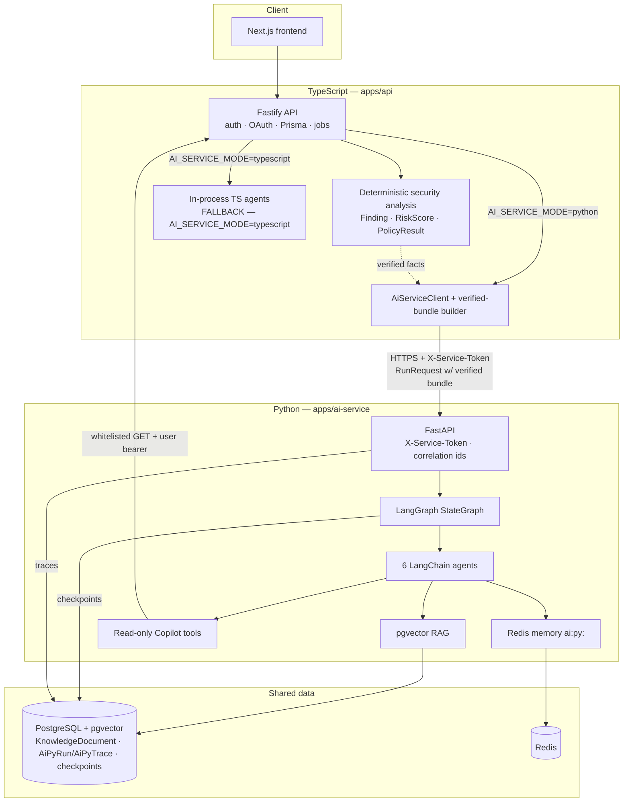
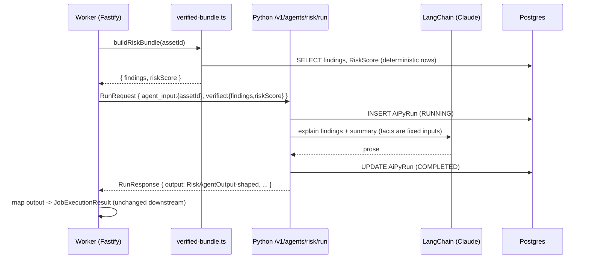

# Phase 31 — Python AI Service Architecture

## System context



## The security-analysis graph

```mermaid
flowchart TD
    START((start)) --> D[discovery]
    D --> R[risk]
    D --> C[compliance]
    R --> RC[recommendation]
    C --> RC
    RC --> RP[report]
    RP --> END((end))

    RP -. interrupt_before when requireApproval .-> HITL{{HITL pause<br/>POST /v1/graph/&#123;id&#125;/resume}}
```



- `risk` and `compliance` fan out from `discovery` and execute in the same
  LangGraph superstep (parallel).
- `recommendation` has two incoming edges — LangGraph waits for **both**
  before it runs.
- `report` runs last; with `requireApproval` the graph checkpoints and
  pauses before it until a resume call injects the approval decision.

## Request flow — an AI_RISK job with AI_SERVICE_MODE=python



## Trust boundary

| Concern | Owner |
|---|---|
| Findings, severities, risk scores, policy results | **Deterministic TypeScript** (source of truth) |
| Verified-bundle assembly | Fastify (`verified-bundle.ts`) |
| LLM reasoning, narration, prioritization prose | Python agents |
| Graph orchestration, checkpoint, HITL | Python LangGraph |
| RAG retrieval (read-only) | Python over existing pgvector |
| Copilot data pulls | Python → whitelisted Fastify GET routes (user bearer, ownership enforced) |
| AI run traces | Python → `AiPyRun` / `AiPyTrace` only |
```
