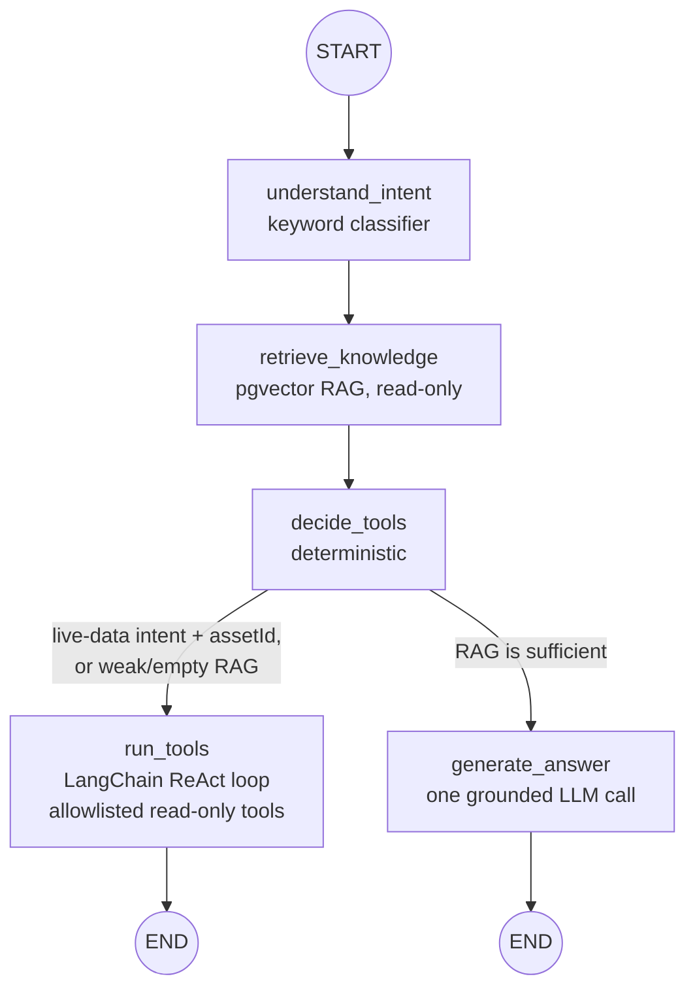
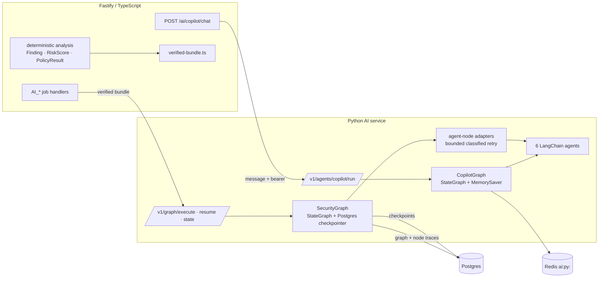

# Phase 32 — LangGraph Orchestration

## A. Security-analysis graph

```mermaid
flowchart TD
    START((START)) --> D[discovery]
    D -->|route_after_discovery<br/>resourceCount == 0| NR[finalize_no_resources]
    D -->|route_after_discovery<br/>resources present| R[risk]
    D --> C[compliance]
    NR --> E1((END))

    R --> RC[recommendation]
    C --> RC
    RC -->|route_after_recommendation<br/>critical == 0 and not forced| RP[report]
    RC -->|route_after_recommendation<br/>critical &gt; 0 or forced| AA[await_approval]

    AA -.->|interrupt&#40;&#41; — checkpoint + pause| HUMAN{{human decision}}
    HUMAN -->|Command&#40;resume=&#123;approved:true&#125;&#41;| AA
    HUMAN -->|Command&#40;resume=&#123;approved:false&#125;&#41;| AA
    AA -->|route_after_approval<br/>approved| RP
    AA -->|route_after_approval<br/>rejected| REV[revise — safe termination]
    RP --> E2((END))
    REV --> E3((END))

    style R fill:#1f6feb22
    style C fill:#1f6feb22
```

* **Fan-out**: `discovery`'s conditional edge returns `["risk","compliance"]` → both run in one LangGraph superstep.
* **Fan-in**: `recommendation` has two static incoming edges → LangGraph will not schedule it until *both* `risk` and `compliance` have written their output.
* **Every branch condition is deterministic** and reads a value that came from verified data — a resource count, a severity count, or a human decision. The LLM never chooses a route.
* **HITL** uses LangGraph's dynamic `interrupt()` — the pause point exists only when `critical > 0` (or the API caller set `requireApproval`). The `ApprovalRequest` payload (execution id, requested action, reason, severity counts, timestamp, correlation id) is checkpointed; resume is `Command(resume={"approved": bool, "note": str})`.

## B. Copilot conversational graph

* Conversation continuity comes from **Redis** (`ai:py:` namespace); the graph itself uses an in-process `MemorySaver` so high-frequency chat does not hit the Postgres checkpoint store.
* The bearer token the callback tools need is taken from a **non-persisted** runtime registry (`app/graph/runtime.py`), never graph state or a checkpoint.
* Tool allowlist is unchanged from Phase 31 — five read-only tools, GET-only, Fastify enforces ownership. No write tools.

## C. Fastify → Python → LangGraph

## Responsibility split (Phase 32.12)

| Layer | Owns |
|---|---|
| **LangChain** | LLM client, prompts, structured output, tools, tool calling, retrieval, embeddings |
| **LangGraph** | state, nodes, edges, conditional routing, parallel supersteps, checkpointing, interrupt/resume, workflow lifecycle |
| **Agents** | domain reasoning + their own Pydantic-validated output |
| **Fastify** | auth, deterministic security analysis, verified data assembly, application API, job orchestration, the trusted data boundary |
