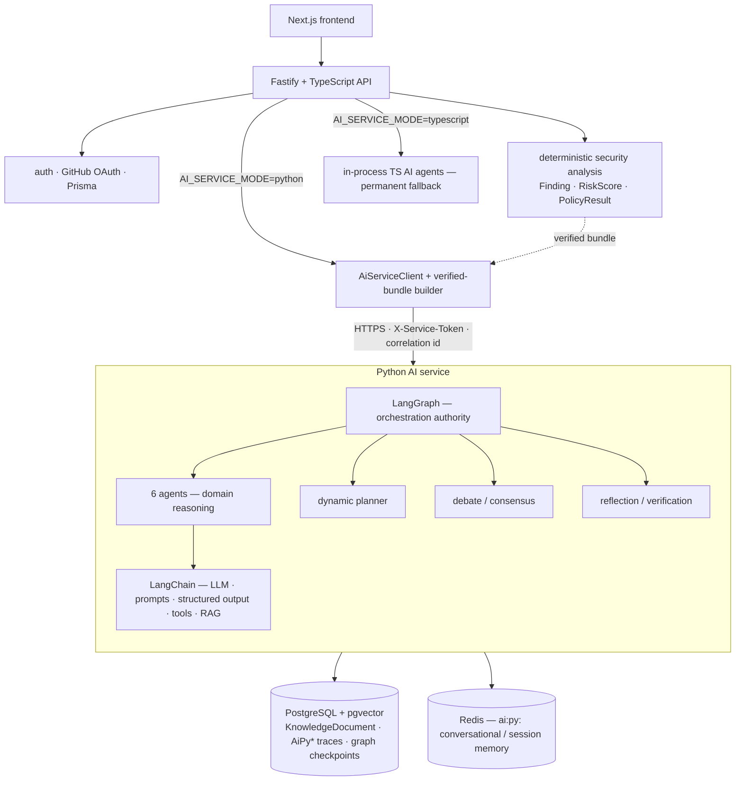
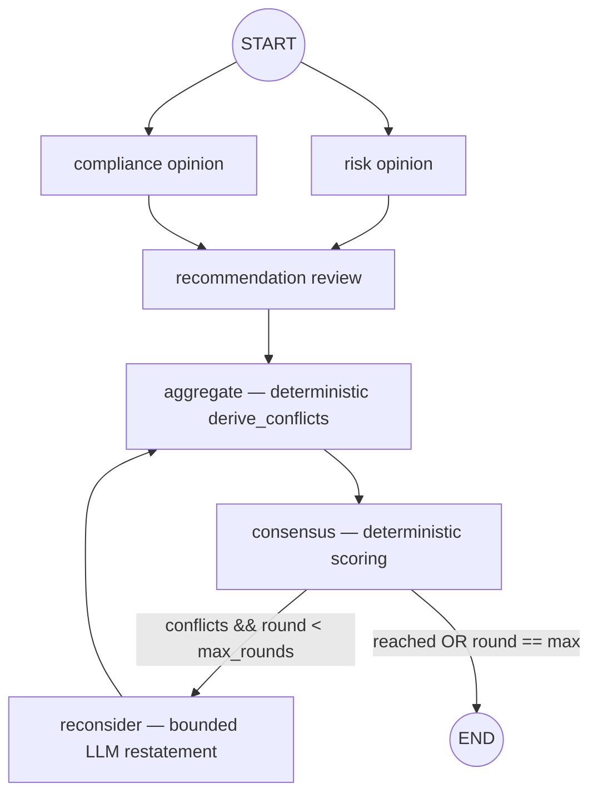
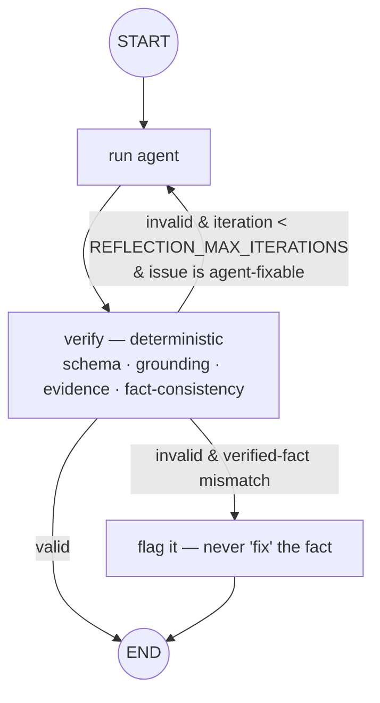
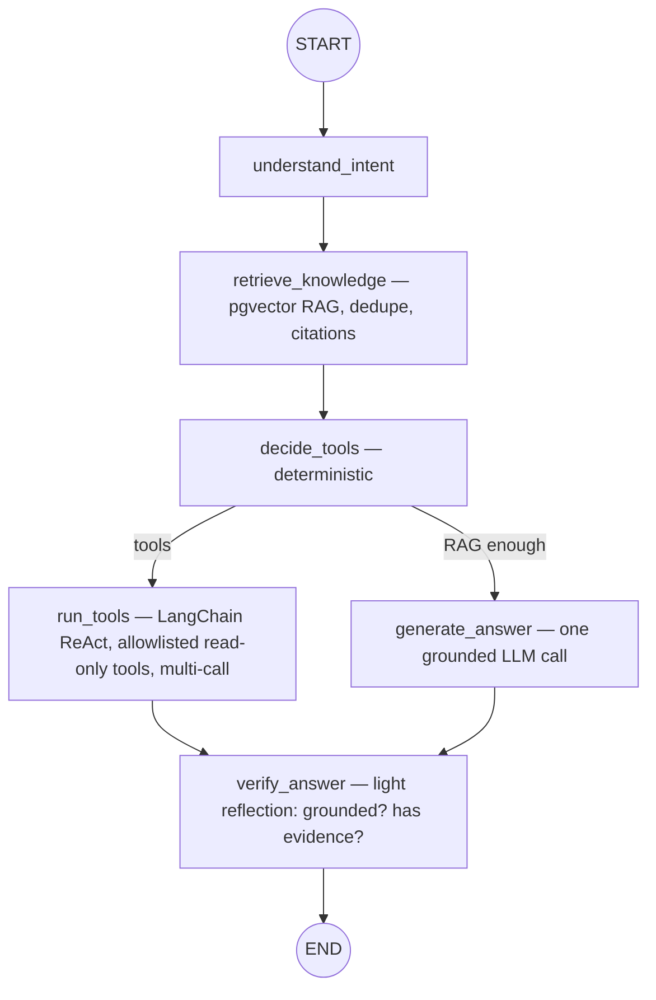

# Phase 33 — Final Python AI Layer

## A. Complete EstateAI architecture

## B. Dynamic planner

```mermaid
flowchart TD
    G[goal + assetId] --> LLM[LLM proposes a structured Plan<br/>with_structured_output&#40;Plan&#41;]
    LLM --> V{validate_plan}
    V -->|invalid, attempts left| LLM
    V -->|invalid, exhausted| FB[deterministic fallback plan<br/>discovery→risk∥compliance→recommendation→report]
    V -->|valid| EXEC
    FB --> EXEC[PlanExecutor.build_plan_graph]
    EXEC --> LGX[LangGraph StateGraph<br/>one node per step, edges from depends_on]
    LGX --> HITL{constraints.require_approval<br/>&& a report step?}
    HITL -->|yes| INT[interrupt&#40;&#41; before report → resume]
    HITL -->|no| DONE
    INT --> DONE[step_outputs envelope]

    V -. rejects .-> X1[unknown agent]
    V -. rejects .-> X2[unknown tool]
    V -. rejects .-> X3[cycle / missing dep / bad shape]
```

The LLM only *proposes*. The registry (`app/planner/registry.py`) is the
authority on which agents / tool categories / dependency shapes are
allowed. LangGraph executes only the validated plan; it never runs an
arbitrary callable, raw SQL, or an HTTP request.

## C. Debate / consensus

* Participants (risk, compliance, recommendation) give **independent,
  grounded** opinions — their verified findings/severities/scores are
  copied verbatim into the debate.
* `aggregate` / `consensus` are pure heuristics ported from the TS
  `consensus.scoring.ts` — agreement score, conflict list, accepted /
  rejected findings, blended confidence. Never an LLM judgment on a fact.
* `reconsider` is a bounded round (`DEBATE_MAX_ROUNDS`) where the LLM
  restates *interpretation* only — it cannot change a verified fact.

## D. Reflection / verification

## E. Copilot LangGraph (Phase 32 + 33.12 verify pass)

## F. Fastify ↔ Python

| Fastify route / job | Python endpoint | Notes |
|---|---|---|
| `AI_DISCOVERY/RISK/COMPLIANCE/RECOMMENDATION/REPORT` jobs | `POST /v1/agents/{agent}/run` | individual agents; Recommendation/Report now get raw `findings`/`policyResults` — Risk/Compliance not re-run (33.8) |
| `AI_FULL_ANALYSIS` job · `POST /ai/graph/analyze` | `POST /v1/graph/execute` | the complete security LangGraph as one workflow (33.7) |
| `POST /ai/graph/{id}/resume` | `POST /v1/graph/{id}/resume` | HITL approval proxy |
| `POST /ai/copilot/chat` | `POST /v1/agents/copilot/run` | Copilot graph |
| — | `POST /v1/planner/{plan,execute,{id}/resume}` | dynamic planner |
| — | `POST /v1/debate/run` | debate / consensus |

## Responsibility split

| Layer | Owns |
|---|---|
| **LangChain** | LLM client + `ChatAnthropic` / fake, prompts, `with_structured_output`, `StructuredTool`, ReAct loop, embeddings, retrieval |
| **LangGraph** | state, nodes, edges, conditional routing, parallel supersteps, checkpointing, `interrupt`/`resume`, plan execution, debate rounds, reflection loop |
| **Agents** | domain reasoning + Pydantic-validated output |
| **Fastify** | auth, deterministic security analysis, verified-bundle assembly, application API, job orchestration — the trusted boundary |
| **PostgreSQL** | application data; **pgvector** = `KnowledgeDocument` retrieval; also AiPy* traces + LangGraph checkpoints |
| **Redis** | `ai:py:` conversational history + session state (bounded, secret-scrubbed) |
